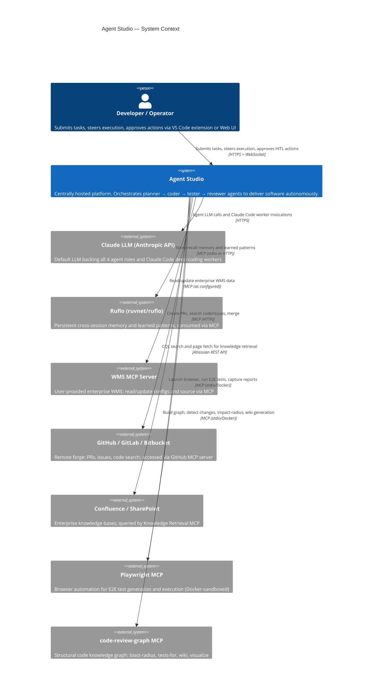
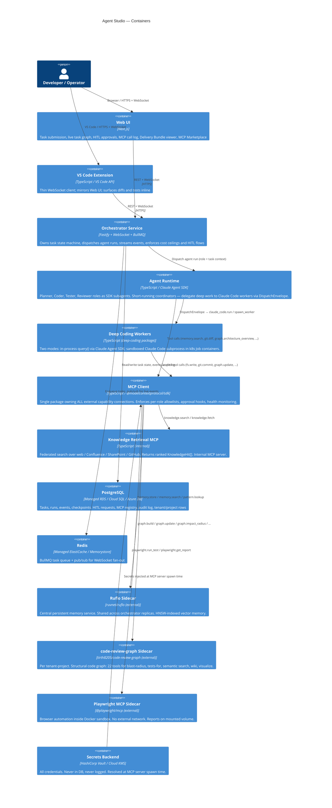
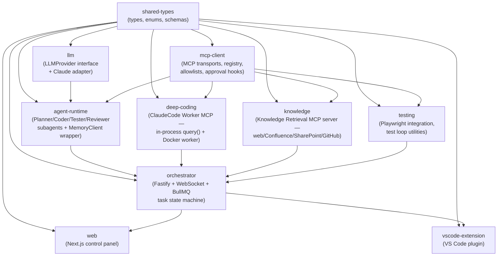

# Architecture Overview

This document describes the Agent Studio architecture using C4-style diagrams — Context, Container, and Component levels — plus a monorepo package dependency map.

---

## 1. System Context Diagram

Agent Studio sits at the centre of a constellation of users, LLM providers, external MCP servers, and enterprise knowledge sources. No agents run on user machines — all execution is cloud-hosted.

---

## 2. Container Diagram

Inside Agent Studio, distinct containers handle orchestration, agent execution, deep coding, tool access, UI, and infrastructure.

---

## 3. Monorepo Package Map

Agent Studio is a pnpm + Turborepo monorepo. The package graph below shows dependency edges (arrows mean "depends on").

**Package responsibilities:**

| Package | Role | Key dependencies |
|---|---|---|
| `shared-types` | Canonical TypeScript types, Zod schemas, enums used across all packages | None |
| `llm` | `LLMProvider` interface + Claude adapter (default) + OpenAI/Gemini/Ollama stubs | `shared-types` |
| `mcp-client` | Single connection manager for all MCP servers; allowlists, approval hooks, health | `shared-types` |
| `knowledge` | Internal Knowledge Retrieval MCP server; adapters for web/Confluence/SharePoint/GitHub | `shared-types`, `mcp-client` |
| `deep-coding` | Internal ClaudeCode Worker MCP; in-process `query()` + sandboxed Docker worker | `shared-types`, `mcp-client` |
| `agent-runtime` | Planner/Coder/Tester/Reviewer subagents; `MemoryClient` wrapper; SKILLs loader | `shared-types`, `llm`, `mcp-client` |
| `orchestrator` | Fastify service; task state machine; BullMQ queue; WebSocket event streaming | `shared-types`, `agent-runtime`, `deep-coding`, `knowledge` |
| `testing` | Playwright MCP integration helpers; test loop utilities; coverage threshold checks | `shared-types`, `mcp-client` |
| `web` | Next.js control panel; WebSocket client; Delivery Bundle viewer; MCP Marketplace | `shared-types` |
| `vscode-extension` | VS Code plugin; WebSocket client; inline diff/test views; HITL approval panel | `shared-types` |

---

## 4. Key Architectural Principles

### No agents run locally
Users connect to the hosted orchestrator from VS Code or a browser. All LLM calls, MCP tool executions, file operations, and test runs happen in the cloud. See [ADR-0013](adr/0013-cloud-hosted-no-local-agents.md).

### MCP as the universal tool boundary
Every external capability — memory (Ruflo), repo ops (Git MCP), forge ops (GitHub MCP), browser automation (Playwright MCP), code understanding (code-review-graph), enterprise data (WMS MCP), knowledge retrieval (internal MCP) — is accessed via the MCP client. No bespoke tool code leaks into `agent-runtime`. See [ADR-0004](adr/0004-mcp-client-transport.md) and [`02-components/mcp-client.md`](02-components/mcp-client.md).

### Outer roles coordinate; inner loop does the work
The four agent roles (Planner, Coder, Tester, Reviewer) are deliberately short-running coordinators. All heavy task breakdown and iterative coding is dispatched to Claude Code deep-coding workers via a typed `DispatchEnvelope`. This separation keeps the outer loop cheap and prevents nested re-planning. See [ADR-0012](adr/0012-embed-claude-code-as-deep-worker.md) and [`02-components/deep-coding-workers.md`](02-components/deep-coding-workers.md).

### No forks of external projects
Ruflo, code-review-graph, and all upstream MCP servers are consumed as external dependencies, pinned to versions in the MCP Registry. Forking any of them would create a maintenance burden and obscure upgrade paths. See [ADR-0009](adr/0009-consume-ruflo-via-mcp-not-fork.md) and [ADR-0006](adr/0006-consume-code-review-graph-mcp.md).

### Provider-agnostic LLM layer
All LLM calls go through the `LLMProvider` interface. Claude is the default (and the recommended choice given the user's SKILLs repo and the `@anthropic-ai/claude-agent-sdk` integration). Swapping to OpenAI, Gemini, or Ollama is a one-adapter change. See [ADR-0002](adr/0002-provider-agnostic-llm.md).

---

## 5. Cross-Reference

| Topic | Detail doc |
|---|---|
| Orchestrator internals | [`02-components/orchestrator.md`](02-components/orchestrator.md) |
| Agent roles + anti-nesting | [`02-components/agent-runtime.md`](02-components/agent-runtime.md) |
| Deep Coding Workers + DispatchEnvelope | [`02-components/deep-coding-workers.md`](02-components/deep-coding-workers.md) |
| MCP client + allowlists | [`02-components/mcp-client.md`](02-components/mcp-client.md) |
| MCP Registry & Manager | [`02-components/mcp-registry.md`](02-components/mcp-registry.md) |
| Cloud hosting topology | [`02-components/hosting-and-deployment.md`](02-components/hosting-and-deployment.md) |
| Delivery Bundle | [`02-components/delivery-bundle.md`](02-components/delivery-bundle.md) |
| All MCP integrations | [`02-integrations/README.md`](02-integrations/README.md) |
| Security | [`06-security.md`](06-security.md) |
| Phased roadmap | [`07-roadmap.md`](07-roadmap.md) |
