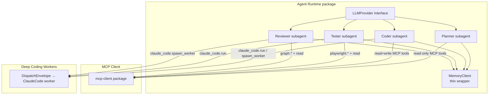
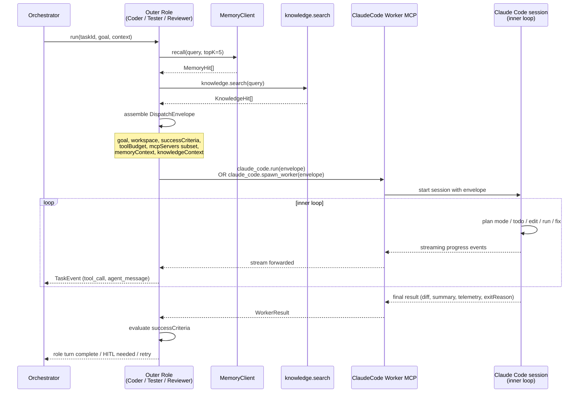

# Agent Runtime

The Agent Runtime is the outer orchestration layer that houses the four named roles — **Planner**, **Coder**, **Tester**, and **Reviewer**. It is built on `@anthropic-ai/claude-agent-sdk` behind a thin `LLMProvider` interface, so any LLM provider can be swapped in without changing role logic.

These four roles are deliberately **short-running coordinators**. They do not implement deep iterative code-editing loops. Instead, they own routing, HITL decisions, approvals, and delivery, and they delegate all heavy task-breakdown and iterative coding work to the **Deep Coding Worker** (see [deep-coding-workers.md](./deep-coding-workers.md)) via a typed `DispatchEnvelope`.

---

## Role overview

| Role | Primary responsibility | Allowed to dispatch workers? | Approvals owned |
|---|---|---|---|
| **Planner** | Decompose the business requirement into a structured plan and todo list | No (`claude_code.*` denied) | None |
| **Coder** | Execute each plan goal by dispatching to Deep Coding Workers; stage and commit changes via Git MCP | Yes — `claude_code.run` and `claude_code.spawn_worker` | `git.push` (write) |
| **Tester** | Determine test surface via `code-review-graph`, dispatch spec generation to Claude Code worker, drive Playwright MCP | Yes — `claude_code.run` for spec generation | None (sandboxed) |
| **Reviewer** | Assemble Delivery Bundle via `code-review-graph`; sign-off gate; can fan out parallel worker calls | Yes — `claude_code.spawn_worker` (parallel A/B) | `github.create_pr`, `github.merge_pr` |

---

## Architecture: SDK subagent structure

Each role is implemented as an SDK subagent configured with:

- A **system prompt** that describes the role's scope, constraints, and decision rules.
- An **allowed-tools list** drawn from the MCP client's per-role allowlist (see [mcp-client.md](./mcp-client.md)).
- A **permission mode** that governs how Claude Code workers invoked by that role operate.



---

## Dispatch sequence: outer role → inner worker → result



---

## Per-role system prompts (summary)

Full prompts live in `packages/agent-runtime/prompts/`. The summaries below capture the critical constraints that each prompt enforces.

### Planner
- Analyse the business requirement and existing code architecture (via `graph.architecture_overview`, `graph.semantic_search`).
- Produce a structured JSON plan: array of `{ goal, successCriteria, estimatedEffort }`.
- Do **not** write code. Do **not** call `claude_code.*` tools (denied by allowlist).
- Call `memory.search` first to surface any prior solutions or patterns.
- Output the plan to the Orchestrator; do not self-iterate.

### Coder
- Take a single plan goal and implement it by dispatching a Deep Coding Worker.
- Assemble `DispatchEnvelope` with narrowest possible MCP subset and pre-fetched memory/knowledge context.
- After worker completes: call `git.stage` → `git.commit` → `graph.update`.
- Do **not** plan — the plan was already produced by the Planner.
- Escalate to HITL if `exitReason === 'blocked_hitl'` or budget is exhausted.

### Tester
- Call `graph.tests_for(changedNodes)` and `graph.impact_radius(changedNodes)` to determine test surface.
- Dispatch a Claude Code worker to generate or update Playwright spec files for the determined surface.
- Drive `playwright.run_test` against the generated specs; collect HTML/JSON reports.
- On failure: call `memory.search`, then `knowledge.search`, then dispatch a fix request to the Coder role via the Orchestrator (not directly).
- Exit loop when pass-rate threshold met or `maxIterations` reached (then block for HITL).

### Reviewer
- Assemble the Delivery Bundle by calling the full `code-review-graph` suite.
- Optionally fan out multiple parallel `spawn_worker` calls for A/B refactor exploration.
- Surface the bundle for human sign-off.
- On approval: call `github.create_pr` (HITL-gated) with the bundle attached.
- Write a `pattern.store` entry to Ruflo capturing what worked, for future runs.

---

## Anti-nesting invariants

These invariants prevent the outer roles from re-doing the work they are supposed to delegate, which would cause redundant planning, budget waste, and unpredictable behaviour.

### Invariant 1 — Planner is denied `claude_code.*`

The Planner role's MCP allowlist explicitly excludes every `claude_code.*` tool:

```typescript
// packages/agent-runtime/config/role-allowlists.ts
export const plannerAllowlist = [
  'memory.*',
  'knowledge.*',
  'graph.architecture_overview',
  'graph.semantic_search',
  'fetch.url',
  // NOTE: claude_code.* intentionally absent
];
```

Attempting to call `claude_code.run` or `claude_code.spawn_worker` from the Planner role will result in a `tool_denied` error from the MCP client, which the SDK surfaces as a tool error to the agent. The Planner prompt reinforces this in natural language, but the allowlist is the hard enforcement boundary.

### Invariant 2 — Planning happens exactly once, inside the inner session

Once the Planner has emitted a structured plan, it is stored in the task record. The Coder, Tester, and Reviewer roles receive the plan via their `DispatchEnvelope.goal` field (one goal per envelope). They do **not** re-plan. The `DispatchEnvelope` includes a `permissionMode` field; for normal coder/tester dispatches this is `'acceptEdits'` — not `'plan'`. Setting `permissionMode: 'plan'` from any role other than a Planner-scoped inner session is flagged as a configuration error at startup.

### Invariant 3 — Inner sessions do not call `memory.*` or `knowledge.*` cold

The outer role pre-fetches relevant `MemoryHit[]` and `KnowledgeHit[]` before assembling the envelope. The inner Claude Code session receives these as static context (`DispatchEnvelope.memoryContext`, `.knowledgeContext`). This keeps the inner session's tool budget focused on code work and keeps expensive retrieval decisions in the outer loop where they can be reasoned about holistically.

### Invariant 4 — Inner sessions do not call steering verbs

The `DispatchEnvelope` is the single boundary between outer and inner loops. Inner sessions never see the Orchestrator REST API. If an inner session needs human input, it surfaces a structured `blocked_hitl` exit reason, and the **outer role** translates that into an `askHuman` call routed through the Orchestrator.

---

## MemoryClient wrapper

The `MemoryClient` is a thin adapter in `packages/agent-runtime/src/memory-client.ts` that standardises Ruflo interactions:

```typescript
interface MemoryClient {
  remember(scope: MemoryScope, kind: MemoryKind, payload: object): Promise<void>;
  recall(query: string, topK?: number): Promise<MemoryHit[]>;
  storePattern(label: string, content: string): Promise<void>;
  lookupPattern(query: string): Promise<PatternHit[]>;
}

type MemoryScope = { tenantId: string; projectId: string; taskId?: string };
type MemoryKind = 'plan' | 'fix' | 'test_result' | 'clarification' | 'completion' | 'pattern';
```

Agent Studio `(tenant, project, task)` maps onto Ruflo's `user/project/local` scope hierarchy. All Ruflo tool calls flow through the MCP client — the `MemoryClient` is purely a typed wrapper that computes the correct scope and serialises the payload.

**Write checkpoints:**
- After planning: `remember(scope, 'plan', { plan })`
- After each successful fix commit: `remember(scope, 'fix', { goal, diff, successCriteria })`
- After tests pass: `remember(scope, 'test_result', { surface, passRate, reportUrl })`
- On human clarification answer: `remember(scope, 'clarification', { question, answer })`
- On task completion: `remember(scope, 'completion', { deliveryBundle })`

**Read checkpoints:**
- Before planning (Planner): `recall(businessRequirement)`
- Before each retry (Coder): `recall(goal)`
- On test failure (Tester): `recall(failureDescription)` before `knowledge.search`
- Before review (Reviewer): `recall(taskSummary)`

---

## LLMProvider interface

Each role is instantiated with an `LLMProvider`. Claude (via `@anthropic-ai/claude-agent-sdk`) is the default. See [llm-abstraction.md](./llm-abstraction.md) for the full interface and adapter catalogue.

```typescript
// packages/llm/src/provider.ts
export interface LLMProvider {
  generate(messages: Message[], options?: GenerateOptions): Promise<GenerateResult>;
  stream(messages: Message[], options?: GenerateOptions): AsyncIterable<StreamChunk>;
  embed(text: string): Promise<number[]>;
  countTokens(messages: Message[]): Promise<number>;
}
```

Per-role model selection is configured in `agent-studio.config.ts`:

```typescript
agentRuntime: {
  models: {
    planner:  { provider: 'claude', model: 'claude-opus-4-5' },
    coder:    { provider: 'claude', model: 'claude-sonnet-4-5' },
    tester:   { provider: 'claude', model: 'claude-sonnet-4-5' },
    reviewer: { provider: 'claude', model: 'claude-opus-4-5' },
  },
}
```

---

## Permission modes

Each role's dispatched Claude Code workers run in a specific permission mode:

| Role | Default `permissionMode` | Notes |
|---|---|---|
| Planner | N/A — does not dispatch | Planner is denied `claude_code.*` |
| Coder | `'acceptEdits'` | Worker can edit files freely within workspace globs |
| Tester (spec gen) | `'acceptEdits'` | Worker generates spec files only |
| Reviewer (A/B) | `'acceptEdits'` | Parallel exploration workers; results compared before any write |
| Any role | `'bypassPermissions'` | Requires explicit operator HITL approval; audit-logged |

`bypassPermissions` is never the default. The MCP client routes any `spawn_worker` call with `permissionMode: 'bypassPermissions'` through the HITL approval gate before forwarding to the `deep-coding` package.

---

## Related components

- [Orchestrator](./orchestrator.md) — dispatches roles, owns task state
- [LLM Abstraction](./llm-abstraction.md) — provider interface and adapters
- [Deep Coding Workers](./deep-coding-workers.md) — inner loop, `DispatchEnvelope`, both dispatch modes
- [MCP Client](./mcp-client.md) — per-role tool allowlists, approval hooks
- [Skills Loader](./skills-loader.md) — skills available to inner Claude Code sessions
- [Human-in-the-Loop](./human-in-the-loop.md) — `askHuman` primitive used by all roles
- [Task State](./task-state.md) — state machine the Orchestrator drives as roles complete
