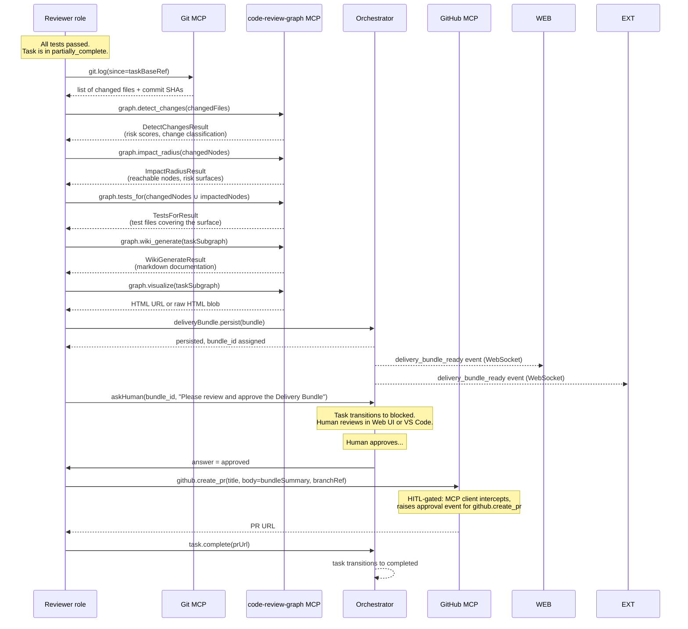

# Delivery Bundle

The Delivery Bundle is the **final artifact** produced by Agent Studio at the end of every task. It is assembled by the Reviewer role, persisted against the task record, and surfaced for human sign-off before any code reaches the main branch. It answers three questions a human reviewer needs before approving a PR: *What changed? What could it affect? Is it tested?*

---

## What the Delivery Bundle contains

```typescript
// packages/shared-types/src/delivery-bundle.ts

export interface DeliveryBundle {
  taskId: string;
  assembledAt: string;                  // ISO-8601

  /** Structural blast-radius: which nodes are reachable from the changed set */
  impactRadius: ImpactRadiusResult;

  /** Which tests cover the changed nodes — drives the test surface */
  testsFor: TestsForResult;

  /** Risk-scored change summary — what changed and how risky is each change */
  detectChanges: DetectChangesResult;

  /** Auto-generated markdown docs for the changed/new feature */
  wiki: WikiGenerateResult;

  /** Interactive HTML graph embedded in the Web UI "Delivery" tab */
  visualizeUrl: string;

  /** true when code-review-graph was unreachable; bundle is diff-based fallback */
  partial: boolean;
  partialReason?: string;

  /** Human sign-off */
  humanApprovedAt?: string;
  humanApprovedBy?: string;

  /** PR created after approval */
  pullRequestUrl?: string;
}
```

---

## Assembly process (step by step)

The Reviewer role assembles the bundle by calling `code-review-graph` tools in sequence after all test thresholds have been met. Each step feeds context into the next.



---

## Step-by-step detail

### Step 1 — Determine the changed set

The Reviewer calls `git.log` to get the list of files and nodes changed by the task (everything since `task.baseRef`). This set is the root of all subsequent graph queries.

### Step 2 — `graph.detect_changes`

`graph.detect_changes(changedFiles)` returns a risk-scored change summary:

```typescript
interface DetectChangesResult {
  changedNodes: GraphNode[];
  riskScores: Record<string, number>;       // nodeId → 0–100
  changeClassification: Record<string, ChangeType>;  // nodeId → 'added'|'modified'|'deleted'
  criticalityFlags: string[];               // high-risk nodes above threshold
  summary: string;                          // human-readable summary (markdown)
}
```

High-risk nodes (e.g. functions called by 20+ other modules) are flagged for human attention.

### Step 3 — `graph.impact_radius`

`graph.impact_radius(changedNodes)` traverses the graph outward from the changed set:

```typescript
interface ImpactRadiusResult {
  directCallers: GraphNode[];
  transitiveCallers: GraphNode[];
  configDependents: GraphNode[];
  maxDepth: number;
  totalImpactedNodes: number;
  allowedModules: string[];       // nodes within pre-approved impact scope
  outOfScopeNodes: string[];      // nodes outside allowed scope — risk flag
}
```

`outOfScopeNodes` is surfaced as a prominent warning in the Web UI: *"These modules were unexpectedly impacted — confirm with the team."*

### Step 4 — `graph.tests_for`

`graph.tests_for(changedNodes ∪ impactedNodes)` returns the exact test files and test IDs that exercise the impacted surface:

```typescript
interface TestsForResult {
  testFiles: string[];
  testIds: string[];
  coverageGaps: string[];   // impacted nodes with no existing test coverage
  coveragePct: number;
}
```

`coverageGaps` feeds back to the Tester role if the task's success criteria require 100% test coverage — the Reviewer can trigger a final test-generation pass before proceeding.

### Step 5 — `graph.wiki_generate`

`graph.wiki_generate(taskSubgraph)` produces markdown documentation for the new or changed feature:

```typescript
interface WikiGenerateResult {
  title: string;
  markdown: string;           // ready to commit to /docs or Confluence
  sections: string[];         // table of contents
  relatedNodes: GraphNode[];
}
```

The wiki is included in the PR body and optionally committed to `/docs/generated/` by the Reviewer role.

### Step 6 — `graph.visualize`

`graph.visualize(taskSubgraph)` produces an interactive HTML graph of the changed + impacted nodes:

```typescript
interface VisualizeResult {
  html: string;        // self-contained HTML with embedded JS
  url?: string;        // if code-review-graph is serving it over HTTP
}
```

The HTML is stored in the task record and served via the Orchestrator's `/api/tasks/:id/delivery-bundle/graph` endpoint. It is embedded as an `<iframe>` in the Web UI's **Delivery** tab.

---

## Persistence

The assembled bundle is persisted as a JSONB column on the `tasks` table:

```sql
UPDATE tasks
SET delivery_bundle = $1::jsonb,
    delivery_bundle_assembled_at = now(),
    status = 'partially_complete'
WHERE id = $2;
```

The bundle is **never modified** after persistence. If a subsequent human clarification leads to additional coder/tester turns, a new bundle version is assembled and stored alongside the prior version (append-only). The task record references the `current_delivery_bundle_id`.

---

## Web UI — "Delivery" tab

The Delivery tab appears on a task detail page once `delivery_bundle_ready` is received. It contains:

| Section | Content |
|---|---|
| **Change summary** | Risk-scored `detectChanges` output; high-risk nodes highlighted |
| **Impact radius** | `impactRadius` with expandable caller/callee tree |
| **Test coverage** | `testsFor` table with coverage gaps flagged in red |
| **Interactive graph** | `graph.visualize` HTML embedded in an iframe |
| **Auto-wiki** | `wiki_generate` markdown rendered inline |
| **Approval** | "Approve" / "Request changes" buttons → triggers `task.approve` or `task.inject_context` |

The tab is read-only from VS Code (mirror of the web view). The **Approve** action is available from both surfaces.

---

## VS Code surface

The VS Code extension surfaces the Delivery Bundle via a Webview panel that loads the same HTML served by the Orchestrator. The approve/reject actions call the same REST endpoints as the web UI. See [vscode-extension.md](./vscode-extension.md) for the session bridging details.

---

## Human sign-off flow (HITL-gated)

1. Reviewer calls `askHuman` with the bundle ID and a structured question (`{ type: 'delivery_review', bundleId, summary }`).
2. Orchestrator transitions the task to `blocked`, publishes `hitl_question` WebSocket event.
3. Human reviews the Delivery tab and clicks **Approve** (or **Request changes**).
4. On **Approve**: Orchestrator resumes the Reviewer role. Reviewer calls `github.create_pr` — which is itself approval-gated (MCP client intercepts, raises a second `hitl_approval_request` for `github.create_pr`). This is the final gate before the PR is opened.
5. On **Request changes**: Orchestrator resumes with the human's feedback injected into the next dispatch envelope. Task re-enters `in_progress` for another coder/tester cycle.

The double gate (bundle approval + PR creation approval) is intentional: it prevents an automated system from opening a PR without two explicit human signals.

---

## Fallback when `code-review-graph` is unavailable

If `code-review-graph` is unreachable (health check failed), the Reviewer falls back to a **diff-based summary**:

1. Call `git.diff(baseRef, HEAD)` to get the raw diff.
2. Call `fetch.url` or inline analysis to produce a plain-text change summary.
3. Mark `bundle.partial = true` and `bundle.partialReason = 'code-review-graph unavailable'`.
4. Continue with assembly — bundle is persisted with the partial flag set.
5. Web UI shows a prominent warning banner: *"Delivery Bundle is partial — structural graph analysis unavailable. Manual review recommended."*

The PR is still opened after human approval; the partial flag is included in the PR body.

---

## Related components

- [Agent Runtime](./agent-runtime.md) — Reviewer role drives the assembly
- [Orchestrator](./orchestrator.md) — persists the bundle, emits `delivery_bundle_ready`
- [Task State](./task-state.md) — `partially_complete → completed` transition gated on bundle approval
- [Human-in-the-Loop](./human-in-the-loop.md) — `askHuman` for bundle review; approval-gated `github.create_pr`
- [Web UI](./web-ui.md) — Delivery tab with interactive graph
- [VS Code Extension](./vscode-extension.md) — mirrors the Delivery tab
