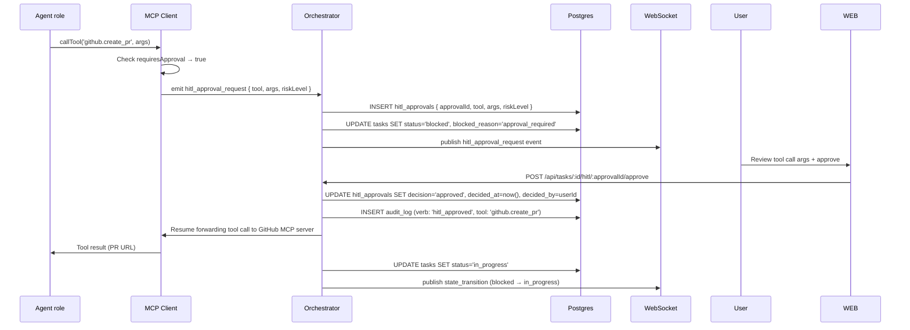

# Human-in-the-Loop (HITL)

Human-in-the-loop is a **first-class primitive** in Agent Studio. Any agent role can ask a question, any MCP tool call can require approval, and any task can be paused for inspection — all through the same unified mechanism. The Orchestrator is the single point of truth for all human interactions; both the Web UI and VS Code extension surface them identically.

---

## The `askHuman` primitive

`askHuman` is the agent-facing API for requesting human input. Any outer agent role can call it at any point during a task turn:

```typescript
// Called from within an agent role turn
await orchestrator.askHuman({
  question: "The order schema has two interpretations. Which should the alert threshold apply to?",
  schema: {
    type: 'object',
    properties: {
      interpretation: {
        type: 'string',
        enum: ['gross_weight', 'net_weight'],
        description: 'Which weight field to use for alert thresholds',
      },
      reason: { type: 'string', description: 'Optional explanation' },
    },
    required: ['interpretation'],
  },
  context: "See wms/schema/orders.ts line 42 for the two fields.",
  timeoutMs: 86_400_000,   // 24 hours (default)
});
```

The `schema` field is a full JSON Schema. The Web UI and VS Code extension both render a typed form from this schema (text input, select, checkbox, date picker, etc.) rather than a free-text box, so the answer is machine-readable and validatable.

---

## HITL trigger paths

### Path A — `askHuman` from an agent role

```mermaid
sequenceDiagram
    participant Agent as Agent role
    participant Orch as Orchestrator
    participant DB as Postgres
    participant WS as WebSocket / Redis pub-sub
    participant WEB as Web UI
    participant EXT as VS Code Extension
    participant User

    Agent->>Orch: askHuman(question, schema, context)
    Orch->>Orch: Wait for current tool call to complete<br/>(pause at tool-call boundary)
    Orch->>DB: INSERT task_hitl_questions
    Orch->>DB: UPDATE tasks SET status='blocked', blocked_reason='hitl_question'
    Orch->>DB: INSERT task_checkpoints (full snapshot)
    Orch->>WS: publish hitl_question event
    WS->>WEB: WebSocket push
    WS->>EXT: WebSocket push
    WEB->>User: HITL approval queue notification
    EXT->>User: VS Code notification popup

    User->>WEB: Submit answer (typed form)
    WEB->>Orch: POST /api/tasks/:id/hitl/:questionId/answer
    Orch->>DB: UPDATE task_hitl_questions SET answer=..., answered_at=now()
    Orch->>DB: UPDATE tasks SET status='in_progress'
    Orch->>DB: INSERT audit_log (verb: 'hitl_answered')
    Orch->>Orch: Reload checkpoint; inject answer into next DispatchEnvelope
    Orch->>WS: publish state_transition (blocked → in_progress)
    WS->>WEB: WebSocket push (clears HITL banner)
    WS->>EXT: WebSocket push (clears VS Code notification)
    Orch->>Orch: Re-enqueue BullMQ job from checkpoint
```

### Path B — Approval-gated MCP tool call



---

## Approval-gated tools

The MCP client intercepts any tool call whose name (or a glob pattern) appears in `McpServerSpec.approvalRequired`. The interception happens **before** the call is forwarded to the server.

Tools that require approval by default:

| Tool | Risk category | Notes |
|---|---|---|
| `git.push` | Write — remote repository | Irreversible without revert |
| `github.create_pr` | Write — public forge | Visible to the whole team |
| `github.merge_pr` | Write — irreversible merge | Code enters main branch |
| `wms.update_config` | Write — live enterprise system | May affect production |
| `wms.apply_patch` | Write — live enterprise data | May affect production |
| `claude_code.spawn_worker` with `permissionMode: 'bypassPermissions'` | Elevated privilege | Bypasses normal permission checks |

Additional tools can be added to `approvalRequired` in any `McpServerSpec` entry, including project-level or tenant-level overrides.

---

## Approval event schema

```typescript
interface HitlApprovalRequest {
  approvalId: string;         // UUID
  taskId: string;
  runId: string;
  role: AgentRole;
  tool: string;               // e.g. 'github.create_pr'
  args: Record<string, unknown>;  // tool arguments (sanitised of secrets)
  riskLevel: 'low' | 'medium' | 'high' | 'critical';
  requestedAt: string;
  timeoutMs: number;
  context?: string;           // why the agent is making this call
}

interface HitlApprovalDecision {
  approvalId: string;
  decision: 'approved' | 'rejected';
  decidedAt: string;
  decidedBy: string;          // user ID
  reason?: string;            // optional rejection reason
}
```

---

## Multi-surface notification

Both surfaces are notified simultaneously for every HITL event:

**Web UI:**
- HITL banner at the top of the task detail page (orange, dismissible only by approving or rejecting).
- Badge on the global **HITL Approval Queue** nav item (`/hitl`).
- Browser notification if the user has granted notification permission (optional).

**VS Code Extension:**
- `vscode.window.showInformationMessage` notification popup with **Review** and **Dismiss** buttons.
- Task list sidebar shows a `⚠ Awaiting Review` badge next to the task.
- Opening the task detail WebviewPanel automatically scrolls to the HITL panel.

**Email / Webhook (optional, configurable per tenant):**
- An email notification is sent to `task.hitlRoutingConfig.reviewerEmail` if configured.
- A webhook POST is sent to `task.hitlRoutingConfig.webhookUrl` if configured (e.g. Slack incoming webhook).

---

## Typed form rendering from JSON Schema

The Web UI and VS Code Webview both render dynamic forms from the `schema` field of a `HitlQuestion`. The renderer maps JSON Schema to React form components:

| JSON Schema type | Form component |
|---|---|
| `string` (no enum) | `<textarea>` |
| `string` with `enum` | `<select>` or radio group |
| `boolean` | Checkbox |
| `number` / `integer` | Number input with min/max |
| `array` of `string` | Multi-select or tag input |
| `object` | Nested section |

The form validates against the schema before enabling the **Submit** button. Invalid answers cannot be submitted.

---

## Timeout handling

Each HITL question has a `timeoutMs` (default: 24 hours, configurable per tenant in `tenant_settings`). Two timeout strategies:

### Strategy 1 — `auto_reject` (safe default)

At `timeoutMs`, the Orchestrator:
1. Records the timeout in `hitl_approvals` with `decision: 'timed_out'`.
2. Sends a structured rejection error to the agent role.
3. Transitions the task to `failed` with `failure_reason: 'hitl_timeout'`.
4. Writes to the audit log.
5. Notifies both surfaces and sends an email (if configured).

The agent receives `{ decision: 'rejected', reason: 'HITL timeout after 24h' }` and does not execute the approval-gated tool call.

### Strategy 2 — `escalate`

At `timeoutMs`, the Orchestrator:
1. Sends a new notification to `task.hitlRoutingConfig.escalationUserId` (if configured).
2. Resets the timeout for the escalation period (configurable, default: 4 hours).
3. If the escalation also times out, falls back to `auto_reject`.

Timeout strategy and escalation routing are configured per tenant:

```typescript
tenant_settings.hitl = {
  defaultTimeoutMs: 86_400_000,         // 24 hours
  onTimeout: 'auto_reject',             // 'auto_reject' | 'escalate'
  escalationTimeoutMs: 14_400_000,      // 4 hours (only for 'escalate')
};
```

---

## Audit trail for all HITL interactions

Every HITL interaction — question asked, approval requested, answer submitted, approval decision made, timeout reached — is recorded to the `audit_log` table:

| Action | `verb` | `actor_type` |
|---|---|---|
| `askHuman` called | `hitl_question_raised` | `agent` |
| `requiresApproval` tool intercepted | `hitl_approval_requested` | `agent` |
| Human submits answer | `hitl_answered` | `user` |
| Human approves | `hitl_approved` | `user` |
| Human rejects | `hitl_rejected` | `user` |
| Timeout — auto-reject | `hitl_timeout_rejected` | `system` |
| Timeout — escalated | `hitl_timeout_escalated` | `system` |

The `after` field of each audit record includes the tool arguments (sanitised: secrets are replaced with `[REDACTED]`) and the human's answer. This creates a complete, non-repudiable record of every human decision made during the task.

---

## Examples of approval-gated flows

### Example 1 — PR creation gate

```
Reviewer role completes delivery bundle.
Reviewer calls: askHuman("Please review the Delivery Bundle and approve the PR.")
→ Task transitions to blocked.
→ Human reviews in Web UI Delivery tab.
→ Human clicks "Approve and Open PR".
→ Orchestrator calls task.approve.
→ Reviewer role resumes and calls github.create_pr.
→ MCP client intercepts github.create_pr (requiresApproval: true).
→ Second HITL approval request: "Allow creation of PR: 'Add inventory alerts'?"
→ Human approves.
→ PR is created. Task transitions to completed.
```

Two approvals are required: one for the Delivery Bundle, one for the PR creation itself. Neither happens without explicit human intent.

### Example 2 — WMS write gate

```
Coder role needs to update a WMS configuration.
Coder dispatches claude_code.run with wms.update_config in the tool subset.
Claude Code calls wms.update_config({ threshold: 500 }).
→ MCP client intercepts (requiresApproval: true).
→ Approval request: "Allow WMS config update: threshold=500 for tenant=acme?"
→ Human reviews args in approval form.
→ Human approves.
→ wms.update_config is forwarded to the WMS MCP server.
→ Result flows back to the Claude Code session.
```

The human sees the exact arguments before they are forwarded. Rejection returns a structured error to the agent, which can try an alternative approach.

### Example 3 — Clarification during planning

```
Planner role cannot determine which of two API versions to target.
Planner calls askHuman({
  question: "Which version of the WMS API should the new alerts use?",
  schema: { type: 'string', enum: ['v2', 'v3'] }
})
→ Task transitions to blocked.
→ Human selects 'v3' in the form.
→ Answer injected into DispatchEnvelope.memoryContext for the next Coder dispatch.
→ Planner resumes and completes the plan with v3 as the target.
```

---

## Related components

- [Orchestrator](./orchestrator.md) — owns all HITL state and routing
- [MCP Client](./mcp-client.md) — intercepts approval-gated tool calls
- [Task State](./task-state.md) — `blocked` state triggered by HITL
- [Execution Control](./execution-control.md) — `task.approve` / `task.reject` verbs
- [Web UI](./web-ui.md) — HITL approval queue and typed form rendering
- [VS Code Extension](./vscode-extension.md) — notification popup and Webview HITL panel
- [Delivery Bundle](./delivery-bundle.md) — HITL-gated PR creation flow
