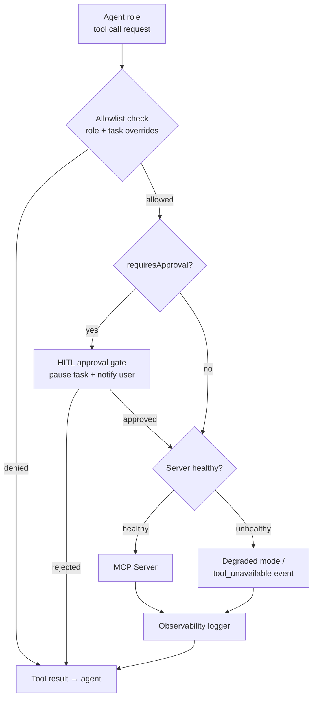

# MCP Client

The MCP client is the **central nervous system** of Agent Studio's tool use. A single `mcp-client` package — built on `@modelcontextprotocol/sdk` — owns every external capability connection. No bespoke tool code leaks into `agent-runtime`. Every tool an agent can call, whether it is a memory operation, a git command, a browser action, or an enterprise system update, is a tool on some MCP server, connected and managed here.

---

## Responsibilities

| Concern | Detail |
|---|---|
| Connection lifecycle | Connects, health-checks, reconnects, and disconnects every registered MCP server |
| Transport abstraction | Supports `stdio`, `streamable-http`, and `sse` transports; chosen per server in config |
| Per-role tool allowlists | Exposes a role-filtered view of tools to each agent role |
| Per-task tool overrides | Allows task definitions to further tighten (never widen) the role allowlists |
| Approval hooks | Intercepts calls to approval-gated tools; raises HITL events before forwarding |
| Health and failover | Heartbeat per server; `tool_unavailable` event on failure; optional secondary instance |
| Observability | Logs every call with `{task, role, server, tool, latency, tokens, result_status}` |

---

## Architecture: flow of an agent tool call



---

## Pluggable transports

The MCP client selects a transport based on each server's `McpServerSpec.transport` field:

| Transport | Implementation | Typical use |
|---|---|---|
| `stdio` | Spawn a child process; communicate over stdin/stdout using JSON-RPC | Local binaries (Git, Filesystem, Fetch, Playwright, Knowledge, ClaudeCode Worker) |
| `streamable-http` | HTTP POST with chunked streaming responses | Remote HTTP MCP servers; central Ruflo; central code-review-graph |
| `sse` | Server-Sent Events — server pushes updates, client POSTs requests | Servers that require push notifications (e.g. long-running browser sessions) |

Transport is instantiated per server connection from `@modelcontextprotocol/sdk`:

```typescript
import { StdioClientTransport, StreamableHTTPClientTransport } from '@modelcontextprotocol/sdk/client/index.js';

function createTransport(spec: McpServerSpec): Transport {
  switch (spec.transport) {
    case 'stdio':
      return new StdioClientTransport({
        command: resolveCommand(spec.source),
        args: spec.source.args ?? [],
        env: resolveSecrets(spec.env),
      });
    case 'streamable-http':
      return new StreamableHTTPClientTransport(
        new URL(spec.url!),
        { headers: resolveAuthHeaders(spec.auth) },
      );
    case 'sse':
      return new SSEClientTransport(new URL(spec.url!));
  }
}
```

---

## McpServerSpec type

Every server in the registry is described by a typed `McpServerSpec`. The full schema is defined in `packages/shared-types/src/mcp.ts`:

```typescript
export interface McpServerSpec {
  name: string;
  version: string;                    // semver range, e.g. "^1.46.0"
  source: McpServerSource;
  transport: 'stdio' | 'streamable-http' | 'sse';
  url?: string;                        // required for http/sse
  env?: EnvVarSpec[];
  auth?: AuthSpec;
  healthcheck?: HealthcheckSpec;
  allowlist: RoleAllowlist;           // per-role tool glob patterns
  approvalRequired: string[];         // tool names or globs requiring HITL
  sandbox?: SandboxProfile;           // docker profile for sandboxed servers
  failover?: { url: string };         // secondary instance URL for http/sse
  enabled: boolean;
}

export interface RoleAllowlist {
  planner:  string[];   // glob patterns, e.g. ['memory.*', 'graph.semantic_search']
  coder:    string[];
  tester:   string[];
  reviewer: string[];
}
```

---

## Per-role tool allowlists

Each agent role sees only the tools explicitly granted to it. The MCP client computes a role-scoped tool list before handing the tool inventory to the agent:

```typescript
function getToolsForRole(allTools: Tool[], role: AgentRole, spec: McpServerSpec): Tool[] {
  const patterns = spec.allowlist[role];
  return allTools.filter(tool =>
    patterns.some(pattern => micromatch.isMatch(tool.name, pattern))
  );
}
```

### Default role allowlists

| MCP Server | Planner | Coder | Tester | Reviewer |
|---|---|---|---|---|
| **Ruflo** (memory) | `memory.search`, `pattern.lookup` | All memory tools | `memory.search` | All memory tools |
| **Git** | Read-only (`git.status`, `git.diff`, `git.log`) | All git tools | Read-only | Read-only |
| **GitHub** | Read-only (`github.search_*`, `github.get_*`) | `github.create_pr`, `github.add_comment` | Read-only | `github.create_pr`, `github.merge_pr` |
| **Playwright** | — | — | `playwright.*` | — |
| **Filesystem** | `fs.read`, `fs.list` | All (`fs.*`) | `fs.read`, `fs.write` (spec files only) | `fs.read` |
| **Fetch** | `fetch.url` | `fetch.url` | `fetch.url` | `fetch.url` |
| **code-review-graph** | `graph.architecture_overview`, `graph.semantic_search` | `graph.impact_radius`, `graph.callers_of`, `graph.callees_of`, `graph.update` | `graph.tests_for`, `graph.impact_radius` | `graph.*` |
| **ClaudeCode Worker** | — (denied) | `claude_code.run`, `claude_code.spawn_worker`, `claude_code.status`, `claude_code.cancel` | `claude_code.run` | `claude_code.spawn_worker` |
| **Knowledge** | `knowledge.search` | `knowledge.search` | `knowledge.search` | `knowledge.search` |
| **WMS** | `wms.read_config`, `wms.read_source` | All WMS tools | — | `wms.read_config` |

The Planner's denial of `claude_code.*` is enforced at the allowlist level (not just the prompt), making it a hard security boundary. See [agent-runtime.md — Anti-nesting invariants](./agent-runtime.md#anti-nesting-invariants).

---

## Per-task tool overrides

A task definition can further restrict what tools are available, but **never widen** beyond the role defaults. This allows "read-only audit tasks" or "documentation-only tasks" to disable write tools safely:

```typescript
// task submission payload
{
  taskId: 'task-abc123',
  toolOverrides: {
    disableTools: ['git.commit', 'git.push', 'fs.write'],  // additional denials
    // enableTools: [...] — NOT supported; cannot widen beyond role allowlist
  }
}
```

The MCP client merges role allowlist and task overrides at dispatch time:

```typescript
const effectiveTools = getToolsForRole(allTools, role, spec)
  .filter(tool => !task.toolOverrides.disableTools.includes(tool.name));
```

---

## Approval hooks

Any tool in `spec.approvalRequired` triggers the HITL gate before the call is forwarded:

```typescript
async function callTool(tool: string, args: unknown, ctx: CallContext): Promise<ToolResult> {
  const spec = registry.getServerForTool(tool);

  if (spec.approvalRequired.some(pat => micromatch.isMatch(tool, pat))) {
    const decision = await hitl.requestApproval({
      taskId: ctx.taskId,
      tool,
      args,
      riskLevel: spec.riskLevel ?? 'medium',
    });

    if (decision !== 'approved') {
      return { isError: true, content: 'Tool call rejected by human reviewer' };
    }
    // decision is logged to audit trail inside hitl.requestApproval()
  }

  return server.callTool(tool, args);
}
```

Tools that require approval by default (configured in platform defaults):

| Tool | Reason |
|---|---|
| `git.push` | Writes to remote repository |
| `github.create_pr` | Opens a PR visible to the whole team |
| `github.merge_pr` | Merges code; irreversible without revert |
| `wms.update_config` | Modifies live enterprise system |
| `wms.apply_patch` | Writes to production WMS data |
| `claude_code.spawn_worker` with `bypassPermissions` | Elevated sandbox privilege |

---

## Health and failover

Each server has a heartbeat configured via `McpServerSpec.healthcheck`:

```typescript
interface HealthcheckSpec {
  tool: string;           // e.g. 'playwright.ping' or 'memory.ping'
  intervalMs: number;     // e.g. 30000
  timeoutMs?: number;     // default: 5000
  failureThreshold?: number; // consecutive failures before marking unhealthy; default: 3
}
```

When a server exceeds `failureThreshold` consecutive failures:
1. The MCP client marks it `unhealthy` in its internal registry.
2. It emits a `tool_unavailable` event to the Orchestrator.
3. The Orchestrator decides:
   - **Non-critical server** (e.g. Fetch): mask tools, task continues in degraded mode with a warning.
   - **Critical server** (e.g. Git): transition task to `blocked`, surface to HITL.
4. If `spec.failover` is configured (secondary URL), the MCP client automatically reconnects to the secondary instance before emitting the event.

On recovery, the client re-runs the health check tool, marks the server `healthy`, and un-masks the tools. The Orchestrator receives a `tool_recovered` event.

---

## Observability

Every MCP tool call is wrapped in an instrumentation layer that writes to the `mcp_call_log` table:

```typescript
interface McpCallRecord {
  id: string;             // UUID
  ts: string;             // ISO-8601
  taskId: string;
  runId: string;
  role: AgentRole;
  serverName: string;
  serverVersion: string;  // registry version that served this call
  toolName: string;
  inputTokens?: number;   // if server reports token usage
  latencyMs: number;
  resultStatus: 'ok' | 'error' | 'approval_rejected' | 'tool_unavailable';
  errorCode?: string;
  approvalId?: string;    // links to hitl_approvals table if approval was required
}
```

This table powers the **MCP Call Log** tab in the Web UI, which shows every tool call across all servers with latency, result, and cost — the full audit trail of what the agent did and why.

---

## Connection pooling

For `stdio` servers, one child process is spawned per Orchestrator pod and reused across task runs. For `http/sse` servers, a connection pool is maintained with configurable max connections per server.

```typescript
mcpClient: {
  connectionPool: {
    maxConnectionsPerServer: 10,
    idleTimeoutMs: 60_000,
    acquireTimeoutMs: 5_000,
  },
}
```

In-flight tasks snapshot the set of connected servers at dispatch time. Registry hot-reloads (add/remove server) apply to **new** tasks only; running tasks complete against the snapshot they started with.

---

## Related components

- [MCP Registry](./mcp-registry.md) — where `McpServerSpec` entries come from
- [Agent Runtime](./agent-runtime.md) — roles that receive role-filtered tool lists
- [Human-in-the-Loop](./human-in-the-loop.md) — HITL primitive the approval hook calls
- [Orchestrator](./orchestrator.md) — receives `tool_unavailable` and `tool_recovered` events
- [Web UI](./web-ui.md) — MCP Call Log tab and health dashboard
