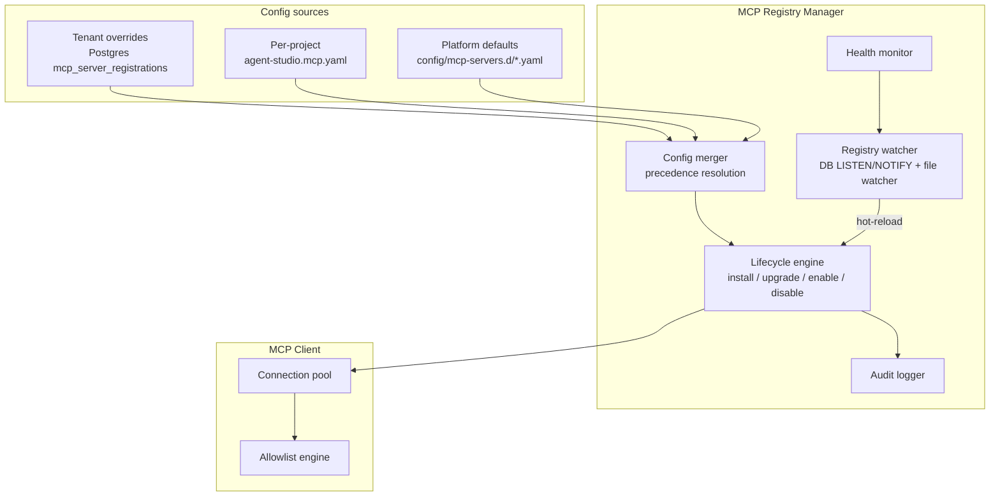

# MCP Registry & Manager

The MCP Registry & Manager is a first-class subsystem that lets operators add, remove, upgrade, enable, and disable MCP servers **without redeploying Agent Studio**. New capabilities — a new enterprise system, a new browser automation server, a new knowledge source — become available as soon as their `McpServerSpec` is registered. The registry sits between the raw transport layer and the agent runtime, acting as the authoritative source of truth for what servers exist and which roles may use which tools.

---

## Architecture overview



---

## Three-layer config precedence

Servers are declared in one of three layered sources. The merger resolves conflicts: **highest priority wins per server name**.

| Priority | Source | Who edits it | When it applies |
|---|---|---|---|
| 1 (highest) | **Tenant DB overrides** — `mcp_server_registrations` table | Tenant admins via Web UI or REST API | Immediately via DB LISTEN/NOTIFY |
| 2 | **Per-project `agent-studio.mcp.yaml`** — checked into the target repo | Project engineers | On next git-clone or pull of the project |
| 3 (lowest) | **Platform defaults** — `config/mcp-servers.d/*.yaml` shipped with Agent Studio | Platform operators (deploy-time) | On Orchestrator restart or file-watcher trigger |

If a server named `playwright` appears in all three sources, the tenant DB entry wins. The project YAML and platform default are shadowed (logged, not applied).

---

## McpServerSpec YAML format

Every registry entry is a typed `McpServerSpec`. Example — the Playwright server as it would appear in `config/mcp-servers.d/playwright.yaml`:

```yaml
name: playwright
version: "^1.46.0"
source:
  kind: npx            # npx | docker | http | binary | git
  package: "@playwright/mcp"
transport: stdio       # stdio | streamable-http | sse
env:
  - name: PLAYWRIGHT_BROWSERS_PATH
    valueFrom:
      secret: playwright-browsers-cache
healthcheck:
  tool: playwright.ping
  intervalMs: 30000
  timeoutMs: 5000
  failureThreshold: 3
allowlist:
  tester:   ["playwright.*"]
  coder:    []
  planner:  []
  reviewer: []
approvalRequired: []
sandbox: docker-playwright
enabled: true
```

Additional fields for other source kinds:

```yaml
# docker source
source:
  kind: docker
  image: ghcr.io/acme/wms-mcp-server:1.2.3
  resourceLimits:
    cpuMillis: 500
    memoryMb: 512
  networkPolicy: egress-allowlist   # references a named network policy

# http source (e.g. central Ruflo)
source:
  kind: http
url: https://ruflo.internal.acme.com/mcp
auth:
  type: bearer
  tokenSecretRef: ruflo-api-token

# git source (community / in-development server)
source:
  kind: git
  repoUrl: https://github.com/acme/custom-mcp-server
  ref: v0.3.1
  buildCommand: npm ci && npm run build
  entrypoint: node dist/server.js
```

---

## Source kinds

| Kind | How it runs | Install step | Notes |
|---|---|---|---|
| `npx` | `npx -y <package>@<version>` spawned per pod | `npm pack` cache warm | Fast; suitable for most stdio servers |
| `docker` | `docker run --rm ...` with resource limits | `docker pull` at install time | Best isolation; required for Playwright sandbox |
| `http` | HTTP/SSE connection to existing endpoint | Health probe only | Ruflo central, user's WMS server, GitHub MCP |
| `binary` | Path to a pre-installed executable | Operator manages install | Air-gapped / compliance scenarios |
| `git` | Clone → build → spawn | `git clone` + `buildCommand` | Community/experimental servers; requires admin approval |

---

## Curated catalog ("MCP Marketplace")

The platform ships with a curated list of known-good servers, pre-populated in `config/mcp-servers.d/`. These are the servers Agent Studio knows how to configure with sensible defaults:

| Server | Default source | Default transport |
|---|---|---|
| Ruflo | `http` | `streamable-http` |
| Git MCP | `npx @modelcontextprotocol/server-git` | `stdio` |
| GitHub MCP | `http` (GitHub-hosted) | `streamable-http` |
| Playwright MCP | `npx @playwright/mcp` | `stdio` |
| Filesystem MCP | `npx @modelcontextprotocol/server-filesystem` | `stdio` |
| Fetch MCP | `npx @modelcontextprotocol/server-fetch` | `stdio` |
| code-review-graph | `docker tirth8205/code-review-graph` | `stdio` |
| ClaudeCode Worker | `binary` (in-tree `deep-coding` package) | `stdio` |
| Knowledge Retrieval | `binary` (in-tree `knowledge` package) | `stdio` |
| Slack | `npx @modelcontextprotocol/server-slack` | `stdio` |
| Confluence | `http` (Atlassian Cloud) | `streamable-http` |
| Jira | `http` (Atlassian Cloud) | `streamable-http` |
| Notion | `npx @notionhq/notion-mcp-server` | `stdio` |

The Web UI presents this catalog as the **MCP Marketplace** view. An operator clicks **Install**, fills in required secrets and config, and the manager writes the registration to the DB, probes health, and makes the tools available immediately. Unlisted servers can be added by pasting a raw `McpServerSpec`.

---

## Lifecycle operations

All lifecycle operations are available via CLI, REST API, and Web UI. They are parity-guaranteed across all three surfaces.

### CLI

```bash
# List registered servers with version, health, and role allowlists
mcp list

# Install from the curated catalog
mcp install playwright

# Add from a raw spec file
mcp add --spec ./my-server.yaml

# Upgrade to latest compatible version (opt-in; never automatic)
mcp upgrade playwright
mcp upgrade playwright --to 1.48.0

# Toggle enabled state (no restart required)
mcp disable playwright
mcp enable playwright

# Remove a server registration (does not uninstall the binary)
mcp remove my-custom-server

# Probe a server, list its advertised tools, show allowlist diff vs registration
mcp test playwright

# Dump the normalised spec with secrets redacted
mcp describe playwright
```

### REST API

```
GET    /api/mcp/servers                    → list all servers
GET    /api/mcp/servers/:name              → describe one server
POST   /api/mcp/servers                    → install / add
PUT    /api/mcp/servers/:name              → update spec
PATCH  /api/mcp/servers/:name/enable       → enable
PATCH  /api/mcp/servers/:name/disable      → disable
DELETE /api/mcp/servers/:name              → remove
POST   /api/mcp/servers/:name/test         → probe health + tool diff
GET    /api/mcp/catalog                    → curated catalog list
```

---

## Version pinning and upgrade safety

Every registration pins a version (semver range, e.g. `"^1.46.0"`). The manager:

1. **Never auto-upgrades.** Operators explicitly run `mcp upgrade`.
2. **Checks upstream** for newer compatible versions and surfaces them in the UI as a badge — "Update available: 1.48.2".
3. **After upgrade** — re-runs the health check and performs an **allowlist diff**:
   - New tools advertised by the server that are not in any role's allowlist → flagged as `DENIED_NEW_TOOL` until an operator explicitly grants them.
   - Removed tools that were in an allowlist → flagged as `ALLOWLIST_STALE`, warning emitted.
4. The allowlist diff is surfaced in `mcp test <name>` output and in the Web UI upgrade modal.
5. Upgrade is staged: the registration is updated in DB, but the running Orchestrator pods reload at next task boundary, not immediately. In-flight tasks continue using the prior version.

This ensures a supply-chain surprise (new tools appearing in a dependency upgrade) cannot silently widen the attack surface.

---

## Runtime hot-reload

The registry watcher monitors two event sources:

**DB LISTEN/NOTIFY (tenant overrides):**
- The Orchestrator subscribes to the `mcp_registry_changed` Postgres channel at startup.
- On `INSERT`, `UPDATE`, or `DELETE` in `mcp_server_registrations`, the notification triggers a re-merge of the config layers.
- The lifecycle engine applies the delta: connect new servers, disconnect removed servers, update allowlists for changed servers.
- **No orchestrator restart required.**

**File watcher (platform defaults + project YAML):**
- A `chokidar` watcher monitors `config/mcp-servers.d/` and the cloned project repo's `agent-studio.mcp.yaml`.
- File changes trigger the same re-merge pipeline.

**In-flight task safety:**
- Running tasks hold a snapshot of the server set at dispatch time (`task.mcpServerSnapshot`).
- Registry changes apply only to tasks dispatched after the reload completes.
- This prevents a mid-task server removal from breaking an in-progress worker.

---

## Parity with the SKILLs loader

The MCP Registry and the [Skills Loader](./skills-loader.md) follow the same mental model:

| Concept | SKILLs | MCP Servers |
|---|---|---|
| Unit | A `SKILL.md` directory | A `McpServerSpec` YAML entry |
| Discovery | Filesystem scan at session start | Registry merge at startup + hot-reload |
| Precedence | tenant > project > platform | tenant DB > project YAML > platform defaults |
| Lifecycle ops | list / install / enable / disable / remove / describe | `mcp list/install/enable/disable/remove/describe` |
| Audit | `skill_loaded`, `skill_shadowed` events | `mcp_registry_mutated` audit log entry |

Operators learn one pattern and apply it to both capabilities.

---

## Audit log

Every registry mutation is written to the append-only `audit_log` with:

| Field | Value |
|---|---|
| `verb` | `mcp_registry_add`, `mcp_registry_update`, `mcp_registry_enable`, `mcp_registry_disable`, `mcp_registry_remove`, `mcp_registry_upgrade` |
| `actor_type` | `'user'` (web UI / CLI), `'system'` (hot-reload from file watcher) |
| `actor_id` | User ID or `'system'` |
| `before` | Prior `McpServerSpec` (null for `add`) |
| `after` | New `McpServerSpec` (null for `remove`) |
| `reason` | Human-supplied reason (required for `remove` and `git`/`binary` installs) |

Registry version is tagged on every MCP call log entry (see [mcp-client.md — Observability](./mcp-client.md#observability)), so a post-hoc question like "which Playwright version produced this failing run?" is answerable from the audit log.

---

## Security posture

The registry is a high-value target: it controls what code runs and what external systems agents can reach. Mitigations:

| Risk | Mitigation |
|---|---|
| Unprivileged user adds malicious server | Tenant-admin-only RBAC on all mutation endpoints |
| Supply-chain attack via `git` or `binary` source | Mandatory human approval for any `source.kind=git` or `source.kind=binary` registration; these are routed through the HITL gate |
| New tools silently widening allowlist after upgrade | Post-upgrade allowlist diff; new tools default to `DENIED`; operator must explicitly grant |
| Secrets leaking into registry rows | Secrets are referenced by name (`valueFrom.secret`) and resolved at spawn time only; never stored in the registration row or any log |
| Container escape via docker-sourced server | Container sandbox defaults applied to every new `docker` server; only operator-approved waivers allow `--privileged` or host mounts |
| Audit tampering | `audit_log` is append-only with DB-level trigger preventing `UPDATE` and `DELETE`; also exported to external log sink |

---

## Related components

- [MCP Client](./mcp-client.md) — consumes the registry to build per-role tool lists
- [Hosting and Deployment](./hosting-and-deployment.md) — registry persistence in Postgres, hot-reload via LISTEN/NOTIFY
- [Human-in-the-Loop](./human-in-the-loop.md) — approval gate for `git`/`binary` sources and `bypassPermissions` workers
- [Web UI](./web-ui.md) — MCP Marketplace UI and health dashboard
- [Skills Loader](./skills-loader.md) — parallel pattern for user-defined capabilities
