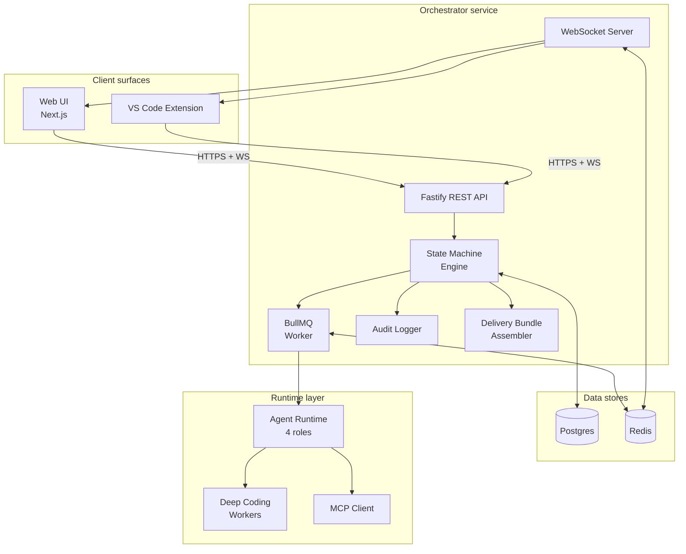
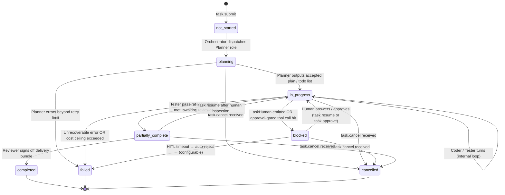

# Orchestrator

The Orchestrator is the central nervous system of Agent Studio. It is a stateless **Fastify** service with a built-in **WebSocket** server. Every other component — agent roles, MCP servers, client surfaces — exists in service of the Orchestrator's primary mission: reliably driving a task from submission to a human-signed-off delivery bundle.

---

## Responsibilities at a glance

| Concern | Detail |
|---|---|
| Task graph management | Stores the directed task graph in Postgres; nodes are tasks, edges are dependency or branching relationships |
| Task queue | BullMQ on Redis — distributes work across Orchestrator replicas with retry, dead-letter, and rate-limiting |
| Event streaming | WebSocket fan-out via Redis pub/sub — every agent event, MCP call, and state transition is forwarded to all connected Web UI and VS Code extension sessions |
| Agent dispatch | Creates and destroys Agent Runtime processes; passes `DispatchEnvelope`s to Deep Coding Workers |
| Task state machine | Owns all state transitions; writes checkpoints atomically with each transition |
| Role routing | Routes between Planner → Coder → Tester → Reviewer based on task phase and success criteria |
| HITL flows | Pauses tasks on `askHuman` events; holds approval-gated MCP calls until user responds |
| Retries | Configurable per-role retry policy with exponential back-off; dead-letter queue for permanently failed tasks |
| Cost ceilings | Enforces per-tenant and per-task token/dollar budgets before dispatching any Claude Code worker |
| Audit log | Append-only log of every state transition, steering verb, MCP approval, and registry mutation |
| Delivery bundle assembly | Coordinates the reviewer role's calls to `code-review-graph` and persists the resulting bundle |

---

## Architecture overview



---

## Task queue (BullMQ on Redis)

Agent dispatch uses BullMQ with a typed job payload. Each job corresponds to a single agent-role turn within a task run.

```
Queue: agent-run
Job data:
  taskId: string
  runId: string
  role: 'planner' | 'coder' | 'tester' | 'reviewer'
  dispatchEnvelope: DispatchEnvelope
  tenantId: string
  projectId: string
  budgetRemaining: { tokens: number, dollarsUsd: number, wallSeconds: number }
```

BullMQ configuration per queue:

| Setting | Value | Rationale |
|---|---|---|
| `attempts` | 3 | Most transient failures resolve within 3 attempts |
| `backoff.type` | `'exponential'` | Avoids thundering herd on provider rate limits |
| `backoff.delay` | 5 000 ms | Base delay; doubles each retry |
| `removeOnComplete` | 1 000 | Keep recent completed jobs for debugging |
| `removeOnFail` | 500 | Dead-letter inspection |
| Concurrency | Configurable per pod | Typically 4–8 concurrent agent runs per Orchestrator pod |

A separate `delivery-bundle` queue handles the reviewer's graph assembly steps asynchronously so they don't block the main run queue.

---

## Event streaming to UI and IDE

Every significant event is published to a Redis channel (`events:task:{taskId}`) and forwarded over WebSocket to all authenticated sessions that have subscribed to that task.

Event envelope:

```typescript
interface TaskEvent {
  id: string;                  // UUID, deduplicated on replay
  taskId: string;
  runId: string;
  role: AgentRole;
  type: TaskEventType;
  payload: unknown;            // typed per event type
  ts: string;                  // ISO-8601
  seq: number;                 // monotonic per task, enables gap detection
}

type TaskEventType =
  | 'state_transition'
  | 'agent_message'
  | 'tool_call'
  | 'tool_result'
  | 'hitl_question'
  | 'hitl_approval_request'
  | 'checkpoint_written'
  | 'cost_update'
  | 'delivery_bundle_ready'
  | 'error';
```

Clients replay missed events on reconnect by sending `{ since: seq }` in the WebSocket handshake. The Orchestrator replays from the Postgres `task_events` table up to a configurable replay window (default: 10 000 events).

---

## Task state machine

The Orchestrator owns the authoritative state of every task. Transitions are written atomically to Postgres using optimistic locking (`version` column). Any replica that tries to write a stale version fails and retries.



### State descriptions

| State | Meaning | Budget consumed? |
|---|---|---|
| `not_started` | Task created, not yet dispatched | No |
| `planning` | Planner role running; producing plan + todo list | Yes |
| `in_progress` | Active agent turns (Coder, Tester, inner loop iterations) | Yes |
| `blocked` | Waiting for human input or approval | No (snapshot taken) |
| `partially_complete` | All tests pass; Reviewer assembling delivery bundle | Yes (reviewer only) |
| `completed` | Human signed off; delivery bundle persisted; PR merged or queued | No |
| `failed` | Irrecoverable error, cost ceiling exceeded, or HITL timeout | No |
| `cancelled` | User hard-stopped the task | No |

### Transition guards

- `planning → in_progress` — requires a non-empty structured plan from the Planner.
- `in_progress → partially_complete` — requires pass-rate ≥ configured threshold AND all `graph.tests_for` items covered.
- `partially_complete → completed` — requires human approval via the HITL primitive AND `delivery_bundle_ready` event recorded.
- Any transition to `failed` — writes a `failure_reason` field; surfaces to both UI surfaces and notifies the user.

---

## Role routing

The Orchestrator routes between the four agent roles in a deterministic phase sequence. Each phase is a BullMQ job. The Orchestrator inspects the result of each job to decide the next phase:

```
Submit → [Planner] → [Coder × N] ⇄ [Tester × M] → [Reviewer] → HITL → Done
```

Routing rules:

1. **Planner** runs exactly once. Its output is a structured plan (list of goals with success criteria) stored in the task record.
2. **Coder** runs for each goal in the plan. If a coder turn fails, the Orchestrator retries (up to the retry limit) before escalating to HITL.
3. **Tester** runs after each coder commit batch. If tests fail, control returns to Coder with the failure context in the `DispatchEnvelope`. This inner loop repeats up to `maxIterations`.
4. **Reviewer** runs once all tester thresholds are met. It assembles the delivery bundle via `code-review-graph` and presents it to the human for sign-off.

---

## HITL flows

The Orchestrator is the single point of truth for all human interactions. Two trigger paths:

**Path A — `askHuman` from an agent role:**
1. Agent emits `{ type: 'hitl_question', question: string, schema: JSONSchema, questionId: UUID }`.
2. Orchestrator transitions task to `blocked`, records the question in `task_hitl_questions` table.
3. Both Web UI and VS Code extension receive a `hitl_question` WebSocket event and surface the question with the typed form matching `schema`.
4. User submits an answer; the REST endpoint `POST /tasks/:id/hitl/:questionId/answer` records it and publishes a `task.resume` event.
5. Orchestrator resumes the BullMQ job from the checkpoint, passing the answer in `DispatchEnvelope.memoryContext`.

**Path B — approval-gated MCP tool call:**
1. MCP client intercepts a call to a tool marked `requiresApproval: true` (e.g. `git.push`, `github.merge_pr`).
2. MCP client emits `{ type: 'hitl_approval_request', tool, args, riskLevel }` to the Orchestrator.
3. Orchestrator transitions task to `blocked` and notifies both surfaces.
4. User approves or rejects via `POST /tasks/:id/hitl/:approvalId/approve` or `.../reject`.
5. On approval: MCP client forwards the call; result flows back to the agent. On rejection: agent receives a structured rejection error and decides next step.
6. Approval decision is recorded to the audit log with actor, timestamp, and tool arguments (sanitised of secrets).

**Timeout handling:** If no response arrives within the configured window (default: 24 hours, configurable per tenant), the Orchestrator either auto-rejects (safe default) or escalates to a secondary approver as configured. Timeout decisions are also audit-logged.

---

## Retries and error handling

```
Per-role retry budget (configurable in agent-studio.config.ts):
  planner:  maxAttempts=2,  backoff=exponential(5s)
  coder:    maxAttempts=3,  backoff=exponential(5s)
  tester:   maxAttempts=3,  backoff=exponential(10s)  # Playwright infra sometimes flaky
  reviewer: maxAttempts=2,  backoff=exponential(5s)
```

On exhausting retries for a non-HITL-able failure:
- Task transitions to `failed`.
- `failure_reason` is populated with the last error, exit reason, and run ID.
- User is notified via WebSocket.
- The task can be manually retried via `task.resume` after human inspection.

On exceeding the cost ceiling:
- Orchestrator cancels the in-flight BullMQ job.
- Sends `AbortSignal` to any in-process `query()` sessions.
- Kills sandboxed worker k8s Jobs via the Kubernetes API.
- Transitions task to `failed` with `failure_reason: 'cost_ceiling_exceeded'`.

---

## Cost ceilings

Cost is tracked per task and per tenant. Before dispatching any Claude Code worker:

1. Orchestrator reads the task's current `totalTokensUsed` and `totalDollarsUsed` from Postgres.
2. Compares against `task.budgetCeiling` (set at submission, adjustable via `task.set_budget`).
3. Compares tenant aggregate for the billing period against `tenant.costCeiling` from the tenant settings table.
4. If either limit would be exceeded by the estimated next dispatch, the task transitions to `blocked` (for human approval to raise the budget) or `failed` (if `onBudgetExhaust: 'fail'` is configured).

Every Claude Code worker dispatch reports actual token usage back to the Orchestrator on completion; the Orchestrator writes a `cost_update` event and updates the task record.

---

## Audit log

Every consequential action is written to the `audit_log` table (append-only; no updates or deletes):

| Column | Description |
|---|---|
| `id` | UUID |
| `ts` | Timestamp with time zone |
| `tenant_id` | Tenant scope |
| `project_id` | Project scope |
| `task_id` | Task scope (nullable for registry mutations) |
| `actor_type` | `'user'` \| `'agent'` \| `'system'` |
| `actor_id` | User ID, agent role + run ID, or `'orchestrator'` |
| `verb` | The action taken (e.g. `state_transition`, `hitl_approved`, `mcp_registry_add`) |
| `before` | JSONB snapshot of previous state (nullable) |
| `after` | JSONB snapshot of new state |
| `reason` | Free-text reason or error message |

The audit log is queryable from the Web UI under **Settings → Audit Log** and is exported to the tenant's configured log sink (e.g. CloudWatch, Datadog, Splunk).

---

## Delivery bundle assembly

When the Reviewer role completes its graph analysis pass, the Orchestrator's Delivery Bundle Assembler collects the outputs and persists them as a structured JSONB blob against the task record:

```typescript
interface DeliveryBundle {
  taskId: string;
  assembledAt: string;
  impactRadius: ImpactRadiusResult;    // from graph.impact_radius
  testsFor: TestsForResult;            // from graph.tests_for
  detectChanges: DetectChangesResult;  // from graph.detect_changes (risk-scored)
  wiki: WikiGenerateResult;            // from graph.wiki_generate (markdown)
  visualizeUrl: string;                // served HTML from graph.visualize
  partial: boolean;                    // true if code-review-graph was unavailable
  humanApprovedAt?: string;
  humanApprovedBy?: string;
}
```

The bundle is surfaced on the **Delivery** tab of the Web UI and accessible from VS Code. The `partial: true` flag is set and a warning banner shown whenever `code-review-graph` was unreachable during assembly.

---

## Configuration reference

Key Orchestrator settings in `agent-studio.config.ts`:

```typescript
orchestrator: {
  port: 3001,
  websocket: { path: '/ws', pingIntervalMs: 30_000 },
  queue: {
    redis: { url: env('REDIS_URL') },
    concurrency: 6,
    stalledInterval: 30_000,
  },
  retries: {
    planner: { maxAttempts: 2, backoffMs: 5_000 },
    coder:   { maxAttempts: 3, backoffMs: 5_000 },
    tester:  { maxAttempts: 3, backoffMs: 10_000 },
    reviewer:{ maxAttempts: 2, backoffMs: 5_000 },
  },
  hitl: {
    defaultTimeoutMs: 86_400_000,  // 24 hours
    onTimeout: 'auto_reject',      // 'auto_reject' | 'escalate'
  },
  costCeiling: {
    onExhaust: 'block_for_approval',  // 'block_for_approval' | 'fail'
  },
}
```

---

## Related components

- [Agent Runtime](./agent-runtime.md) — the four roles dispatched by the Orchestrator
- [Task State](./task-state.md) — detailed state machine semantics, checkpoints, rollback
- [Execution Control](./execution-control.md) — pause/resume/inject/cancel/branch verbs
- [Human-in-the-Loop](./human-in-the-loop.md) — `askHuman` primitive, approval gates
- [Deep Coding Workers](./deep-coding-workers.md) — inner loop dispatch
- [Delivery Bundle](./delivery-bundle.md) — reviewer artifact assembly
- [Hosting and Deployment](./hosting-and-deployment.md) — Redis, Postgres, k8s topology
