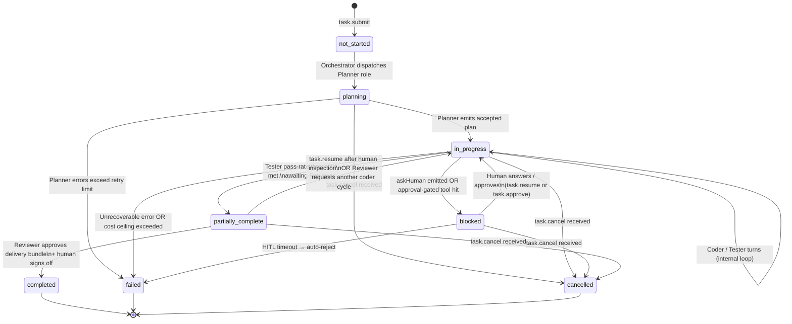

# Task State

Task state is the authoritative record of where a task is in its lifecycle. The Orchestrator owns the state machine; every transition is written atomically to Postgres, a checkpoint is snapshotted, and an event is emitted to all connected surfaces. No component changes task state directly — they emit signals, and the Orchestrator applies transitions.

---

## State machine diagram



---

## States

| State | Meaning | Budget consumed? | Checkpoint written? |
|---|---|---|---|
| `not_started` | Task record created; not yet dispatched to any role | No | No (creation record only) |
| `planning` | Planner role running; decomposing the business requirement | Yes | Yes — at entry |
| `in_progress` | Active agent turns: Coder, Tester, inner loop iterations | Yes | Yes — after each worker run |
| `blocked` | Waiting for human input or approval | No | Yes — snapshot at transition |
| `partially_complete` | All test thresholds met; Reviewer assembling Delivery Bundle | Yes (Reviewer only) | Yes — after each graph step |
| `completed` | Human signed off; Delivery Bundle persisted; PR queued or merged | No | Yes — final checkpoint |
| `failed` | Irrecoverable error, cost ceiling, or HITL timeout | No | Yes — with `failure_reason` |
| `cancelled` | User hard-stopped the task | No | Yes — with `cancelled_at` and `cancelled_by` |

---

## What happens at each transition

### `not_started → planning`

Triggered by the Orchestrator after `task.submit` is processed by BullMQ.

1. **Write** `tasks.status = 'planning'` with optimistic lock (`version` column CAS).
2. **Checkpoint** — write initial checkpoint: `{ status: 'planning', plan: null, goals: [] }`.
3. **Emit** `state_transition` event: `{ from: 'not_started', to: 'planning' }`.
4. **Dispatch** Planner role job to BullMQ `agent-run` queue.
5. **Memory** — Planner pre-fetches `memory.search(businessRequirement)` from Ruflo.

### `planning → in_progress`

Triggered when the Planner role emits a non-empty structured plan.

1. **Validate** plan structure (array of `{ goal, successCriteria }`; at least one goal).
2. **Write** `tasks.status = 'in_progress'`, `tasks.plan = plan`.
3. **Checkpoint** — `{ status: 'in_progress', plan, completedGoals: [], currentGoalIndex: 0 }`.
4. **Emit** `state_transition` + `plan_accepted` events.
5. **Dispatch** first Coder role job.
6. **Memory** — write `memory.store(scope, 'plan', plan)` to Ruflo.

### `in_progress → in_progress` (internal loop)

After each Coder or Tester worker turn completes:

1. **Write** updated progress fields: `completedGoals`, `currentGoalIndex`, `iterationCount`.
2. **Checkpoint** — full snapshot including the latest diff, todo list, test results.
3. **Emit** `checkpoint_written` event (triggers Web UI checkpoint badge update).
4. **Route** — Orchestrator decides next job: another Coder turn, a Tester turn, or Reviewer dispatch.

### `in_progress → blocked`

Triggered by two paths (see [human-in-the-loop.md](./human-in-the-loop.md)):

**Path A — `askHuman` from an agent role:**
1. **Wait** for the current in-flight tool call to complete (pause is honored at tool-call boundary).
2. **Write** `tasks.status = 'blocked'`, `tasks.blocked_reason = 'hitl_question'`.
3. **Write** `task_hitl_questions` record with `{ questionId, question, schema, askedAt }`.
4. **Checkpoint** — full session snapshot including pending question.
5. **Emit** `hitl_question` event to all surfaces.
6. **Cancel** any further BullMQ job dispatch for this task.

**Path B — approval-gated MCP tool call:**
1. MCP client intercepts the call before forwarding.
2. Emits `hitl_approval_request` to Orchestrator.
3. Steps 2–6 above with `blocked_reason = 'approval_required'`.

### `blocked → in_progress`

Triggered by `task.resume` or `task.approve`:

1. **Write** `tasks.status = 'in_progress'`.
2. **Write** answer/decision to `task_hitl_questions` or `hitl_approvals` table.
3. **Load** checkpoint to restore agent context.
4. **Inject** answer into the next `DispatchEnvelope.memoryContext`.
5. **Emit** `state_transition` event.
6. **Re-dispatch** BullMQ job from the checkpoint.

### `in_progress → partially_complete`

Triggered when the Tester role reports pass-rate ≥ threshold and all `graph.tests_for` items covered.

1. **Write** `tasks.status = 'partially_complete'`.
2. **Checkpoint** — includes final test report and coverage data.
3. **Emit** `state_transition` + `tests_passed` events.
4. **Dispatch** Reviewer role job.

### `partially_complete → completed`

Triggered after human approves the Delivery Bundle and the PR is created.

1. **Write** `tasks.status = 'completed'`, `tasks.completed_at = now()`.
2. **Write** `tasks.delivery_bundle.human_approved_at` and `human_approved_by`.
3. **Checkpoint** — final, immutable.
4. **Emit** `state_transition` + `delivery_bundle_signed_off` events.
5. **Memory** — Reviewer writes `pattern.store` to Ruflo: what worked, for future runs.

### Any state → `failed`

1. **Write** `tasks.status = 'failed'`, `tasks.failure_reason = { code, message, runId, lastError }`.
2. **Checkpoint** — with failure context.
3. **Emit** `state_transition` + `task_failed` events.
4. **Kill** any in-flight sandboxed workers via k8s Job API.
5. **Cancel** any in-process `query()` sessions via `AbortSignal`.

### Any state → `cancelled`

1. **Write** `tasks.status = 'cancelled'`, `tasks.cancelled_at`, `tasks.cancelled_by`.
2. **Hard-stop** sandboxed workers and in-process sessions (same as `failed`).
3. **Checkpoint** — final.
4. **Emit** `state_transition` + `task_cancelled` events.
5. **Approval-gated tool calls** in flight are **not executed** — the approval is voided.

---

## The blocked state in detail

`blocked` is the most complex state. It covers two distinct sub-cases, both represented by `blocked_reason`:

```typescript
type BlockedReason =
  | 'hitl_question'       // agent called askHuman()
  | 'approval_required'   // MCP client intercepted an approval-gated tool call
  | 'cost_ceiling'        // budget exhausted; awaiting budget raise
  | 'pause_requested';    // user issued task.pause
```

**`clarification_needed` event schema** (for `hitl_question`):

```typescript
interface HitlQuestion {
  questionId: string;    // UUID
  taskId: string;
  runId: string;
  role: AgentRole;
  question: string;      // natural language
  schema: JSONSchema;    // typed shape of the expected answer
  askedAt: string;
  timeoutMs: number;     // escalation threshold
  context?: string;      // additional context the agent wants to show the human
}
```

**Automatic resume on answer:** Once the user POSTs an answer to `/api/tasks/:id/hitl/:questionId/answer`, the Orchestrator validates the answer against `schema` and immediately re-dispatches the BullMQ job from the snapshot. No manual resume required for `hitl_question` — the answer itself is the resume trigger.

---

## Pause semantics

`task.pause` is a graceful stop. The pause is **honored at the next tool-call boundary**, not immediately. This guarantees:

- An in-flight MCP tool call (e.g. a file write or an API call) is allowed to complete before the snapshot.
- No partial writes are left in external systems.
- The checkpoint is taken at a consistent state.

Implementation:
1. Orchestrator sets an in-memory `pauseRequested` flag on the task context.
2. The deep-coding worker checks this flag before each tool call.
3. On the next flag check: worker exits with `exitReason: 'cancelled'`.
4. Outer role receives `WorkerResult{ exitReason: 'cancelled' }` and emits `task.blocked` with `blocked_reason: 'pause_requested'`.

The task remains in `blocked` until `task.resume` is called. Budget stops accumulating immediately (no further tool calls).

---

## Checkpoint structure

A checkpoint is a snapshot of all state needed to resume without data loss:

```typescript
interface TaskCheckpoint {
  id: string;              // UUID
  taskId: string;
  createdAt: string;
  triggerEvent: string;    // which event triggered this checkpoint
  status: TaskStatus;
  plan: PlanGoal[];
  completedGoals: string[];
  currentGoalIndex: number;
  iterationCount: number;
  pendingQuestion?: HitlQuestion;
  lastDiff?: string;       // unified diff of last worker run
  lastTodoList?: TodoItem[];
  testResults?: TestReport;
  mcpServerSnapshot: McpServerSpec[];  // servers active at this point
  budgetSnapshot: {
    totalTokensUsed: number;
    totalDollarsUsed: number;
    budgetCeiling: BudgetCeiling;
  };
}
```

Checkpoints are stored in the `task_checkpoints` table (append-only). The task record points to `current_checkpoint_id`.

---

## Rollback and branch semantics

**Rollback (`task.rollback`):**
1. User selects a prior checkpoint from the UI (visible in the checkpoint timeline).
2. Orchestrator loads the selected checkpoint.
3. Task transitions to `blocked` with `blocked_reason: 'pause_requested'` and the checkpoint restored.
4. User resumes via `task.resume`; the task continues from the rollback point.
5. Any checkpoints after the rollback point are retained (not deleted) — they become orphaned history for audit purposes.

**Branch (`task.branch`):**
1. A new task record is created with a copy of the selected checkpoint as its initial state.
2. The new task is linked to the original via `parent_task_id`.
3. The original task continues undisturbed on its own branch.
4. Both tasks are visible in the UI, linked as a branch pair.

Branches are useful for A/B exploration at the outer task level (vs. the inner parallel dispatch handled by the Reviewer role).

---

## All transitions persisted for audit

Every state transition is written to the `audit_log` table with:

```
verb: 'state_transition'
before: { status: <prior>, checkpointId: <prior checkpoint id> }
after: { status: <new>, checkpointId: <new checkpoint id> }
actor_type: 'agent' | 'user' | 'system'
actor_id: <role name + run ID, or user ID>
reason: <trigger description>
```

This means the complete history of every task is reconstructible from the audit log alone.

---

## Related components

- [Orchestrator](./orchestrator.md) — owns and enforces the state machine
- [Execution Control](./execution-control.md) — steering verbs that trigger transitions
- [Human-in-the-Loop](./human-in-the-loop.md) — the `askHuman` primitive that causes `blocked` transitions
- [Deep Coding Workers](./deep-coding-workers.md) — workers write results that drive `in_progress` loop
- [Delivery Bundle](./delivery-bundle.md) — `partially_complete → completed` gate
