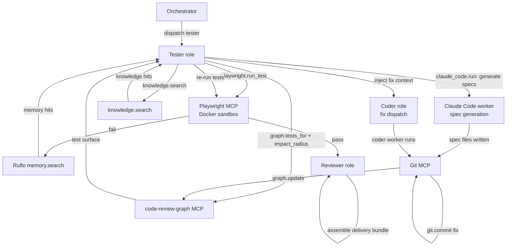

# Testing Pipeline

The testing pipeline is the feedback loop that validates agent-produced code before it reaches the reviewer and the human. It is driven by the **Tester role**, uses `code-review-graph` to determine exactly what to test, and uses **Playwright MCP** (inside a Docker sandbox) for execution. On failure, the pipeline consults Ruflo memory and the knowledge retrieval layer before dispatching fixes — avoiding redundant re-invention of known solutions.

---

## Overview



---

## Step 1 — Determine the test surface via `code-review-graph`

The Tester role does **not** guess which tests to run. It calls `code-review-graph` to get the exact set:

```typescript
// Tester role — determine test surface
const changedNodes = await git.log({ since: task.baseRef, format: 'nodes' });

const testSurface = await mcpClient.callTool('graph.tests_for', {
  nodes: changedNodes,
});
// → { testFiles: ['tests/wms/orders.spec.ts', ...], testIds: [...], coverageGaps: [...] }

const impactedNodes = await mcpClient.callTool('graph.impact_radius', {
  nodes: changedNodes,
});
// → { directCallers: [...], transitiveCallers: [...], totalImpactedNodes: 42 }

// Expand the test surface to cover impacted nodes too
const fullTestSurface = union(testSurface.testIds, impactedTestsFor(impactedNodes));
```

`coverageGaps` (nodes with no existing tests) is surfaced in the task's HITL question if test generation is required — the Tester dispatches a spec-generation worker before running Playwright.

---

## Step 2 — Generate or update spec files

If the test surface includes new nodes with no existing specs (`coverageGaps` is non-empty), the Tester dispatches a Claude Code worker to write the spec files:

```typescript
const specGenResult = await mcpClient.callTool('claude_code.run', {
  goal: `Generate Playwright spec files covering: ${coverageGaps.join(', ')}`,
  workspace: { path: task.workspacePath, writableGlobs: ['tests/**/*.spec.ts'] },
  successCriteria: { tests: [] },   // no automated check; spec files just need to exist
  toolBudget: { maxToolCalls: 50, maxTokens: 20_000, maxWallSeconds: 300 },
  mcpServers: [filesystemMcp, gitMcp],
  permissionMode: 'acceptEdits',
  memoryContext: [],
  knowledgeContext: [],
  returnShape: 'diff',
});
```

The worker writes the spec files, and the Tester commits them via `git.commit` before running Playwright.

---

## Step 3 — Execute tests via Playwright MCP (Docker sandbox)

Playwright runs inside a Docker sandbox with a headful or headless browser. The Tester calls:

```typescript
const testRun = await mcpClient.callTool('playwright.run_test', {
  specFiles: fullTestSurface.testFiles,
  testIds: fullTestSurface.testIds,
  config: { browser: 'chromium', headless: true, timeout: 30_000 },
  reportFormat: ['html', 'json'],
});
// → { passCount, failCount, skippedCount, reportUrl, screenshotUrls, jsonReport }
```

The Playwright MCP server (`@playwright/mcp` or equivalent) runs as a stdio child process of the Orchestrator, but the browser itself runs inside a Docker container to isolate it from the host. The HTML and JSON reports are stored as task artifacts and linked from the task record.

Screenshots of failures are captured automatically and surfaced in the Web UI test results panel.

---

## Step 4 — Evaluate results

```typescript
const passRate = testRun.passCount / (testRun.passCount + testRun.failCount);
const coverageMet = testRun.coveragePct >= task.config.minCoveragePct;

if (passRate >= task.config.minPassRate && coverageMet) {
  // → proceed to Reviewer
  await orchestrator.transition(taskId, 'partially_complete');
} else if (iterationCount >= task.config.maxTestIterations) {
  // → block for HITL
  await orchestrator.askHuman({ question: 'Tests did not pass within iteration limit', schema: { ... } });
} else {
  // → failure handling loop
  await handleFailures(testRun.failures);
}
```

Default thresholds (configurable per task):

| Threshold | Default value |
|---|---|
| `minPassRate` | 1.0 (100% — all tests must pass) |
| `minCoveragePct` | 80 |
| `maxTestIterations` | 5 |

---

## Step 5 — Failure handling: memory + knowledge before fix dispatch

On test failure, the Tester follows a retrieval-first strategy **before** dispatching a fix to the Coder. This ensures known solutions surface cheaply without burning another full coder iteration:

```typescript
async function handleFailures(failures: TestFailure[]): Promise<void> {
  const failureDescription = summariseFailures(failures);

  // 1. Check Ruflo for prior solutions to similar failures
  const memoryHits = await memoryClient.recall(failureDescription, 5);

  // 2. Check the knowledge layer (web / Confluence / SharePoint / GitHub)
  const knowledgeHits = await mcpClient.callTool('knowledge.search', {
    query: failureDescription,
    sources: ['web', 'github', 'confluence'],
    topK: 5,
  });

  // 3. Assemble fix context with retrieved solutions
  const fixContext = {
    failures,
    memoryHits,
    knowledgeHits,
    testReport: testRun.jsonReport,
    graphContext: impactedNodes,
  };

  // 4. Request Coder role to apply fixes (via Orchestrator — not a direct call)
  await orchestrator.requestCoderFix({
    taskId,
    fixContext,
    goal: `Fix failing tests: ${failures.map(f => f.testId).join(', ')}`,
  });
}
```

The Orchestrator routes the fix request to the Coder role, which dispatches a new Claude Code worker with the enriched fix context. This keeps the Tester and Coder roles cleanly separated — the Tester identifies what failed and provides context; the Coder owns the fix implementation.

---

## Step 6 — Graph update after each commit

After the Coder commits a fix, the Orchestrator calls `graph.update` before dispatching the next Tester turn:

```typescript
// Orchestrator — after each coder fix commit
await mcpClient.callTool('graph.update', {
  changedFiles: coderResult.changedFiles,
  commitRef: newCommitSha,
});
```

`graph.update` completes in under ~2 seconds on multi-thousand-file repos, so the graph is continuously in sync with agent output. The next Tester iteration starts with an up-to-date graph and may have a different test surface if the fix changed the dependency structure.

---

## Step 7 — Loop exit conditions

The testing loop exits in one of three ways:

| Condition | Action |
|---|---|
| `passRate >= minPassRate` AND `coveragePct >= minCoveragePct` | Transition to `partially_complete`; dispatch Reviewer role |
| `iterationCount >= maxTestIterations` | Transition to `blocked`; `askHuman` with full test history and final report |
| `exitReason === 'cost_ceiling'` from any worker | Transition to `blocked`; surface budget exhaustion for human decision |

When the loop exits due to max iterations, the HITL question includes:
- The final test report HTML link
- A summary of which failures persist
- Memory and knowledge hits that were retrieved but not sufficient
- The option to: raise `maxTestIterations`, lower `minPassRate`, or override with a manual fix

---

## Step 8 — Final review builds Delivery Bundle

After the loop exits successfully (`partially_complete`), the Orchestrator dispatches the Reviewer role. The Reviewer re-uses the `testsFor` result from the Tester's last successful run as part of the Delivery Bundle assembly (see [delivery-bundle.md](./delivery-bundle.md)). The PR is opened only after the human approves the bundle — it is gated via the HITL `github.create_pr` approval.

---

## Docker sandbox configuration

Playwright runs in a Docker container with these constraints:

```yaml
# Sandbox profile: docker-playwright
image: mcr.microsoft.com/playwright:v1.46.0-jammy
resourceLimits:
  cpuMillis: 2000
  memoryMb: 2048
  maxWallSeconds: 600
network:
  egress:
    - host: localhost   # Playwright communicates with the test server over loopback
    - host: "*.internal.acme.com"  # application under test (configurable)
volumes:
  - type: bind
    source: task.workspacePath
    target: /workspace
    readonly: false     # Playwright writes screenshots and reports here
```

The Playwright container has **no internet access** except to the application under test. The application server itself runs as a second container in the same task network namespace, spun up by the Coder via a `scripts/start-dev.sh` invocation through the Filesystem MCP.

---

## Observability

All test runs are recorded:

```typescript
interface TestRunRecord {
  id: string;
  taskId: string;
  iteration: number;
  specFiles: string[];
  passCount: number;
  failCount: number;
  skippedCount: number;
  coveragePct: number;
  reportUrl: string;
  screenshotUrls: string[];
  memoryHitsUsed: number;
  knowledgeHitsUsed: number;
  wallMs: number;
  playwrightVersion: string;
}
```

Test history is visible in the Web UI task detail page under the **Tests** tab, showing a timeline of all iterations with pass/fail counts and the evolution of coverage.

---

## Related components

- [Agent Runtime](./agent-runtime.md) — Tester role logic
- [Deep Coding Workers](./deep-coding-workers.md) — Claude Code workers for spec generation and fix dispatch
- [MCP Client](./mcp-client.md) — routes `playwright.*`, `graph.*`, and `knowledge.*` calls
- [Delivery Bundle](./delivery-bundle.md) — Reviewer uses `testsFor` output from the final test run
- [Human-in-the-Loop](./human-in-the-loop.md) — HITL gate at max iterations and on PR creation
