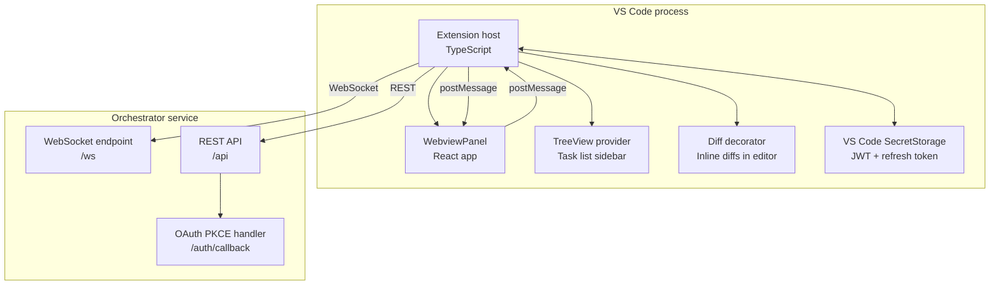
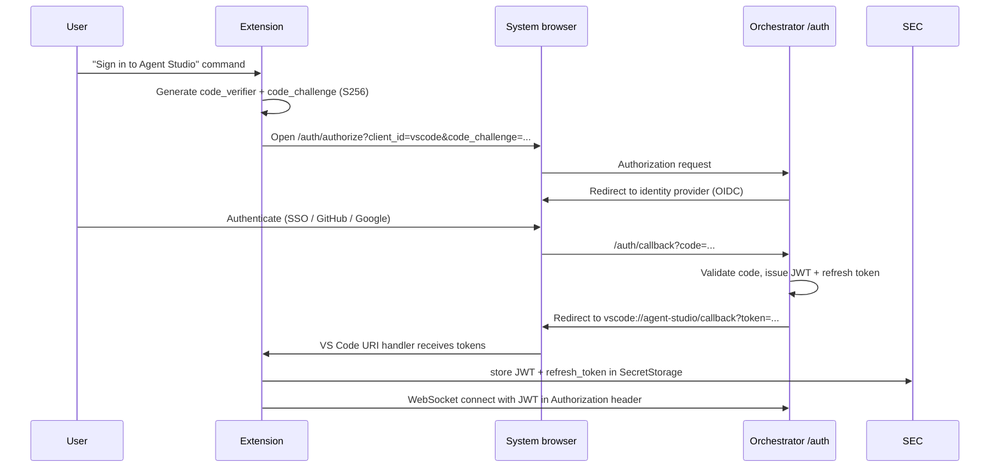

# VS Code Extension

The Agent Studio VS Code extension is a **thin client** that opens a persistent WebSocket to the hosted Orchestrator and provides a native IDE experience for submitting, monitoring, and steering tasks — without running any agent logic locally. It is a peer of the Web UI: both surfaces use the same REST and WebSocket API, the same session token, and the same event stream.

---

## Design principles

| Principle | Implication |
|---|---|
| No local agent execution | Extension is a display and control surface only; no LLM calls, no MCP connections |
| Session parity with Web UI | One user can start a task in the browser, steer it from VS Code, and approve from their phone |
| Same transport | WebSocket for live events; REST for imperative commands; identical to Web UI |
| Authoritative state on server | If both surfaces are open simultaneously, they show the same state; no client-side divergence |
| Offline graceful | Extension degrades to showing last-known state when WebSocket is disconnected; reconnects automatically |

---

## Component diagram



---

## Authentication: OAuth PKCE → JWT

The extension uses the OAuth 2.0 PKCE flow to obtain a short-lived JWT:



The JWT is short-lived (default: 1 hour). The extension silently refreshes it using the `refresh_token` stored in `SecretStorage` before expiry. No token is ever written to disk in plaintext, stored in `settings.json`, or logged.

Tokens are scoped to `{ tenantId, projectId, userId }` — the same triple as the web session — so switching between extension and browser doesn't require re-authentication.

---

## WebSocket: live event stream

The extension maintains a single persistent WebSocket connection per authenticated session:

```typescript
// packages/vscode-extension/src/connection.ts

class OrchestratorConnection {
  private ws: WebSocket;
  private reconnectDelay = 1000;

  async connect(token: string): Promise<void> {
    this.ws = new WebSocket(`wss://studio.acme.com/ws`, {
      headers: { Authorization: `Bearer ${token}` },
    });

    this.ws.on('message', (raw) => {
      const event = JSON.parse(raw) as TaskEvent;
      this.eventBus.emit(event.type, event);
    });

    this.ws.on('close', () => this.scheduleReconnect());
    this.ws.on('error', () => this.scheduleReconnect());
  }

  // Subscribe to a task's event stream
  subscribe(taskId: string, since?: number): void {
    this.ws.send(JSON.stringify({ type: 'subscribe', taskId, since }));
  }
}
```

On reconnect, the extension sends `{ since: lastSeenSeq }` to replay missed events from the Postgres `task_events` table. This ensures the UI is consistent even after a network interruption.

---

## REST: imperative commands

All steering verbs are sent as REST calls:

```typescript
// packages/vscode-extension/src/api-client.ts

class ApiClient {
  async pauseTask(taskId: string, reason: string): Promise<void> {
    await this.post(`/api/tasks/${taskId}/pause`, { reason });
  }

  async approveHitl(taskId: string, questionId: string, answer: unknown): Promise<void> {
    await this.post(`/api/tasks/${taskId}/hitl/${questionId}/approve`, { answer });
  }

  async submitTask(spec: TaskSubmitRequest): Promise<{ taskId: string }> {
    return this.post('/api/tasks', spec);
  }
  // ... all verbs from execution-control.md
}
```

REST calls use a short-lived JWT with automatic refresh. If the JWT expires mid-call, the client refreshes it and retries once.

---

## UI surfaces in VS Code

### Task list sidebar (TreeView)

A `TreeDataProvider` in the Activity Bar shows all tasks for the current project:

```
AGENT STUDIO
├── In Progress
│   ├── [●] Add inventory alerts (42 min)  → task-abc123
│   └── [●] Refactor WMS order handler (8 min)  → task-def456
├── Blocked — Awaiting Review
│   └── [⚠] Update config schema  → task-ghi789
├── Completed (today)
│   └── [✓] Add order status endpoint
└── Failed
    └── [✗] Migrate legacy reports
```

Clicking a task opens the **Task Detail WebviewPanel**.

### Task detail WebviewPanel

A React app (bundled into the extension) that mirrors the Web UI's task detail page:

| Tab | Content |
|---|---|
| **Overview** | Task title, status, budget used, timeline |
| **Plan** | Structured plan goals with status badges |
| **Transcripts** | Agent messages, tool calls (streaming in real time via WebSocket) |
| **Tests** | Test run history with pass/fail counts; links to HTML reports |
| **Delivery** | Delivery Bundle viewer (loads `graph.visualize` HTML in iframe); approve/reject buttons |
| **MCP Log** | Every tool call across all servers with latency and result |
| **Control** | Pause / Resume / Cancel / Inject Context / Set Budget |

The Webview communicates with the extension host via `postMessage`. The extension host makes all API calls and forwards events; the Webview is stateless and driven entirely by messages.

### Inline diff decorator

When a task produces a diff (after a Coder worker run), the extension applies VS Code `TextEditorDecorationType` markers:

- Green gutter marks for added lines
- Red gutter marks for removed lines
- A CodeLens above each changed function with the task ID and a link to the task detail panel

The diff is fetched from the Orchestrator's `GET /api/tasks/:id/diff` endpoint and applied to the currently open editor files.

### HITL approval prompt

When a `hitl_question` or `hitl_approval_request` event arrives:

1. A VS Code notification popup appears: *"Agent Studio: Human input required for task 'Add inventory alerts'"*.
2. The notification has **Review** and **Dismiss** buttons.
3. **Review** opens the Task Detail Webview at the HITL panel.
4. The HITL panel renders the question with the typed form matching `schema` (text input, select, checkbox, etc.).
5. Submitting the form calls the REST endpoint and the notification clears.

If the Webview is already open, the HITL panel becomes active without a new notification.

---

## Parity matrix with Web UI

Every feature is available from both surfaces. This table is the contract that prevents drift.

| Feature | Web UI | VS Code Extension |
|---|---|---|
| Task submission | ✓ Form | ✓ Command palette + form |
| Live task list | ✓ Dashboard | ✓ Sidebar TreeView |
| Agent transcripts (streaming) | ✓ | ✓ Webview panel |
| MCP call log | ✓ | ✓ Webview panel tab |
| Knowledge hit inspector | ✓ | ✓ Webview panel tab |
| Memory browser | ✓ | ✓ Webview panel tab |
| HITL approval queue | ✓ | ✓ Notification + Webview |
| Delivery Bundle viewer | ✓ | ✓ Webview panel tab |
| Delivery Bundle approval | ✓ | ✓ Webview panel tab |
| Inline diff decoration | — | ✓ Editor gutter marks |
| Pause / Resume / Cancel | ✓ | ✓ |
| Inject context | ✓ | ✓ (can inject selected editor text) |
| Override plan | ✓ | ✓ |
| Branch / Rollback | ✓ | ✓ |
| Set budget | ✓ | ✓ |
| MCP server health dashboard | ✓ | ✓ Webview panel |
| MCP Marketplace (install/upgrade) | ✓ | ✓ Webview panel |
| Run history | ✓ | ✓ |
| Audit log view | ✓ | Read-only Webview |

Features marked **—** are intentionally absent (inline diff decoration is IDE-specific; MCP Marketplace install form requires desktop-class width).

---

## Session bridging

If a user has both the Web UI and the VS Code extension open simultaneously:

- Both are subscribed to the same `events:task:{taskId}` Redis channel.
- Both receive identical `TaskEvent` objects in the same order (monotonic `seq`).
- State updates (e.g. HITL approval in VS Code) are immediately reflected in the Web UI via the next event.
- There is **no** client-side authoritative state — all state lives on the server.

If a user approves a HITL question in the Web UI, the VS Code extension receives the `state_transition` event from `blocked` to `in_progress` and clears its HITL notification automatically.

---

## Extension manifest (key capabilities)

```json
{
  "name": "agent-studio",
  "displayName": "Agent Studio",
  "contributes": {
    "commands": [
      { "command": "agentStudio.signIn", "title": "Agent Studio: Sign In" },
      { "command": "agentStudio.submitTask", "title": "Agent Studio: Submit Task" },
      { "command": "agentStudio.pauseTask", "title": "Agent Studio: Pause Task" },
      { "command": "agentStudio.openTaskDetail", "title": "Agent Studio: Open Task Detail" }
    ],
    "views": {
      "activitybar": [{ "id": "agentStudio.taskList", "name": "Agent Studio" }]
    },
    "viewsContainers": {
      "activitybar": [{ "id": "agentStudio", "title": "Agent Studio", "icon": "resources/icon.svg" }]
    }
  },
  "activationEvents": ["onStartupFinished"]
}
```

---

## Related components

- [Web UI](./web-ui.md) — peer surface; parity matrix maintained jointly
- [Orchestrator](./orchestrator.md) — WebSocket and REST server the extension connects to
- [Human-in-the-Loop](./human-in-the-loop.md) — HITL events the extension surfaces
- [Execution Control](./execution-control.md) — steering verbs the extension exposes
- [Delivery Bundle](./delivery-bundle.md) — Delivery tab in the extension Webview
