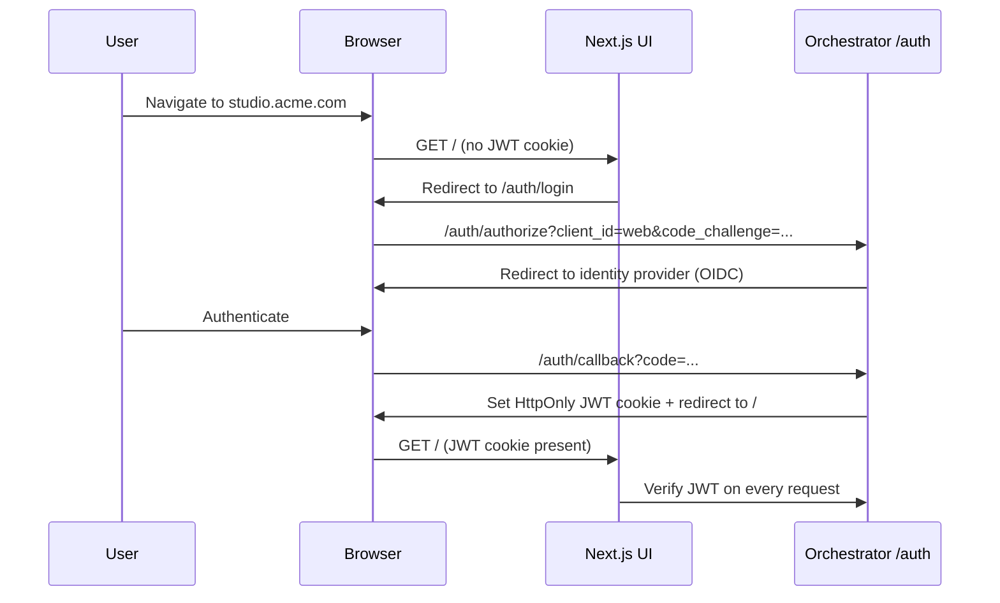

# Web UI

The Agent Studio Web UI is a **Next.js control panel** that provides full visibility into and control over every running task, agent transcript, MCP call, and delivery artifact. It is a peer of the VS Code extension: both surfaces expose the same features, use the same REST and WebSocket API, and share the same session token.

---

## Technology stack

| Component | Technology |
|---|---|
| Framework | Next.js 14+ (App Router) |
| Styling | Tailwind CSS + shadcn/ui |
| State management | React Server Components for static pages; SWR + WebSocket for live data |
| Charts and graphs | Recharts (metrics); `graph.visualize` HTML iframe (Delivery Bundle) |
| Auth | OAuth PKCE via browser redirect; JWT stored in `HttpOnly` `Secure` cookie |
| API transport | REST (imperative commands); WebSocket (`/ws`) for live events |

---

## Authentication



The JWT cookie is `HttpOnly`, `Secure`, and `SameSite=Strict`. The UI server (Next.js) validates the JWT on every API route handler and proxies WebSocket connections to the Orchestrator. No JWT is exposed to browser JavaScript.

The refresh token is stored in a separate `HttpOnly` cookie and silently exchanged for a new JWT before expiry using a background route (`/api/auth/refresh`).

---

## Pages and views

### Dashboard (`/`)

- Live list of all tasks for the tenant/project: status badges, progress bars, time elapsed, cost used vs. ceiling.
- Filter by: status, assignee, date range.
- Quick-action buttons per task: Pause, Resume, Cancel, Open Detail.
- Aggregate metrics: tasks running, tasks blocked, total cost this billing period, MCP server health summary.

### Task detail (`/tasks/:id`)

The primary workspace. Tabs:

| Tab | Description |
|---|---|
| **Overview** | Title, business requirement, current status, plan goals with status, timeline of state transitions |
| **Plan** | The structured plan produced by the Planner; editable when task is `blocked` (via `task.override_plan`) |
| **Transcripts** | Agent messages, tool calls, and tool results in real time; role-colour-coded; searchable |
| **Tests** | Test run history; iteration timeline; pass/fail/skip counts; link to Playwright HTML report; coverage chart |
| **Delivery** | Delivery Bundle viewer (see below) |
| **MCP Log** | Every tool call across all servers with server name, tool name, latency, token usage, result status; filterable |
| **Knowledge** | Knowledge-hit inspector: every `knowledge.search` call with query, sources hit, top results |
| **Memory** | Memory browser: reads Ruflo via MCP; shows stored memories and patterns for this task/project |
| **Control** | Pause / Resume / Cancel / Inject Context / Override Plan / Set Budget / Branch / Rollback |
| **HITL** | Open questions and approval requests; answer form; approval history |

### Delivery Bundle viewer (`/tasks/:id` → Delivery tab)

```
┌─────────────────────────────────────────────────────┐
│  Delivery Bundle — task: Add inventory alerts         │
│  Assembled: 2026-04-11 14:32 UTC  [partial: false]   │
├─────────────────────────────────────────────────────┤
│  ⚠ Impact Radius (42 nodes, 3 out-of-scope)          │
│  [Expandable tree of impacted modules]               │
├─────────────────────────────────────────────────────┤
│  ✓ Test Coverage (94% — 2 gaps flagged)              │
│  [Table of test files → impacted nodes]              │
├─────────────────────────────────────────────────────┤
│  Risk-Scored Changes                                 │
│  HIGH:   wms/alert-engine.ts (score: 87)             │
│  MEDIUM: wms/order-service.ts (score: 41)            │
│  LOW:    config/thresholds.yaml (score: 12)          │
├─────────────────────────────────────────────────────┤
│  Auto-wiki (generated markdown)                      │
│  [Rendered markdown panel]                           │
├─────────────────────────────────────────────────────┤
│  Interactive Code Graph                              │
│  [iframe → graph.visualize HTML]                    │
├─────────────────────────────────────────────────────┤
│  [Approve and Open PR]    [Request Changes]          │
└─────────────────────────────────────────────────────┘
```

The **Approve and Open PR** button sends `task.approve` and then the `github.create_pr` tool call flows through its own approval gate.

### HITL approval queue (`/hitl`)

Consolidated view of all open HITL questions and approval requests across all tasks. Each entry shows:
- Task title and ID
- Question text and schema-driven answer form
- Time waiting
- Risk level (for approval-gated tool calls)
- Approve / Reject buttons

Sorted by time waiting descending. Accessible from the dashboard's "Blocked" count badge.

### MCP server health dashboard (`/mcp`)

Live status of every registered MCP server:

| Server | Version | Status | Last heartbeat | Tools available | Roles |
|---|---|---|---|---|---|
| Ruflo | 2.1.0 | ✓ Healthy | 3s ago | 8 | all |
| Playwright | 1.46.2 | ✓ Healthy | 12s ago | 14 | tester |
| GitHub MCP | 1.2.0 | ⚠ Degraded | 47s ago | 20 | coder, reviewer |
| WMS MCP | — | ✗ Unreachable | 5m ago | — | — |

Click a server row to see: full spec (secrets redacted), allowlist per role, recent call log, error log.

### MCP Marketplace (`/mcp/marketplace`)

Curated catalog of known-good MCP servers. Each catalog entry shows:
- Name, description, default source kind
- Required secrets (name only, no values)
- Roles that can use it
- "Install" button → opens a form for secrets + config → calls `POST /api/mcp/servers`

Installed servers appear in the **health dashboard**. An **Upgrade available** badge appears when a newer compatible version is detected.

### Memory browser (`/memory`)

Reads Ruflo via MCP on behalf of the logged-in user's tenant/project context:

- Lists memory entries by type (plan, fix, test_result, clarification, completion, pattern)
- Search by keyword
- Shows: content, created at, task ID it came from, scope (project/local)
- Delete (tenant-admin only; recorded to audit log)

### Knowledge hit inspector (`/tasks/:id` → Knowledge tab)

Per-task view of all `knowledge.search` calls:

| Query | Sources | Top result | Hits | Used in dispatch | Latency |
|---|---|---|---|---|---|
| "WMS inventory threshold alert" | web, github, confluence | GitHub issue #1234: Similar alert impl | 5 | ✓ | 320ms |
| "Playwright flaky test fix" | web | MDN + Stack Overflow articles | 3 | ✓ | 180ms |

Click a row to expand all hits with full snippet and URL.

### Run history (`/tasks/:id/runs`)

Every agent-role turn and Claude Code worker dispatch recorded, with:
- Role, mode (run/spawn_worker), start/end time
- Token usage, cost, exit reason
- Link to the diff produced (if any)
- Link to the checkpoint written

### Audit log (`/settings/audit`)

Filterable view of the `audit_log` table:
- Filter by: verb, actor, task, date range
- Export to CSV
- Tenant-admin only

---

## Live data architecture

The Web UI uses a hybrid data strategy:

```
Static/slow data → Next.js Server Components + SWR (polling every 30s)
Live task data   → WebSocket subscription (same /ws endpoint as VS Code extension)
```

WebSocket subscription is initiated from a client component after hydration:

```typescript
// components/task-event-stream.tsx
'use client';

export function TaskEventStream({ taskId }: { taskId: string }) {
  const ws = useOrchestratorWebSocket();

  useEffect(() => {
    ws.subscribe(taskId, { since: lastSeenSeq });
    return () => ws.unsubscribe(taskId);
  }, [taskId]);

  // Events drive optimistic UI updates via React state
}
```

The Next.js API routes (`/api/*`) proxy REST calls to the Orchestrator with the JWT from the cookie. The browser never makes direct calls to the Orchestrator — all go through the Next.js server, which validates the JWT and forwards.

---

## Parity matrix with VS Code extension

| Feature | Web UI | VS Code Extension |
|---|---|---|
| Task submission | ✓ Form | ✓ Command palette + form |
| Live task list | ✓ Dashboard | ✓ Sidebar TreeView |
| Agent transcripts (streaming) | ✓ | ✓ Webview panel |
| MCP call log | ✓ | ✓ Webview panel tab |
| Knowledge hit inspector | ✓ | ✓ Webview panel tab |
| Memory browser | ✓ | ✓ Webview panel tab |
| HITL approval queue | ✓ | ✓ Notification + Webview |
| Delivery Bundle viewer | ✓ | ✓ Webview panel tab |
| Delivery Bundle approval | ✓ | ✓ Webview panel tab |
| Inline diff decoration | — | ✓ Editor gutter marks |
| Pause / Resume / Cancel | ✓ | ✓ |
| Inject context | ✓ | ✓ (can inject selected editor text) |
| Override plan | ✓ | ✓ |
| Branch / Rollback | ✓ | ✓ |
| Set budget | ✓ | ✓ |
| MCP server health dashboard | ✓ | ✓ Webview panel |
| MCP Marketplace (install/upgrade) | ✓ | ✓ Webview panel |
| Run history | ✓ | ✓ |
| Audit log view | ✓ Full | ✓ Read-only Webview |

---

## Session bridging

The Web UI and the VS Code extension share a single server-side session. If a user opens the same task in both surfaces:

- Both subscribe to `events:task:{taskId}` via the Orchestrator's WebSocket.
- Events arrive in identical order (monotonic `seq`).
- An action in one surface (e.g. approving a HITL question in VS Code) immediately updates the other via the next `state_transition` event.
- There is no client-side authoritative state. Both surfaces are views over the same server state.

---

## Related components

- [VS Code Extension](./vscode-extension.md) — peer surface; parity matrix maintained jointly
- [Orchestrator](./orchestrator.md) — REST and WebSocket server the UI connects to
- [Human-in-the-Loop](./human-in-the-loop.md) — HITL approval queue and approval flows
- [Delivery Bundle](./delivery-bundle.md) — Delivery tab content
- [MCP Registry](./mcp-registry.md) — MCP Marketplace backed by the registry
- [Execution Control](./execution-control.md) — Control tab steering verbs
