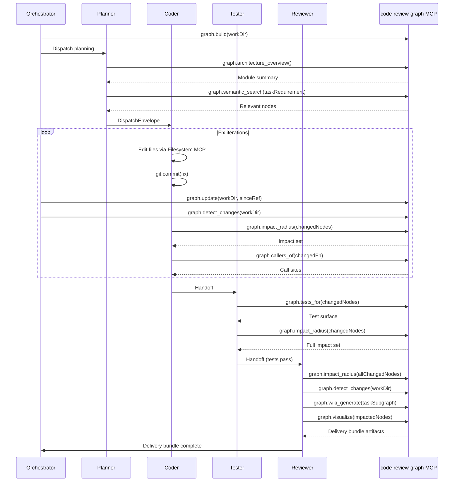

# code-review-graph — Structural Code Knowledge Graph

## Overview

[code-review-graph](https://github.com/tirth8205/code-review-graph) (`tirth8205/code-review-graph`) is a Python-based structural knowledge graph and 22-tool MCP server. It uses tree-sitter to parse source code into a graph of functions, classes, modules, and their relationships (calls, imports, test coverage), and exposes that graph through an MCP interface.

Agent Studio does **not** build its own tree-sitter indexer or code graph. It consumes `code-review-graph` as an external MCP server, pinned to a specific version in the MCP Registry.

---

## ADR Reference: Not Forked (ADR-0006)

ADR-0006 records the decision to consume code-review-graph as an upstream distribution rather than reimplementing its capabilities. Key reasons:

- Its authors report 6.8×–49× token reductions on code review tasks by replacing full-file ingestion with targeted graph queries — a capability that would take months to reproduce from scratch.
- The MCP boundary is the contract; its Python runtime is invisible to Agent Studio's TypeScript codebase.
- Upgrades flow through the MCP Registry like every other server — no Agent Studio code changes.

---

## Transport

Two deployment options, selected in the `McpServerSpec`:

| Mode | Transport | When to Use |
|---|---|---|
| **stdio** | `stdio` | Single-node or dev; the Python MCP server is spawned as a child process. SQLite graph database on local disk. |
| **Sidecar container** | `streamable-http` | Production; one sidecar container per tenant-project, with a persistent volume for the SQLite graph. Shared across orchestrator replicas. |

Production deployments should use the sidecar container so the graph (which takes time to build) persists across orchestrator pod restarts and is shared across replicas working on the same project.

---

## Tools

> Tool names are per the published 22-tool manifest. The full manifest should be fetched at integration time via `mcp test code-review-graph`. Only the tools listed in the `allowlist` section of the `McpServerSpec` are accessible to agents.

| Tool | Description | Primary Role |
|---|---|---|
| `graph.build` | Build the full structural graph from a repository | Orchestrator (task start) |
| `graph.update` | Incrementally update the graph for changed files since a git ref | Orchestrator (after each commit) |
| `graph.detect_changes` | Produce a risk-scored change summary (new/modified/deleted nodes) | Coder, Reviewer |
| `graph.impact_radius` | Given a set of changed nodes, return all transitively affected nodes | Coder, Tester, Reviewer |
| `graph.callers_of` | List all call sites that invoke a given function or method | Coder |
| `graph.callees_of` | List all functions called by a given function or method | Coder |
| `graph.tests_for` | Return the set of test files/functions that cover a given set of nodes | Tester |
| `graph.semantic_search` | Vector search over node names, docstrings, and code content | Planner, Coder |
| `graph.architecture_overview` | High-level summary of module structure, entry points, and dependency clusters | Planner |
| `graph.wiki_generate` | Auto-generate Markdown documentation for a subgraph or community | Reviewer |
| `graph.visualize` | Generate an interactive HTML visualization of the graph or a subgraph | Reviewer |

---

## Per-Role Allowlist

| Role | Allowed Tools |
|---|---|
| **Planner** | `graph.architecture_overview`, `graph.semantic_search` |
| **Coder** | `graph.impact_radius`, `graph.callers_of`, `graph.callees_of`, `graph.update`, `graph.detect_changes`, `graph.semantic_search` |
| **Tester** | `graph.tests_for`, `graph.impact_radius` |
| **Reviewer** | All tools — drives the delivery bundle |

---

## Three Jobs code-review-graph Does for Agent Studio

### Job A — Token-Efficient Existing Code Understanding

Before planning, the Planner uses the graph to locate the relevant slice of the codebase instead of ingesting it whole:

```
Planner dispatched with task requirement
→ graph.architecture_overview()
  → Returns: module clusters, entry points, dependency graph summary
→ graph.semantic_search(query=taskRequirement, topK=10)
  → Returns: the 10 most semantically relevant functions/classes
→ Planner now understands the relevant code surface (hundreds of tokens)
  instead of reading the entire codebase (millions of tokens)
→ Planner builds DispatchEnvelope with targeted workspace.writableGlobs
```

The authors' reported 6.8×–49× token reduction applies here: instead of loading 50 files, the planner loads 3 targeted graph slices.

### Job B — Incremental Tracking of Agent Output

This is the capability that makes the delivery loop work. After every `git.commit` by the Coder or Tester, the orchestrator immediately calls:

```
graph.update(workDir, sinceRef=previousHead)
graph.detect_changes(workDir)
```

Because `graph.update` completes in approximately 2 seconds even on multi-thousand-file repositories, the graph is continuously in sync with agent output. Every subsequent role that queries `graph.impact_radius`, `graph.tests_for`, or `graph.callers_of` sees the current state of the codebase — not a stale snapshot from task start.

This produces a **live structural map of everything the agents have touched**:
- New nodes (functions, classes, config entries the Coder added)
- Modified nodes (functions the Coder changed)
- New edges (new call sites, new imports, new test coverage)
- Risk scores (criticality of changed nodes based on fan-in)

### Job C — Delivery Bundle Generation

At task completion, the Reviewer assembles the **Delivery Bundle** by calling:

```
graph.impact_radius(changedNodes)
  → "What else could the agent's changes have affected?"

graph.tests_for(changedNodes)
  → Confirm every impacted node has test coverage
  → Feed exact test surface to Playwright loop

graph.detect_changes(workDir)
  → Risk-scored change summary for human reviewer

graph.wiki_generate(subgraph=taskCommunity)
  → Auto-generated Markdown docs of new/changed feature

graph.visualize(subgraph=impactedNodes)
  → Interactive HTML graph embedded in Web UI "Delivery" tab
```

The bundle is persisted to the task record and surfaced in both the Web UI and the VS Code extension. It is the artefact the human signs off on before merge.

---

## Integration with the Delivery Loop



---

## Failure Mode

If code-review-graph is unreachable:

| Stage | Fallback |
|---|---|
| Before planning | Planner falls back to reading key files directly via Filesystem MCP (higher token cost) |
| After each commit | `graph.update` is skipped; orchestrator logs `graph_unavailable` warning |
| Test surface | Tester falls back to running the full test suite |
| Delivery bundle | Reviewer falls back to a plain `git diff --stat` summary; task flagged `partial_delivery — graph unavailable` |

The `partial_delivery` flag appears in the task record, the Web UI, and the VS Code extension. No hard dependency — the task can complete without the graph.

---

## Config Snippet

```yaml
# config/mcp-servers.d/code-review-graph.yaml

name: code-review-graph
version: "^2.0.0"          # pin to tested minor; update explicitly
source:
  kind: docker
  package: "ghcr.io/tirth8205/code-review-graph:2.0.0"
  # For stdio (dev/single-node):
  # kind: npx
  # package: "code-review-graph"   # if published to npm
  # Or:
  # kind: binary
  # package: "/usr/local/bin/code-review-graph-mcp"
transport: streamable-http   # sidecar in production; stdio for dev
url: "http://code-review-graph-{tenantId}-{projectId}.internal:8080/mcp"
env:
  - name: GRAPH_DATA_DIR
    value: "/data/graph"     # persistent volume mount inside the sidecar
  - name: GRAPH_LOG_LEVEL
    value: "warn"
healthcheck:
  tool: graph.architecture_overview
  intervalMs: 60000
  timeoutMs: 15000
retries:
  maxAttempts: 3
  backoffMs: 2000
allowlist:
  planner:
    - "graph.architecture_overview"
    - "graph.semantic_search"
  coder:
    - "graph.impact_radius"
    - "graph.callers_of"
    - "graph.callees_of"
    - "graph.update"
    - "graph.detect_changes"
    - "graph.semantic_search"
  tester:
    - "graph.tests_for"
    - "graph.impact_radius"
  reviewer:
    - "graph.build"
    - "graph.update"
    - "graph.detect_changes"
    - "graph.impact_radius"
    - "graph.callers_of"
    - "graph.callees_of"
    - "graph.tests_for"
    - "graph.semantic_search"
    - "graph.architecture_overview"
    - "graph.wiki_generate"
    - "graph.visualize"
approvalRequired: []
sandbox: docker-code-review-graph   # resource limits for the sidecar
enabled: true
```

### stdio variant (development / single-node)

```yaml
name: code-review-graph
version: "^2.0.0"
source:
  kind: npx
  package: "code-review-graph"
transport: stdio
env:
  - name: GRAPH_DATA_DIR
    value: "/var/agent-studio/graph/{tenantId}/{projectId}"
  - name: GRAPH_LOG_LEVEL
    value: "warn"
healthcheck:
  tool: graph.architecture_overview
  intervalMs: 60000
  timeoutMs: 15000
# ... same allowlist as above
enabled: true
```

---

## Versioning and Upgrades

code-review-graph is managed through the MCP Registry like every other server. Upgrade procedure:

1. Operator runs `mcp upgrade code-review-graph --to 2.1.0` via CLI or Web UI.
2. Manager checks upstream manifest for new tools.
3. Any new tools not in the current allowlist default to **DENIED** for all roles.
4. Manager runs the healthcheck against the new version.
5. Operator explicitly grants new tools to roles if desired.
6. In-flight tasks continue using the previous version; new tasks pick up the upgrade.

This ensures that a new `graph.*` tool released in a future version of code-review-graph cannot be invoked by agents until an operator explicitly grants it, preventing supply-chain surprises from silently widening the tool surface.
