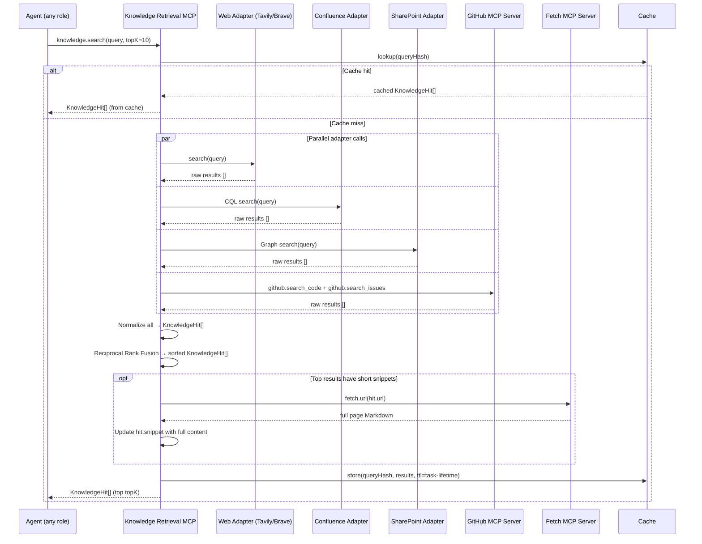

# Knowledge Retrieval MCP — Federated External Search

## Overview

The Knowledge Retrieval MCP is an **internal MCP server** shipped as part of Agent Studio (`packages/knowledge`). It provides a single unified tool — `knowledge.search` — that queries multiple external knowledge sources in parallel, re-ranks results using reciprocal rank fusion, and returns a normalized list of `KnowledgeHit` objects.

Its purpose is to answer the question: **"Has this problem been solved before — anywhere our organisation has knowledge?"** Agents call it proactively before attempting a non-trivial fix, and reactively after a test failure, to surface solutions before writing new code.

---

## Why an Internal MCP Server?

Knowledge retrieval is Agent Studio-specific logic (federation policy, adapter wiring, RRF ranking, caching, tenant source configuration). No upstream MCP server provides this federation. By exposing it as an MCP server, it:

- Benefits from the same allowlist, approval, health-check, and observability infrastructure as every other server.
- Is callable through the standard tool-use loop — agents call `knowledge.search` exactly like `memory.search` or `git.diff`.
- Can be upgraded independently (new adapters, different ranking strategies) without changing agent-runtime code.

---

## Tools

### `knowledge.search`

```typescript
// Tool signature (TypeScript types match the MCP tool schema)
knowledge.search({
  query: string,            // natural language question or error message
  sources?: KnowledgeSource[],  // subset to query; default: all enabled sources
  topK?: number,            // max results after re-ranking; default: 10
})
→ KnowledgeHit[]
```

**Sources:**

| Source identifier | Adapter | Auth |
|---|---|---|
| `"web"` | Pluggable web search (Tavily / Brave / SerpAPI) | Web search API key per tenant |
| `"confluence"` | Atlassian REST API v2 + CQL | Confluence API token per tenant |
| `"sharepoint"` | Microsoft Graph `/search/query` | Azure AD app registration per tenant |
| `"github"` | Delegates to GitHub MCP server (`github.search_code` + `github.search_issues`) | Inherits GitHub PAT from GitHub MCP config |

### `knowledge.fetch`

```typescript
knowledge.fetch({
  url: string,              // URL of a knowledge hit to retrieve in full
  source: KnowledgeSource,  // which adapter to use for authentication (e.g. Confluence token)
})
→ { content: string, title: string, url: string }
```

Used when `knowledge.search` returns a hit with a short snippet and the agent needs the full document. For `"web"` sources, this delegates to the Fetch MCP server's `fetch.url`. For `"confluence"` and `"sharepoint"`, the adapter uses its authenticated client to fetch the full page content.

---

## Normalized `KnowledgeHit` Type

All adapters return results normalized to this shape before re-ranking:

```typescript
interface KnowledgeHit {
  source: 'web' | 'confluence' | 'sharepoint' | 'github';
  title: string;
  url: string;
  snippet: string;          // best excerpt (100-500 chars); full content if fetched
  score: number;            // adapter-native relevance score (normalized to [0,1])
  retrievedAt: string;      // ISO 8601 timestamp
  metadata?: {
    spaceKey?: string;      // Confluence space
    siteUrl?: string;       // SharePoint site
    repo?: string;          // GitHub repository
    issueNumber?: number;   // GitHub issue/PR number
    fileRef?: string;       // GitHub code search file reference
  };
}
```

---

## The Four Adapters

### 1. Web Search Adapter

Uses a pluggable web search provider. The provider is configured per tenant:

| Provider | Config field | Notes |
|---|---|---|
| Tavily | `TAVILY_API_KEY` | Recommended — returns clean, structured results with good snippet quality |
| Brave Search | `BRAVE_API_KEY` | Alternative; good for technical queries |
| SerpAPI | `SERPAPI_KEY` | Fallback; wraps Google/Bing |

The adapter calls the configured provider's search API, receives a list of results (`{ title, url, snippet, score }`), normalizes to `KnowledgeHit[]`, and optionally fetches full content for top results via the Fetch MCP server.

### 2. Confluence Adapter

Uses Atlassian REST API v2 with CQL (Confluence Query Language):

```
GET /wiki/rest/api/v2/search?cql=text~"{query}" AND type=page&limit={topK}&expand=body.view
Authorization: Bearer {CONFLUENCE_API_TOKEN}
```

Results are normalized to `KnowledgeHit` with `source: "confluence"`. The full page body is extracted from the `body.view.value` HTML field and converted to Markdown. If the response is large, only the first 2000 characters are included in the snippet; `knowledge.fetch` retrieves the full document when needed.

Auth: per-tenant Confluence API token and base URL, stored in the secrets backend.

### 3. SharePoint Adapter

Uses Microsoft Graph API search:

```
POST https://graph.microsoft.com/v1.0/search/query
{
  "requests": [{
    "entityTypes": ["driveItem", "listItem", "site"],
    "query": { "queryString": "{query}" },
    "size": {topK}
  }]
}
Authorization: Bearer {SHAREPOINT_ACCESS_TOKEN}
```

The access token is obtained via the Azure AD client credentials flow using the per-tenant app registration (client ID + client secret from secrets backend). Token is cached for its expiry window.

Results include SharePoint document metadata and a text extract. The adapter normalizes these to `KnowledgeHit[]` with `source: "sharepoint"`.

### 4. GitHub Adapter

Rather than re-implementing GitHub search, the GitHub adapter **delegates to the GitHub MCP server**:

```typescript
// Inside the GitHub adapter
const codeResults = await mcpClient.callTool('github.search_code', {
  query: `${query} repo:${orgName}`,
  perPage: Math.ceil(topK / 2),
});
const issueResults = await mcpClient.callTool('github.search_issues', {
  query: `${query} org:${orgName} type:issue`,
  perPage: Math.ceil(topK / 2),
});
// Normalize both to KnowledgeHit[]
```

This means GitHub search respects the same auth token, rate limit handling, and allowlist as all other GitHub tool calls. No separate GitHub API client code exists in the knowledge package.

---

## Reciprocal Rank Fusion Re-Ranking

After all adapters return their results, the Knowledge Retrieval MCP applies Reciprocal Rank Fusion (RRF) to produce a single merged, ranked list:

```
RRF score = Σ (over adapters k) { 1 / (rank_k + 60) }
```

Where `rank_k` is the 1-indexed position of the document in adapter k's result list, and 60 is the standard RRF constant. Documents that appear in multiple adapters receive a higher combined score. The top `topK` documents from the merged list are returned.

RRF is preferred over score fusion because it is robust to different score scales across adapters (Confluence scores are not comparable to SerpAPI scores). It also naturally promotes documents that appear in multiple sources.

---

## Per-Query-Hash Caching

Results are cached for the lifetime of the task:

```typescript
const cacheKey = `${tenantId}:${taskId}:${sha256(query + JSON.stringify(sources))}`;
if (cache.has(cacheKey)) return cache.get(cacheKey);
// ... fetch, re-rank, store, return
cache.set(cacheKey, results, { ttl: 'task-lifetime' });
```

Cache entries are stored in-memory (per orchestrator pod) and are evicted when the task completes. This prevents duplicate API calls when the same query is issued multiple times within a task (e.g. the tester queries after each test failure for the same error). It does not persist across tasks.

---

## When Agents Call Knowledge Retrieval

| Trigger | Role | Query source |
|---|---|---|
| Before a non-trivial fix (proactive) | Coder | Task requirement + symptom description |
| After test failure (reactive) | Tester | Test name + error message + failing assertion |
| Before planning a complex feature | Planner | Task requirement text |
| Before reviewing a changed module | Reviewer | Module name + change summary |
| When memory.search returns no hit | Any | Same query as memory.search |

The standard two-stage lookup is:

1. `memory.search` (Ruflo) — cheap, local, cross-session. If a hit scores above the threshold, skip step 2.
2. `knowledge.search` — federated, external, slower. Used when local memory has no relevant hit.

---

## Per-Tenant Configuration

Each tenant configures which sources are enabled and supplies credentials:

```yaml
# Tenant knowledge config (stored in tenants.config JSON column)
knowledge:
  sources:
    web:
      enabled: true
      provider: tavily
    confluence:
      enabled: true
      baseUrl: "https://mycompany.atlassian.net"
    sharepoint:
      enabled: true
      tenantId: "your-azure-tenant-id"
      siteUrl: "https://mycompany.sharepoint.com/sites/engineering"
    github:
      enabled: true
      org: "mycompany"
  # Secrets are referenced by name; values live in Vault/KMS
  secrets:
    TAVILY_API_KEY: tavily-api-key
    CONFLUENCE_API_TOKEN: confluence-api-token
    SHAREPOINT_CLIENT_ID: sharepoint-client-id
    SHAREPOINT_CLIENT_SECRET: sharepoint-client-secret
```

Adapters for disabled sources are skipped entirely at query time. The knowledge tool still returns results from enabled sources.

---

## Sequence Diagram



---

## Config Snippet

```yaml
# config/mcp-servers.d/knowledge.yaml

name: knowledge
version: "1.0.0"       # internal server — version matches Agent Studio release
source:
  kind: binary
  package: "/app/packages/knowledge/dist/server.js"   # in-tree build artefact
transport: stdio
env:
  # Secrets are injected per-tenant at spawn time from the secrets backend
  - name: TAVILY_API_KEY
    valueFrom:
      secret: tavily-api-key
  - name: CONFLUENCE_API_TOKEN
    valueFrom:
      secret: confluence-api-token
  - name: CONFLUENCE_BASE_URL
    valueFrom:
      secret: confluence-base-url
  - name: SHAREPOINT_CLIENT_ID
    valueFrom:
      secret: sharepoint-client-id
  - name: SHAREPOINT_CLIENT_SECRET
    valueFrom:
      secret: sharepoint-client-secret
  - name: SHAREPOINT_TENANT_ID
    valueFrom:
      secret: sharepoint-tenant-id
healthcheck:
  tool: knowledge.search
  intervalMs: 60000
  timeoutMs: 15000
retries:
  maxAttempts: 2
  backoffMs: 2000
allowlist:
  planner:  ["knowledge.search", "knowledge.fetch"]
  coder:    ["knowledge.search", "knowledge.fetch"]
  tester:   ["knowledge.search", "knowledge.fetch"]
  reviewer: ["knowledge.search", "knowledge.fetch"]
approvalRequired: []
enabled: true
```
