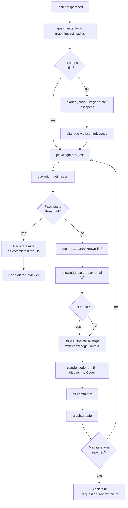

# Playwright MCP — Browser Automation and Testing

## Overview

The Playwright MCP server provides browser automation and end-to-end test execution. It is consumed as an upstream distribution (`@playwright/mcp` or equivalent), run inside a Docker sandbox with no external network access. Only the **Tester** role may call Playwright tools — no other role has access.

Playwright is not used for exploratory browsing. Its purpose in Agent Studio is narrowly defined: run the test surface determined by the code-review-graph, capture results, and feed outcomes back into the retry loop.

---

## Transport

**`stdio` inside a Docker sandbox.** The Playwright MCP server runs as a sandboxed child process rather than a bare `npx` invocation. The orchestrator spawns the Docker container at task start (when the tester role is first dispatched) and tears it down when the task exits.

```
Orchestrator pod → Docker run (playwright-sandbox) → stdio → @playwright/mcp
```

The sandbox container is configured with:

- **No external network egress** — Playwright can only reach the application under test (mounted as a local service within the container network, or accessed via an internal-only URL). It cannot make outbound HTTP requests to the public internet.
- **Report volume mounted** — the host orchestrator mounts a task-specific volume at `/reports` inside the container. Playwright writes HTML reports, JSON results, and screenshots there. The orchestrator reads results from the shared volume without going through the stdio channel.
- **Read-only repo mount** — the task working directory (the codebase) is mounted read-only at `/workspace`. Playwright can read test specs from there but cannot modify them. Test spec generation and modification is done by the tester via Filesystem MCP (outside the sandbox).

---

## Tools

| Tool | Description |
|---|---|
| `playwright.launch` | Launch a browser instance (chromium, firefox, or webkit) |
| `playwright.navigate` | Navigate to a URL within the sandboxed network |
| `playwright.click` | Click a page element by selector |
| `playwright.fill` | Fill an input field with text |
| `playwright.snapshot` | Capture a screenshot or accessibility snapshot of the current page |
| `playwright.run_test` | Execute a test file or suite from the mounted workspace |
| `playwright.get_report` | Read the latest test report from the mounted `/reports` volume |

---

## Tester Role Only

The `playwright.*` allowlist is exclusive to the Tester role. No other role can call any Playwright tool:

```yaml
allowlist:
  planner:  []
  coder:    []
  tester:   ["playwright.*"]
  reviewer: []
```

The Tester calls Playwright tools through the standard MCP tool-use loop. The Coder and Reviewer never directly touch the browser.

---

## Test Surface Determination

The tester does **not** guess which tests to run. Before dispatching any Playwright call, the tester queries the code-review-graph:

```
Tester → graph.tests_for(changedNodes)       # which existing tests cover changed code?
Tester → graph.impact_radius(changedNodes)   # which downstream modules were affected?
```

The result is a precise set of test files and modules. The tester passes this set to `playwright.run_test` rather than running the entire suite. This keeps test runs fast and avoids false positives from unrelated failures.

If the code-review-graph is unavailable (degraded mode), the tester falls back to running the full test suite and flags the run as `partial_delivery — graph unavailable`.

---

## Docker Sandbox Configuration

```yaml
# Sandbox profile: docker-playwright
# Referenced from McpServerSpec.sandbox

image: "mcr.microsoft.com/playwright:v1.46.0-jammy"
network:
  mode: "internal"                 # no external egress
  allowedHosts:
    - "app-under-test.internal"    # application under test (configured per task)
mounts:
  - hostPath: "/var/agent-studio/tasks/{taskId}/reports"
    containerPath: "/reports"
    readOnly: false
  - hostPath: "/var/agent-studio/tasks/{taskId}/workspace"
    containerPath: "/workspace"
    readOnly: true
resources:
  cpuLimit: "2"
  memoryLimit: "4Gi"
  wallTimeLimit: "30m"            # hard kill after 30 minutes
env:
  - name: PLAYWRIGHT_BROWSERS_PATH
    value: "/ms-playwright"       # pre-installed in the image
  - name: CI
    value: "true"
  - name: REPORT_DIR
    value: "/reports"
```

---

## Test Loop and Failure Handling

The tester operates in a retry loop with a configurable maximum iteration count (`task.budget_iterations`, default: 5):



Key points:
- `memory.search` is called before `knowledge.search` — cheap local lookup first.
- If `memory.search` returns a hit above the relevance threshold, `knowledge.search` is skipped.
- The fix dispatch uses a `DispatchEnvelope` with `knowledgeContext` pre-loaded so the inner loop starts with relevant context and does not waste its tool budget on retrieval.
- Each fix commit triggers `graph.update` so the next test run reflects the current code.

---

## Pass/Fail Thresholds

| Metric | Default threshold | Configurable? |
|---|---|---|
| Pass rate | ≥ 95% of tests pass | Yes — per task or per project |
| Coverage delta | ≥ 0% (no regression) | Yes |
| Max iterations | 5 | Yes — `task.budget_iterations` |
| Wall time budget | 30 minutes | Yes — `task.budget_wall_seconds` |

If thresholds are not met after `max_iterations`, the orchestrator blocks the task and raises a HITL event with the full test report attached.

---

## Config Snippet

```yaml
# config/mcp-servers.d/playwright.yaml

name: playwright
version: "^1.46.0"
source:
  kind: docker
  package: "mcr.microsoft.com/playwright:v1.46.0-jammy"
transport: stdio
env:
  - name: PLAYWRIGHT_BROWSERS_PATH
    value: "/ms-playwright"
  - name: REPORT_DIR
    value: "/reports"
healthcheck:
  tool: playwright.launch
  intervalMs: 60000
  timeoutMs: 15000
retries:
  maxAttempts: 2
  backoffMs: 3000
allowlist:
  planner:  []
  coder:    []
  tester:   ["playwright.launch", "playwright.navigate", "playwright.click",
             "playwright.fill", "playwright.snapshot", "playwright.run_test",
             "playwright.get_report"]
  reviewer: []
approvalRequired: []
sandbox: docker-playwright
enabled: true
```

---

## Observability

Every Playwright tool call is logged with:

```json
{
  "task": "task-abc123",
  "role": "tester",
  "server": "playwright",
  "tool": "playwright.run_test",
  "latencyMs": 12430,
  "resultStatus": "success",
  "testFile": "tests/wms/config.spec.ts",
  "passed": 14,
  "failed": 2,
  "skipped": 1
}
```

Test report artefacts (HTML, JSON, screenshots) are persisted to the task working directory and linked from the task event log so the operator can inspect them from the web UI's "Delivery" tab.
