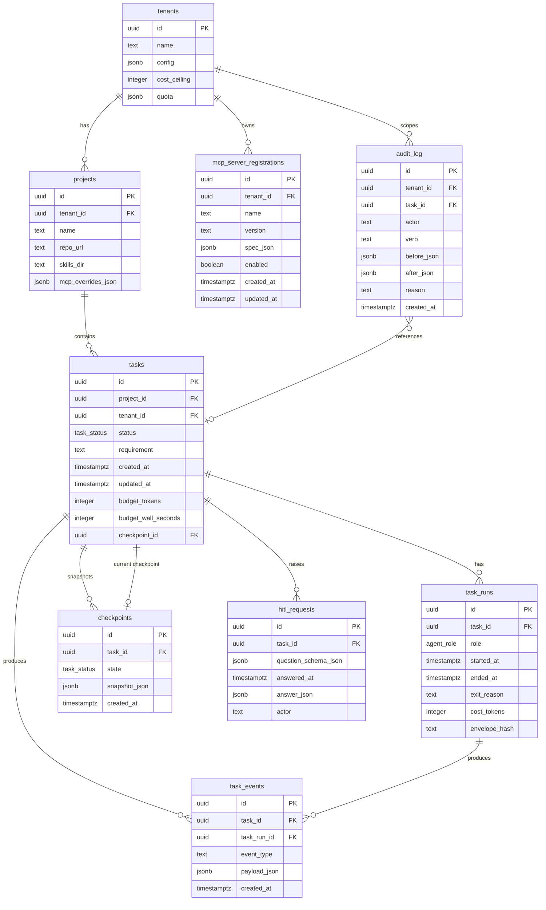

# Data Model — Orchestrator Database

Agent Studio's orchestrator persists all task state, event history, HITL interactions, MCP server registrations, and audit records in a **managed PostgreSQL** database. This document defines every table, its columns, types, and relationships.

This document covers the **orchestrator database only** — not Ruflo's internal schema (which is managed by the Ruflo distribution), nor the code-review-graph's SQLite graph (managed by that server), nor any transient Redis state (BullMQ queue entries, WebSocket pub/sub).

---

## Table Definitions

### `tenants`

Top-level isolation boundary. Every database row in every other table is scoped to a tenant.

| Column | Type | Constraints | Description |
|---|---|---|---|
| `id` | `uuid` | PK, default `gen_random_uuid()` | Tenant identifier |
| `name` | `text` | NOT NULL, UNIQUE | Human-readable tenant name |
| `config` | `jsonb` | NOT NULL, default `'{}'` | Tenant-level configuration (knowledge source toggles, SKILLs repo URL, knowledge source base URLs, etc.) |
| `cost_ceiling` | `integer` | NOT NULL, default `1000000` | Maximum token budget across all active tasks for this tenant (enforced before each Claude Code dispatch) |
| `quota` | `jsonb` | NOT NULL, default `'{}'` | Rate and concurrency limits: `{ maxConcurrentTasks, maxTasksPerDay, maxTokensPerDay }` |

### `projects`

A project corresponds to one target software repository. Tasks are always scoped to a project.

| Column | Type | Constraints | Description |
|---|---|---|---|
| `id` | `uuid` | PK, default `gen_random_uuid()` | Project identifier |
| `tenant_id` | `uuid` | FK → `tenants.id`, NOT NULL | Owning tenant |
| `name` | `text` | NOT NULL | Human-readable project name |
| `repo_url` | `text` | NOT NULL | Git remote URL (SSH or HTTPS) |
| `skills_dir` | `text` | NULLABLE | Path or URL to the SKILLs directory for this project; overrides tenant default |
| `mcp_overrides_json` | `jsonb` | NOT NULL, default `'[]'` | Array of `McpServerSpec` objects that override platform defaults for this project only |

### `tasks`

The central unit of work. A task represents one autonomous delivery request.

| Column | Type | Constraints | Description |
|---|---|---|---|
| `id` | `uuid` | PK, default `gen_random_uuid()` | Task identifier |
| `project_id` | `uuid` | FK → `projects.id`, NOT NULL | Owning project |
| `tenant_id` | `uuid` | FK → `tenants.id`, NOT NULL | Owning tenant (denormalized for fast row-level security queries) |
| `status` | `task_status` (enum) | NOT NULL, default `'not_started'` | Current lifecycle state: `not_started`, `planning`, `in_progress`, `blocked`, `partially_complete`, `completed`, `failed`, `cancelled` |
| `requirement` | `text` | NOT NULL | Natural language description of what the task should accomplish |
| `created_at` | `timestamptz` | NOT NULL, default `now()` | Task creation timestamp |
| `updated_at` | `timestamptz` | NOT NULL, default `now()` | Last status change timestamp |
| `budget_tokens` | `integer` | NOT NULL, default `500000` | Maximum total token budget for all Claude Code dispatches in this task |
| `budget_wall_seconds` | `integer` | NOT NULL, default `3600` | Maximum wall-clock time for the task (hard kill trigger) |
| `checkpoint_id` | `uuid` | FK → `checkpoints.id`, NULLABLE | Most recent checkpoint (for rollback / resume) |

### `task_runs`

One record per agent-role execution within a task. A task typically has multiple runs (planner, coder, tester, reviewer, and retries of each).

| Column | Type | Constraints | Description |
|---|---|---|---|
| `id` | `uuid` | PK, default `gen_random_uuid()` | Run identifier |
| `task_id` | `uuid` | FK → `tasks.id`, NOT NULL | Owning task |
| `role` | `agent_role` (enum) | NOT NULL | `planner`, `coder`, `tester`, `reviewer` |
| `started_at` | `timestamptz` | NOT NULL | When this role's execution began |
| `ended_at` | `timestamptz` | NULLABLE | When this role's execution completed (NULL if still running) |
| `exit_reason` | `text` | NULLABLE | How the run ended: `success`, `failed`, `timeout`, `over_budget`, `blocked_hitl`, `cancelled` |
| `cost_tokens` | `integer` | NOT NULL, default `0` | Total tokens consumed across all dispatches in this run |
| `envelope_hash` | `text` | NULLABLE | SHA-256 of the last `DispatchEnvelope` sent, for audit correlation with MCP call logs |

### `task_events`

Append-only event log for every significant occurrence within a task. Used for live streaming to the UI and for historical audit.

| Column | Type | Constraints | Description |
|---|---|---|---|
| `id` | `uuid` | PK, default `gen_random_uuid()` | Event identifier |
| `task_id` | `uuid` | FK → `tasks.id`, NOT NULL | Owning task |
| `task_run_id` | `uuid` | FK → `task_runs.id`, NULLABLE | Run that produced this event (NULL for task-level events) |
| `event_type` | `text` | NOT NULL | Event type string (see event type catalogue below) |
| `payload_json` | `jsonb` | NOT NULL, default `'{}'` | Event-specific payload |
| `created_at` | `timestamptz` | NOT NULL, default `now()` | Event timestamp |

**Event type catalogue (partial):**

| `event_type` | Payload fields | Description |
|---|---|---|
| `task.state_changed` | `{ from, to, reason }` | Task status transitioned |
| `agent.message` | `{ role, content }` | Agent produced a message |
| `mcp.tool_called` | `{ server, tool, args, latencyMs, resultStatus }` | MCP tool invoked |
| `mcp.tool_unavailable` | `{ server, tool }` | MCP server or tool unavailable |
| `hitl.question` | `{ question, schema, toolName?, toolArgs? }` | Human input requested |
| `hitl.resolved` | `{ answeredAt, actor, answer, approved? }` | Human answered a HITL request |
| `memory.unavailable` | `{}` | Ruflo unreachable; running stateless |
| `graph.unavailable` | `{}` | code-review-graph unreachable |
| `task.delivery_bundle_ready` | `{ bundleRef, prUrl? }` | Delivery bundle assembled |

### `checkpoints`

Periodic snapshots of task state that allow rollback and resume after interruption or failure.

| Column | Type | Constraints | Description |
|---|---|---|---|
| `id` | `uuid` | PK, default `gen_random_uuid()` | Checkpoint identifier |
| `task_id` | `uuid` | FK → `tasks.id`, NOT NULL | Owning task |
| `state` | `task_status` (enum) | NOT NULL | Task status at checkpoint time |
| `snapshot_json` | `jsonb` | NOT NULL | Serialized state: current role, git ref, last planner output, last dispatch envelope hash, memory hit hashes, etc. |
| `created_at` | `timestamptz` | NOT NULL, default `now()` | Checkpoint timestamp |

Checkpoints are created: after planning completes, after each successful coder commit, after test pass, and before any HITL-gated operation.

### `hitl_requests`

Every human-in-the-loop interaction: clarification questions and approval/rejection decisions.

| Column | Type | Constraints | Description |
|---|---|---|---|
| `id` | `uuid` | PK, default `gen_random_uuid()` | HITL request identifier |
| `task_id` | `uuid` | FK → `tasks.id`, NOT NULL | Owning task |
| `question_schema_json` | `jsonb` | NOT NULL | The question posed to the human, including type, text, and expected answer schema |
| `answered_at` | `timestamptz` | NULLABLE | When the human answered (NULL if pending) |
| `answer_json` | `jsonb` | NULLABLE | The human's answer (NULL if pending or rejected) |
| `actor` | `text` | NULLABLE | Identity of the human who answered (user ID or email) |

### `mcp_server_registrations`

Tenant-level overrides to the platform's default MCP server catalog. Records written here take precedence over both platform defaults and project-level YAML.

| Column | Type | Constraints | Description |
|---|---|---|---|
| `id` | `uuid` | PK, default `gen_random_uuid()` | Registration identifier |
| `tenant_id` | `uuid` | FK → `tenants.id`, NOT NULL | Owning tenant |
| `name` | `text` | NOT NULL | Server name (matches `McpServerSpec.name`; unique per tenant) |
| `version` | `text` | NOT NULL | Pinned version or semver range |
| `spec_json` | `jsonb` | NOT NULL | Full `McpServerSpec` with secrets redacted (secret values never stored) |
| `enabled` | `boolean` | NOT NULL, default `true` | Whether the server is active for this tenant |
| `created_at` | `timestamptz` | NOT NULL, default `now()` | Registration timestamp |
| `updated_at` | `timestamptz` | NOT NULL, default `now()` | Last modification timestamp |

UNIQUE constraint: `(tenant_id, name)`.

### `audit_log`

Append-only, tamper-evident log of all steering verbs, registry mutations, and HITL decisions. No rows are ever deleted or updated.

| Column | Type | Constraints | Description |
|---|---|---|---|
| `id` | `uuid` | PK, default `gen_random_uuid()` | Audit record identifier |
| `tenant_id` | `uuid` | FK → `tenants.id`, NOT NULL | Owning tenant |
| `task_id` | `uuid` | FK → `tasks.id`, NULLABLE | Related task (NULL for registry mutations not tied to a task) |
| `actor` | `text` | NOT NULL | Identity of the actor (user ID, service account, or `system`) |
| `verb` | `text` | NOT NULL | Action performed: `task.pause`, `task.resume`, `task.inject`, `task.approve`, `task.reject`, `task.cancel`, `task.branch`, `task.rollback`, `mcp.install`, `mcp.upgrade`, `mcp.remove`, `mcp.enable`, `mcp.disable`, `hitl.approve`, `hitl.reject` |
| `before_json` | `jsonb` | NULLABLE | State before the action (for mutations; NULL for additive actions) |
| `after_json` | `jsonb` | NOT NULL | State after the action |
| `reason` | `text` | NULLABLE | Human-provided reason (optional free-text) |
| `created_at` | `timestamptz` | NOT NULL, default `now()` | Record timestamp |

---

## Enum Types

```sql
CREATE TYPE task_status AS ENUM (
  'not_started',
  'planning',
  'in_progress',
  'blocked',
  'partially_complete',
  'completed',
  'failed',
  'cancelled'
);

CREATE TYPE agent_role AS ENUM (
  'planner',
  'coder',
  'tester',
  'reviewer'
);
```

---

## Entity-Relationship Diagram



---

## Key Indexes

```sql
-- Fast task lookup by status and tenant (orchestrator queue polling)
CREATE INDEX tasks_tenant_status_idx ON tasks (tenant_id, status, created_at);

-- Fast event streaming by task (WebSocket fan-out)
CREATE INDEX task_events_task_created_idx ON task_events (task_id, created_at);

-- Fast audit queries by tenant and actor
CREATE INDEX audit_log_tenant_actor_idx ON audit_log (tenant_id, actor, created_at);

-- Fast HITL pending lookup
CREATE INDEX hitl_requests_pending_idx ON hitl_requests (task_id, answered_at)
  WHERE answered_at IS NULL;

-- MCP registry lookup by tenant and name
CREATE UNIQUE INDEX mcp_registrations_tenant_name_idx ON mcp_server_registrations (tenant_id, name);
```

---

## Row-Level Security

All tables (except `tenants`) have PostgreSQL Row-Level Security (RLS) policies that filter by `tenant_id`. The orchestrator service connects with a role that has the current tenant ID set as a session variable:

```sql
SET app.current_tenant_id = 'the-tenant-uuid';
```

RLS policies enforce:

```sql
-- Example for tasks table
CREATE POLICY tasks_tenant_isolation ON tasks
  USING (tenant_id = current_setting('app.current_tenant_id')::uuid);
```

Tenant administrators access only their own rows. The platform service account (used for background jobs) bypasses RLS with a privileged role.

---

## Migrations

Database migrations are managed with a TypeScript migration tool (e.g. `node-pg-migrate` or `db-migrate`) in `packages/orchestrator/migrations/`. Each migration is a timestamped SQL file. The orchestrator runs pending migrations on startup before accepting traffic.

Migration naming convention: `{timestamp}_{description}.sql`

Example:
```
001_create_tenants.sql
002_create_projects.sql
003_create_tasks.sql
004_create_task_runs.sql
005_create_task_events.sql
006_create_checkpoints.sql
007_create_hitl_requests.sql
008_create_mcp_server_registrations.sql
009_create_audit_log.sql
010_add_rls_policies.sql
```
