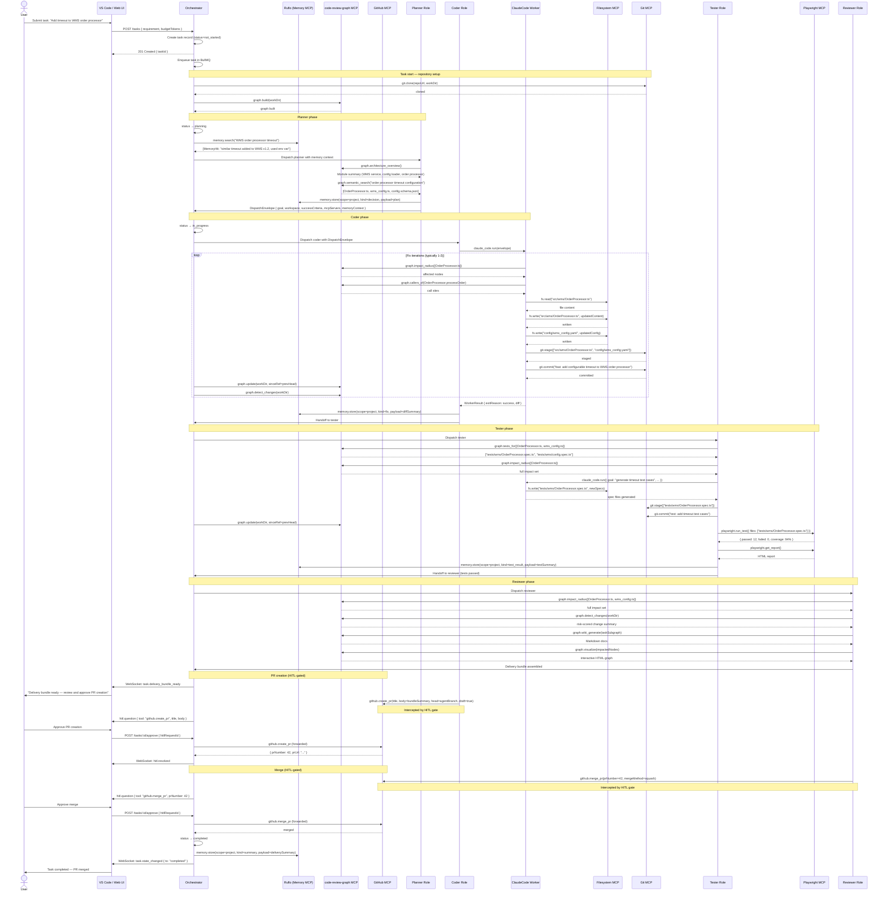
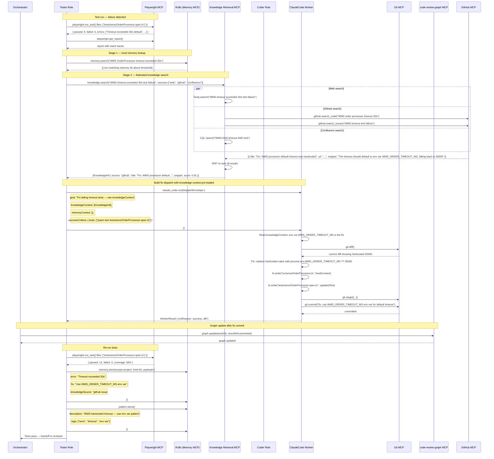

# Sequence Flows — End-to-End Execution Diagrams

This document presents three Mermaid sequence diagrams that trace the most important execution paths through Agent Studio:

1. **Happy path** — task submitted through to delivery bundle and merged PR
2. **Test failure retry loop** — how the system recovers from a failing test using memory and knowledge retrieval
3. **HITL mid-task approval** — how a WMS write call is intercepted, approved by a human, and continued

---

## 1. Happy Path — Task Submitted to Delivery Bundle

This diagram traces a complete successful run: the user submits a task, the orchestrator dispatches it through all four roles, and the human approves the final PR merge.



---

## 2. Test Failure Retry Loop

This diagram shows how the system recovers when a test fails: it searches Ruflo memory first, then the Knowledge Retrieval MCP, uses the found context to build a targeted fix dispatch, and re-runs tests.



---

## 3. HITL Mid-Task Approval — WMS Config Write

This diagram shows how a coder's call to `wms.update_config` is intercepted by the HITL approval gate, presented to the human in both VS Code and the web UI, and then either approved (forwarded to WMS) or rejected (Coder proposes alternative).

```mermaid
sequenceDiagram
    actor U as User
    participant VSC as VS Code Extension
    participant WEB as Web UI
    participant O as Orchestrator
    participant MC as MCP Client
    participant CO as Coder Role
    participant CCW as ClaudeCode Worker
    participant WMS as WMS MCP Server

    note over CO,CCW: Coder is mid-fix — needs to update WMS config
    CCW->>MC: wms.update_config({
    note right of CCW: configId: "order-processor",
    note right of CCW: patch: { orderTimeoutMs: 45000 }
    CCW->>MC: })

    note over MC,O: MCP Client intercepts — tool is approval-gated
    MC->>MC: Check allowlist: coder → wms.update_config ✓
    MC->>MC: Check approvalRequired: wms.update_config → true
    MC->>O: Raise HITL: { hitlRequestId, tool: "wms.update_config", args, riskContext: "WMS config write" }

    note over O: Task run paused; HITL record created
    O->>O: Create hitl_requests row (answered_at=NULL)
    O->>O: Pause CCW iteration (suspend tool call)

    par Notify both surfaces
        O->>VSC: WebSocket: hitl.question { hitlRequestId, tool, args, question }
        O->>WEB: WebSocket: hitl.question { hitlRequestId, tool, args, question }
    end

    VSC->>U: Notification: "Approval needed: wms.update_config { orderTimeoutMs: 45000 }"
    WEB->>U: HITL approval card shown in task view

    alt User approves
        U->>WEB: Click "Approve" + enter reason "45s is correct per RFC-0042"
        WEB->>O: POST /tasks/:id/approve { hitlRequestId, answer: { approved: true }, reason }
        O->>O: Update hitl_requests (answered_at, actor, answer)
        O->>O: Append to audit_log { verb: "hitl.approve", actor, before, after, reason }

        note over O,MC: Resume suspended tool call
        O->>MC: Forward approved tool call
        MC->>WMS: wms.update_config({ configId: "order-processor", patch: { orderTimeoutMs: 45000 } })
        WMS-->>MC: { success: true, configVersion: "v43" }
        MC-->>CCW: Tool result: { success: true, configVersion: "v43" }

        par Notify both surfaces
            O->>VSC: WebSocket: hitl.resolved { hitlRequestId, approved: true, actor }
            O->>WEB: WebSocket: hitl.resolved { hitlRequestId, approved: true, actor }
        end

        CCW->>CCW: Continue fix loop with config updated
        CCW->>CCW: git.stage + git.commit("fix: update WMS order timeout to 45s")

    else User rejects
        U->>VSC: Click "Reject" + enter reason "45s is too long — use 30s"
        VSC->>O: POST /tasks/:id/reject { hitlRequestId, reason }
        O->>O: Update hitl_requests (answered_at, actor, answer=null)
        O->>O: Append to audit_log { verb: "hitl.reject", actor, reason }

        note over O,MC: Return rejection to CCW
        O->>MC: Return ToolRejectedError to pending call
        MC-->>CCW: ToolRejectedError { reason: "45s is too long — use 30s" }

        par Notify both surfaces
            O->>VSC: WebSocket: hitl.resolved { hitlRequestId, approved: false, actor, reason }
            O->>WEB: WebSocket: hitl.resolved { hitlRequestId, approved: false, actor, reason }
        end

        CCW->>CCW: Handle rejection: re-read reason
        CCW->>MC: wms.update_config({ configId: "order-processor", patch: { orderTimeoutMs: 30000 } })
        note over MC,O: New approval gate triggered for revised value
    end
```

---

## Notes on Diagram Conventions

- **Parallel `par` blocks** show operations that happen concurrently, typically fan-out to multiple adapters or notifications.
- **`note` annotations** label phase boundaries (task start, planner phase, etc.) for readability.
- **`alt` blocks** show branching paths (approve vs. reject).
- The diagrams omit retry backoff, MCP health-check polling, and Redis pub/sub fan-out for clarity. See `docs/02-components/orchestrator.md` and `docs/02-components/mcp-client.md` for those details.
- Tool call arguments are abbreviated in the diagrams; full schemas are in the individual integration docs under `docs/02-integrations/`.
