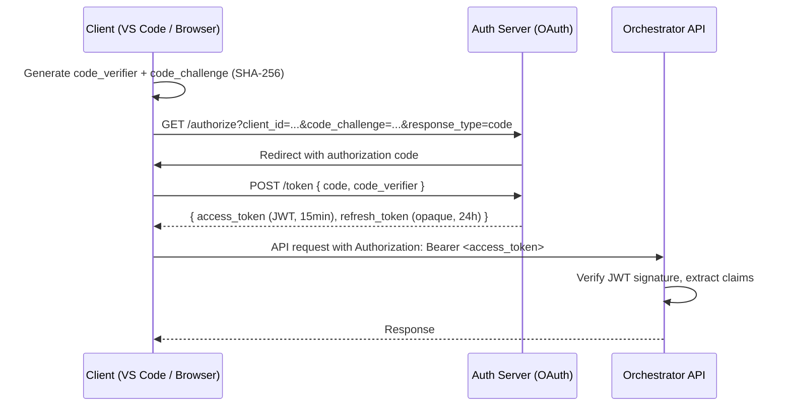

# Security — Authentication, Authorization, Tenancy, Secrets, and Sandboxing

Agent Studio is a centrally hosted multi-tenant platform that executes code on behalf of its users. Every layer of the system is designed around the principle of **least privilege**: agents get the minimum tool access needed for their role, tasks run in isolated sandboxes, and secrets are never stored anywhere they could be read by code or logged.

---

## 1. Authentication

### OAuth PKCE Flow

Clients (VS Code extension and web UI) authenticate via **OAuth 2.0 with PKCE** (Proof Key for Code Exchange). This flow is appropriate for public clients that cannot securely store a client secret.



### JWT Claims

```json
{
  "sub": "user-uuid",
  "tenantId": "tenant-uuid",
  "projectId": "project-uuid-or-null",
  "email": "user@example.com",
  "roles": ["member"],
  "iat": 1712500000,
  "exp": 1712500900,
  "jti": "token-uuid"             // for revocation
}
```

**Roles:**

| Role | Capabilities |
|---|---|
| `member` | Submit tasks, view task events, approve/reject HITL requests for own tasks |
| `admin` | All member capabilities + view all tenant tasks + inject context |
| `tenant-admin` | All admin capabilities + manage MCP server registrations + manage tenant config |

### Token Storage

| Client | Token storage |
|---|---|
| VS Code extension | VS Code Secret Storage API (OS keychain-backed) — never in `globalState` or disk |
| Browser | `HttpOnly` secure cookie (for refresh token) + memory-only variable (for access token) — never `localStorage` |

### Silent Refresh

The client proactively refreshes the access token 60 seconds before expiry using the refresh token. A `401 Unauthorized` on a refresh attempt triggers a full re-authentication flow. The refresh token is rotated on each use (refresh token rotation).

---

## 2. Authorization

### Per-Tenant Row Isolation

Every database table (except `tenants`) carries a `tenant_id` column. PostgreSQL Row-Level Security (RLS) policies enforce that a database session can only see rows matching its tenant:

```sql
-- Session variable set by the orchestrator before every query
SET app.current_tenant_id = '<tenant-uuid>';

-- RLS policy (example for tasks)
CREATE POLICY tasks_tenant_isolation ON tasks
  FOR ALL TO app_role
  USING (tenant_id = current_setting('app.current_tenant_id')::uuid);
```

There is no application-layer tenant filter that can be forgotten — the database enforces isolation unconditionally.

### Per-Role MCP Tool Allowlists

Every MCP server registration declares a per-role allowlist. The MCP client enforces these allowlists before forwarding any tool call:

```
Agent calls tool
  ↓
MCP client checks: is this tool in the active role's allowlist?
  ├── No → ToolDeniedError returned immediately (no network call made)
  └── Yes → continue to approval check
```

Allowlists use glob patterns: `["graph.*"]`, `["playwright.*"]`, `["git.status", "git.diff", "git.log"]`. The platform ships conservative defaults; operators can only **tighten** allowlists at the task level, never widen them beyond the role default.

### Tenant-Admin-Only Registry Mutations

Mutations to the MCP server registry (`POST /mcp/servers`, `DELETE /mcp/servers/:name`, enable/disable) require the `tenant-admin` role. `member` and `admin` users can read the registry but not modify it.

### HITL Actor Recording

Every HITL approval or rejection records the actor's identity (user ID and email, extracted from the JWT) in the `hitl_requests` table and the `audit_log`. This creates a non-repudiable record of who approved a potentially dangerous tool call (e.g. `github.merge_pr`, `wms.apply_patch`).

---

## 3. Secrets Management

### The Rule

**No secret value is ever:**
- Written to any database row or config file
- Included in any MCP Registry `spec_json` entry
- Logged in any MCP call log, audit trail, error message, or structured log
- Passed through environment variables that persist after server spawn
- Included in a `DispatchEnvelope` (memory and knowledge context only; never credentials)

### Secrets Backend

All credentials are stored in **HashiCorp Vault** (preferred for on-premises and cloud-agnostic deployments) or the cloud provider's KMS/secrets manager (AWS Secrets Manager, Google Secret Manager, Azure Key Vault). The orchestrator is configured with the secrets backend URL and a service account credential at deploy time.

### Which Credentials Are Managed

| Secret Name (example) | Value |
|---|---|
| `github-pat` | GitHub Personal Access Token or GitHub App private key |
| `wms-api-token` | WMS MCP server authentication token |
| `ruflo-api-key` | Ruflo endpoint API key |
| `confluence-api-token` | Atlassian Confluence REST API token |
| `sharepoint-client-id` | Azure AD app client ID for SharePoint |
| `sharepoint-client-secret` | Azure AD app client secret for SharePoint |
| `anthropic-api-key` | Anthropic API key for Claude Code workers |
| `tavily-api-key` | Tavily web search API key |
| `brave-api-key` | Brave Search API key (alternative) |
| `ruflo-postgres-url` | Connection string for Ruflo's PostgreSQL backend |
| `playwright-browsers-cache` | Cache path for Playwright browser binaries |

Credentials are keyed per-tenant: `{tenantId}/{secretName}`. The orchestrator resolves the correct secret for the active tenant before spawning each MCP server process.

### How Secrets Reach MCP Servers

For **stdio MCP servers**: the orchestrator reads the secret value from the secrets backend immediately before forking the child process and injects it as an environment variable in the child's environment. The environment variable is not inherited by any other process.

For **HTTP MCP servers**: the orchestrator reads the secret and constructs the `Authorization` header at connection time. The header is never written to disk or logs.

In both cases, the `McpServerSpec.env[].valueFrom.secret` field holds only the secret name. The value is resolved and injected at spawn time, never stored in the registry row.

---

## 4. Claude Code Worker Sandboxing

Sandboxed workers (Mode B: `claude_code.spawn_worker`) run in **per-task Docker containers** on a dedicated worker node pool. Each container is fully isolated:

### Container Configuration

```yaml
# Per-task worker container spec
image: "agent-studio/claude-code-worker:latest"

mounts:
  # Repo snapshot — read-only
  - type: bind
    source: "/var/agent-studio/tasks/{taskId}/workspace"
    target: "/workspace"
    readOnly: true
  # Overlay FS for writes — diffed back at container exit
  - type: overlay
    target: "/workspace-writable"
    lowerDir: "/var/agent-studio/tasks/{taskId}/workspace"

resources:
  cpuLimit: "2"
  cpuRequest: "0.5"
  memoryLimit: "4Gi"
  memoryRequest: "1Gi"
  ephemeralStorageLimit: "10Gi"

# Hard kill at wall-time limit
activeDeadlineSeconds: 1800     # 30 minutes; configurable per task

network:
  # Egress allowlist — only Anthropic API and approved MCP endpoints
  egressRules:
    - host: "api.anthropic.com"
      port: 443
    - host: "*.internal"        # internal MCP sidecar services
      port: 8080
  # Block all other egress
  defaultEgressPolicy: Deny

securityContext:
  runAsNonRoot: true
  runAsUser: 1000
  readOnlyRootFilesystem: true
  allowPrivilegeEscalation: false
  capabilities:
    drop: ["ALL"]

# Scoped MCP client config — only the tools this task needs
# Written into the container at spawn time, not inherited from orchestrator
volumeMounts:
  - name: mcp-config
    mountPath: "/etc/agent-studio/mcp-config.json"
    readOnly: true
```

### `bypassPermissions` Gate

`permissionMode=bypassPermissions` grants the inner loop unrestricted filesystem and tool access within the container. This mode:

- **Always requires HITL approval** before the container is spawned (see `docs/02-integrations/claude-code-worker.md`)
- Is never the default; operators must explicitly choose it
- Is recorded in the `audit_log` with the approving actor's identity
- Still operates within the container's network egress allowlist — `bypassPermissions` refers to file system permissions, not network permissions

### Worker Result Extraction

When the container exits:
1. The overlay filesystem diff is computed: only files written to `/workspace-writable` are included.
2. The diff is validated: file paths must be within `envelope.workspace.writableGlobs`.
3. Files outside the writable globs are silently discarded and the discarded paths logged.
4. The validated diff is applied to the actual task workspace.

---

## 5. Playwright Sandbox

The Playwright MCP server runs inside a Docker container with stricter network isolation than the Claude Code worker:

```yaml
network:
  mode: "internal"
  # Only the application under test — no general internet access
  allowedHosts:
    - "app-under-test.internal:{port}"
  defaultEgressPolicy: Deny

# No writable access to the repository
mounts:
  - source: "/var/agent-studio/tasks/{taskId}/workspace"
    target: "/workspace"
    readOnly: true
  - source: "/var/agent-studio/tasks/{taskId}/reports"
    target: "/reports"
    readOnly: false   # only the reports volume is writable
```

The Playwright container cannot make outbound HTTP requests except to the application under test. This prevents test scripts from exfiltrating secrets or making network calls to external systems.

---

## 6. Fetch MCP Domain Allowlist

The Fetch MCP server enforces a domain allowlist (configured via environment variable) and blocks private IP ranges at both the application level and via network egress rules on the orchestrator pod:

**Application-level blocks** (enforced by `@modelcontextprotocol/server-fetch`):
- All domains not in `FETCH_DOMAIN_ALLOWLIST`
- Domains resolving to private/loopback addresses (regardless of allowlist membership)

**Network-level blocks** (egress firewall on orchestrator pod):
- `169.254.0.0/16` — cloud provider metadata endpoints (AWS IMDS, GCP metadata, etc.)
- `10.0.0.0/8`, `172.16.0.0/12`, `192.168.0.0/16` — private RFC 1918 ranges
- `127.0.0.0/8` — loopback

Defence-in-depth: even if the Fetch MCP server's allowlist check is bypassed (e.g. via a redirect chain), the network-level block prevents the HTTP request from reaching private services.

---

## 7. MCP Registry Security

The MCP registry is a high-value attack surface: a malicious or compromised server registration could introduce new code execution paths or exfiltrate data through new tool calls.

### Mandatory Human Approval for High-Risk Source Kinds

Registering an MCP server with `source.kind=git` or `source.kind=binary` requires **mandatory human approval** from a `tenant-admin` before the server becomes active:

```
Tenant admin: POST /mcp/servers { source: { kind: "git", package: "..." } }
  ↓
MCP Registry Manager: source.kind is high-risk → raise HITL
  ↓
Platform admin reviews: git URL, package contents, intended use
  ↓
Approve → server registered and enabled
Reject → registration not created
```

`npx`, `docker`, and `http` kinds are lower risk (npm provenance, Docker image scanning, and remote endpoints are independently auditable) and do not require platform admin approval.

### New Tools Default to DENIED After Upgrade

When an MCP server is upgraded:
1. The manager fetches the new version's tool manifest.
2. Any tool in the new manifest that is not in the current allowlist **defaults to DENIED** for all roles.
3. The manager surfaces the tool diff in the web UI: "These 2 new tools are available but not granted to any role."
4. The operator explicitly grants new tools to roles as needed.

This prevents a supply-chain attack where a malicious server update adds a new `fs.write` or `git.push` tool that agents would silently gain access to.

### Allowlist Diff Logged to Audit

Every allowlist change (new tool granted, tool revoked, role permissions changed) is appended to the `audit_log` with the actor's identity, the before state, and the after state.

---

## 8. Audit Log

The `audit_log` table is the tamper-evident record of all consequential actions in the platform:

| Verb category | Examples |
|---|---|
| Task steering | `task.pause`, `task.resume`, `task.inject`, `task.cancel`, `task.branch`, `task.rollback` |
| HITL decisions | `hitl.approve`, `hitl.reject` — with tool name, arguments, and actor |
| MCP registry mutations | `mcp.install`, `mcp.upgrade`, `mcp.remove`, `mcp.enable`, `mcp.disable` |
| Allowlist changes | `mcp.allowlist_changed` — with before/after per-role tool lists |

### Properties of the Audit Log

- **Append-only:** no UPDATE or DELETE statements are issued against `audit_log`. The database user that the orchestrator connects with does not have UPDATE or DELETE privileges on this table.
- **Tamper-evident:** rows include a `created_at` timestamp and are written in strict chronological order. Any gap in sequence numbers (if added) would indicate tampering.
- **Actor-attributed:** every row records the identity of the actor. Machine actions (automated orchestrator decisions) use `actor = "system"`.
- **Reason field:** HITL decisions and registry mutations include an optional free-text reason from the actor.

### Audit Retention

Audit log rows are retained for the duration specified by the tenant's data-retention policy (default: 1 year). Rows older than the retention period are archived to cold storage (S3/GCS/Azure Blob), not deleted.

---

## 9. Security Invariants Summary

The following invariants must hold at all times. Violations should be treated as bugs, not policy exceptions:

1. **No secret value in any DB row, config file, log, or API response body.**
2. **No agent role can call a tool not in its allowlist.** Enforcement is at the MCP client layer, not in agent system prompts.
3. **No `bypassPermissions` spawn without HITL approval.** Enforced by the ClaudeCode Worker MCP server before spawning.
4. **No Playwright egress to the public internet.** Enforced by network policy on the Playwright sandbox container.
5. **No Fetch MCP call to a private IP.** Enforced by both the server's allowlist check and the pod's network egress rules.
6. **No MCP registry mutation without tenant-admin role.** Enforced by the REST API authorization middleware.
7. **No `git` or `binary` source registration without platform admin review.** Enforced by the registry manager's approval gate.
8. **All HITL decisions are recorded in audit_log with actor identity.** Enforced by the HITL flow before forwarding approved calls.
9. **No tenant can see another tenant's data.** Enforced by PostgreSQL RLS on all tables.
10. **All steering verbs (pause, resume, inject, cancel, branch, rollback) are recorded in audit_log.** Enforced by the orchestrator's steering verb handlers before executing the action.
