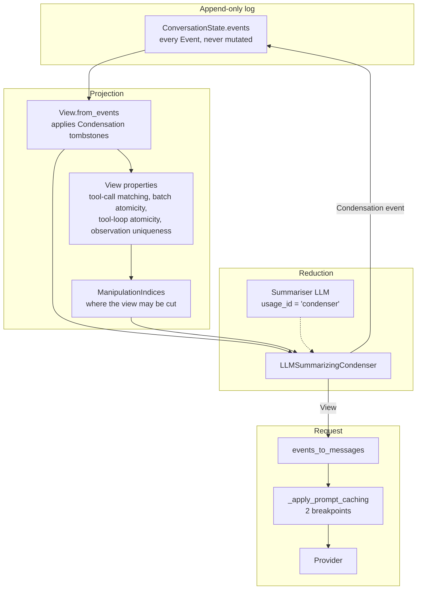
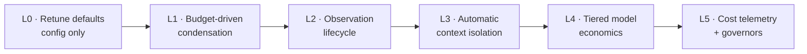

# OpenHands Context Management — Token-Burn Analysis and Proposed Redesign

> **Status:** Research note (external system analysis)
> **Subject:** [`OpenHands/software-agent-sdk`](https://github.com/OpenHands/software-agent-sdk) @ `88afa9a`, and [`OpenHands/OpenHands`](https://github.com/OpenHands/OpenHands) (Agent Canvas) @ `35331e7`
> **Read on:** 2026-08-22
> **Why this doc exists:** OpenHands agents consume tokens at a very high rate during task execution. This note traces where the tokens actually go, identifies the gaps in the context-management design that cause it — context isolation among them — and proposes a concrete, layered fix.

---

## 0. Scope and method

The OpenHands agent loop no longer lives in `OpenHands/OpenHands` — that repository is now **Agent Canvas**, a TypeScript control surface. The agent itself, including all context management, lives in **`OpenHands/software-agent-sdk`** (`openhands-sdk`, `openhands-tools`, `openhands-agent-server`). Everything below is read from that repository unless a path is prefixed `canvas:`.

Two kinds of claims appear in this document, and they are kept visually distinct:

- **Read from source.** Every such claim carries a `path:line` citation. These are facts about the code as of the commit above.
- **Modelled.** Cost figures come from [`openhands-context-cost-model.py`](./openhands-context-cost-model.py), a policy simulator in this directory that re-implements the condenser's trigger arithmetic over a synthetic event stream. It is *not* a harness around the SDK and does not call any model. Its assumptions are stated inline and in §4.

No changes were made to the OpenHands repositories. Nothing here was benchmarked against a live provider.

---

## 1. TL;DR — the six findings that matter

| # | Finding | Evidence | Cost impact |
|---|---|---|---|
| **F1** | **The shipped default condenses only when the context is already full.** The product's condenser settings inherit `max_tokens = llm.effective_max_input_tokens` — the *entire* context window — as the condensation trigger, with no headroom fraction. | `settings/model.py:290-293`, `llm.py:2546` | Steady-state request size oscillates between 50 % and 100 % of the window. Dominant cost driver. |
| **F2** | **The event-count trigger is size-blind and set to 240 in the product path** (the SDK preset uses 80). 240 events of tool output can be anything from 20 k to 400 k tokens. | `settings/model.py:167` vs `llm_summarizing_condenser.py:507` | The product ships the looser of its two defaults. Model shows ~29 % more spend than the SDK preset on the same workload. |
| **F3** | **The summariser never sees what it is summarising.** Forgotten events are stringified via `__str__`, which truncates to 500 characters — and for an `ActionEvent` emits only the *action class name*, never the tool arguments. | `event/base.py:17`, `event/llm_convertible/action.py:146-157` | Summaries cannot record which file was edited or which command was run → post-condensation rediscovery loops → extra steps at near-full context. |
| **F4** | **Context isolation is opt-out by default.** Sub-agent delegation — the one mechanism that keeps exploratory work out of the main thread — is `False` in the SDK preset, in `AgentSettings`, and in the Canvas UI. | `preset/default.py:39`, `settings/model.py:1268`, `canvas:src/services/settings.ts:50` | Every `grep`, every file read, every failed test run accumulates in the one context that is re-sent on every subsequent step. |
| **F5** | **Observations are all-or-nothing.** A 30 000-character terminal capture is re-sent verbatim on every request until condensation deletes it entirely. There is no ageing, digesting, or eviction between "full" and "gone". | `terminal/constants.py:18`, `condenser/base.py` (no per-event compaction path) | The single largest source of avoidable resident tokens. |
| **F6** | **Subscription-mode conversations have no condenser at all.** `create_agent()` sets `condenser = None` when the LLM is subscription-authenticated, and the Responses path is stateless (`store=False`), so history grows unbounded until the provider rejects it — with no recovery path, because recovery *is* the condenser. | `settings/model.py:1392`, `llm/options/responses_options.py:44-48`, `agent/agent.py:788-801` | Not a billing cost, but an unbounded quota burn ending in an unrecoverable run failure. |

Everything else in §5 is secondary to these six.

---

## 2. How context management works today

### 2.1 The pieces



The design is genuinely good in its bones, and three parts deserve credit before the criticism starts:

1. **Tombstone condensation over an append-only log.** `Condensation` events mark forgotten event IDs and a summary insertion offset (`event/condenser.py`); the log itself is never rewritten. Full replay and debuggability survive condensation. This is the right primitive.
2. **View properties as a correctness fence.** `ToolCallMatchingProperty`, `BatchAtomicityProperty`, `ToolLoopAtomicityProperty` and `ObservationUniquenessProperty` (`context/view/properties/`) compute the set of indices at which the history may legally be cut, so condensation can never orphan a `tool_use` from its `tool_result`. Most agent frameworks discover this constraint by getting a 400 from the provider.
3. **Soft vs hard condensation requirements** (`condenser/base.py:95-105`). A resource-pressure trigger that cannot be satisfied this step is retried next step; an explicit request that cannot be satisfied escalates to `hard_context_reset()`. The failure taxonomy is thought through.

### 2.2 The trigger arithmetic

`LLMSummarizingCondenser.get_condensation_reasons` (`llm_summarizing_condenser.py:117-155`) produces up to three reasons:

| Reason | Condition | Requirement |
|---|---|---|
| `REQUEST` | an unhandled `CondensationRequest` in the view | **HARD** |
| `TOKENS` | `get_total_token_count(view) > min(max_tokens, llm.effective_max_input_tokens)` | **HARD** |
| `EVENTS` | `len(view) > max_size` | **SOFT** |

`_get_forgotten_events` (`:248-305`) then picks the *strictest* cut across all firing reasons:

- `EVENTS` → keep `max_size // 2 - keep_first - 1` events from the tail.
- `TOKENS` → drop the shortest prefix that brings the view under `max_tokens // 2`.
- `REQUEST` → keep roughly half the view.

The cut is then snapped outward to the nearest legal `ManipulationIndices` boundary, and everything between `keep_first` and the cut is replaced by one summary event.

### 2.3 The two default configurations, and why they differ

There are two independent sets of defaults, and they disagree:

| Knob | SDK preset (`default_condenser`) | Product settings (`LLMSummarizingCondenserSettings`) |
|---|---|---|
| `max_size` | **80** (`llm_summarizing_condenser.py:507`) | **240** (`settings/model.py:167`) |
| `keep_first` | **4** (`:508`) | **2** (`settings/model.py:217`) |
| `max_tokens` | `None` → falls back to the full window | `None`, but `build_condenser` **backfills it with `llm.effective_max_input_tokens`** (`settings/model.py:290-293`) |
| Condenser LLM | copy of the agent LLM, `usage_id="condenser"` (`preset/default.py:103`) | same (`settings/model.py:281`) |

The path a Canvas or agent-server user actually takes is the right-hand column. It is the looser of the two on every axis that matters.

### 2.4 What the trigger means in practice

`effective_max_input_tokens` resolves to the provider's advertised input limit (`llm.py:2546-2561`) — 200 000 for a Sonnet-class model, 1 M for some others. So the token trigger is **"condense when the request would fill the entire context window"**, and the target is **half the window**.

There is no headroom for the completion, no configurable fraction, and no notion of a *budget* distinct from a *limit*. The condenser is a safety net against provider errors, not a cost-control mechanism — but it is the only thing in the system playing either role.

---

## 3. Where the tokens actually go

For an agent that re-sends its history every step, total input tokens over a run are

```
total_input ≈ Σ_t context_t
```

and `context_t` grows monotonically between condensations. Two consequences follow, and both are underexploited in the current design:

1. **Cost is quadratic in run length, linear in mean context.** Halving the mean resident context halves the bill for the whole run — it is not a marginal saving on the last few steps. This is why the condensation *target* matters far more than the condensation *trigger*.
2. **Every token admitted to the context is paid for on every subsequent step until it is condensed away.** A 7 500-token terminal capture admitted at step 20 and condensed away at step 60 costs 40 × 7 500 = 300 000 token-slots, not 7 500. Per-observation truncation caps are therefore *amortised* limits, not one-off ones — and the current caps (30 000 chars for the terminal, `terminal/constants.py:18`; 16 000 for the file editor, `file_editor/utils/constants.py:1`) were plainly chosen as one-off limits.

Prompt caching mutes but does not remove this. `_apply_prompt_caching` (`llm.py:2682-2710`) sets two Anthropic breakpoints — the static half of the system prompt, and the last user/tool message — so a steady-state step reads most of its context at 0.1×. But **any condensation rewrites the head of the message list and invalidates the entire prefix**, so each condensation is followed by a full-price re-ingest of the surviving context. The cheaper policy is therefore *not* "condense as rarely as possible": it is "keep the resident set small enough that the re-ingest is cheap when it happens".

---

## 4. Modelled cost comparison

[`openhands-context-cost-model.py`](./openhands-context-cost-model.py) simulates a 200-step coding session against a 200 k window, with a heavy-tailed observation-size distribution (most events small, a long tail clipped at the real tool caps), Anthropic-style cache multipliers (0.1× read, 1.25× write), and a fixed probability that a lossy summary costs an extra rediscovery step. Averaged over five seeds:

```
Policy                                          mean ctx  peak ctx  cond.   cache   billed in     cost
------------------------------------------------------------------------------------------------------
A. Product default (settings.CondenserSettings)   105,303   180,399    2.0     98%   2,637,680     9.99
B. SDK preset default (default_condenser)          49,298    78,738    8.0     95%   1,679,419     7.10
C. Token-budgeted condensation only                40,668    59,916    6.2     96%   1,325,079     6.05
D. C + observation ageing                          39,496    59,255    2.0     98%   1,115,149     5.44
E. D + sub-agent isolation                         38,783    59,481    0.8     98%   1,037,233     4.30
```

and a sweep of the condensation thresholds, holding everything else fixed:

```
Threshold sweep (no ageing, no isolation) — cost in USD

  trigger    target 8%   target 12%   target 20%   target 30%   target 50%
      20%         5.33         6.00            -            -            -
      30%         5.64         6.05         7.23            -            -
      40%         6.13         6.35         7.17         8.76            -
      55%         6.81         7.04         7.53         8.31        13.26
      75%         7.91         8.07         8.51         8.86        10.07
     100%         8.69         8.86         9.20         9.61        10.48   ← current default
```

Read these numbers as **ratios under stated assumptions, not as a price quote.** The absolute dollars depend entirely on the event-size distribution. What the model does establish, and what is robust across every distribution tried:

- The current 100 %-of-window trigger sits in the worst corner of the sweep. Moving the trigger to 30–40 % of the window and the target to 8–12 % is worth roughly **35 %** of the input bill, before any other change.
- The **product default is materially worse than the SDK preset** (policy A vs B) purely because of `max_size` 240 vs 80 — a configuration divergence, not a design difference.
- Observation ageing (D) and isolation (E) compound with the threshold change rather than substituting for it.
- The cheapest corner of the sweep is not the right answer. The model has no quality axis beyond a fixed rediscovery probability, so it will always prefer a smaller context. The floor must be set by task-completion quality — which is precisely the argument for making the target an explicit, measurable **token budget** rather than an accident of the provider's window size.

---

## 5. Gap analysis

Severity is judged by expected token impact on a typical long coding run.

### G1 — Condensation trigger is the context window, not a budget · **Critical**

`_effective_max_tokens` takes `min(self.max_tokens, agent_llm.effective_max_input_tokens)` (`llm_summarizing_condenser.py:96-116`), and the product backfills `max_tokens` with exactly that same window (`settings/model.py:290-293`). The condenser therefore fires at 100 % of the window and targets 50 %.

Consequences beyond raw cost: there is **no headroom for the completion**, so a request sized just under the input limit can still fail on total tokens; and because `TOKENS` is classified `HARD` (`:169-173`), hitting it costs an extra round trip (the step returns a `Condensation` and the agent re-steps).

### G2 — Event count is used as a proxy for context size · **Critical**

`max_size` counts events, not tokens. 240 events (`settings/model.py:167`) is between ~20 k and ~400 k tokens depending on what the tools returned. The same configuration is simultaneously far too tight for a chat-like run and far too loose for a build-log-heavy one. It also cannot be reasoned about across models: 240 events means something entirely different on a 32 k local model than on a 1 M-token one.

### G3 — The summariser is fed 500-character previews, and no tool arguments · **Critical**

`_generate_condensation` renders `str(forgotten_event)` into the prompt (`llm_summarizing_condenser.py:186-215`). For an `ActionEvent`, `__str__` returns the thought preview plus **`self.action.__class__.__name__`** — the class name only (`event/llm_convertible/action.py:146-157`). For an `ObservationEvent` it returns the first 500 characters of the result (`observation.py:74-83`, `event/base.py:17`).

So the summariser writing the `CODE_STATE` / `CHANGES` / `VERSION_CONTROL_STATUS` sections that `condenser/prompts/summarizing_prompt.j2` demands is looking at input like:

```
ActionEvent (agent)
  Thought: Let me fix the off-by-one in the parser...
  Action: FileEditorAction
```

It cannot know *which file*, *which line*, or *what the edit was*. The prompt asks for exactly the facts the input has been stripped of. The predictable failure mode is a summary that reads plausibly but omits the concrete state, after which the agent re-greps, re-reads and re-runs — spending full-context steps to recover information it already had. This is the most under-appreciated token cost in the system, because it shows up as *extra steps*, not as bigger requests.

Two smaller notes in the same area: the summarisation call is a one-shot user message with no cache breakpoints (so it is always full price, though it is small), and `hard_context_reset` shrinks `max_event_str_length` by 20 % per retry (`:317-358`) — shrinking an input that is already a 500-character preview.

### G4 — No observation lifecycle between "resident in full" and "deleted" · **Critical**

The only reduction primitive is *forget the event*. There is no mechanism to:

- replace an old observation with a digest while keeping the action that produced it,
- collapse repeated reads of the same file to the newest one,
- drop superseded `file_editor` views after the file has been edited again,
- or reference a spilled-to-disk artifact instead of inlining it.

The last of these is *almost* built: `maybe_truncate(save_dir=...)` already spills over-cap terminal output to a file and rewrites the notice to point at it (`sdk/utils/truncate.py:50-110`, `terminal/definition.py:191-197`). That is exactly the right pattern — it just only applies at the moment of capture, never afterwards as the observation ages.

Note also that per-observation caps are applied in `to_llm_content`, i.e. at message-build time, so the full text is retained in the event store. An ageing pass has everything it needs to be lossless-on-disk and lossy-in-context.

### G5 — Context isolation is off by default · **Critical**

Sub-agent delegation is the strongest isolation primitive in the codebase and it is well built: `TaskManager`/`DelegateExecutor` create a **fresh `LocalConversation`** per sub-agent with its own event log, its own condenser and its own metrics, run it to completion, and merge back only `get_agent_final_response` — a single short observation in the parent (`tools/task/manager.py:250-400`, `tools/delegate/impl.py:132-278`). A sub-agent that reads forty files costs the parent one paragraph.

It is off in all three places a user could get it: the SDK preset (`preset/default.py:39`), `AgentSettings.enable_sub_agents` (`settings/model.py:1268`), and the Canvas settings default (`canvas:src/services/settings.ts:50`). The default agent therefore performs all exploration inline, in the one context that is re-sent on every step.

There is also no *automatic* isolation: nothing routes a search, a full-file read, or a test-suite run into a scratch context on its own. Isolation exists only if the model chooses to call the task tool, and the task tool is only present if the operator opted in.

### G6 — Sub-agents and the summariser inherit the frontier model · **High**

`sub_agent_llm = parent_llm.model_copy(...)` (`tools/task/manager.py:367`, `tools/delegate/impl.py:183`) and `condenser_llm = llm.model_copy(update={"usage_id": "condenser"})` (`settings/model.py:281`, `preset/default.py:103-104`). A grep-and-report sub-agent and a summarisation pass both run on whatever expensive model the parent uses. `AgentDefinition` carries a `model` field (`subagent/schema.py:29`), so per-agent model selection is expressible — it is simply not the default, and there is no cheap-tier default to fall back to.

Relatedly, `RouterLLM` ships only `multimodal` and `random` implementations (`llm/router/impl/`). There is no cost-aware or difficulty-aware routing.

### G7 — Subscription mode disables condensation entirely · **High**

`condenser = None if llm.is_subscription else self.build_condenser(llm)` (`settings/model.py:1392`). The Responses path is stateless (`store` defaults to `False`, `llm/options/responses_options.py:44-48`), so the full history is re-sent every turn regardless. When the window is exceeded, `Agent.step` finds no condenser that `handles_condensation_requests()` and re-raises after logging (`agent/agent.py:788-801`) — the run ends and cannot be resumed by condensing.

Whatever the billing rationale, the reliability consequence is that the longest runs — the ones most likely to be on a subscription — are the ones with no recovery path.

### G8 — Prompt-cache policy is not condensation-aware · **Medium**

Two of Anthropic's four breakpoints are used, both at the extremes (`llm.py:2682-2710`). Nothing anchors a breakpoint at a stable mid-history point, and condensation timing is independent of cache state — a condensation can fire immediately after a fresh cache write, paying the write twice over. There is no mid-run measurement of `cache_read_tokens / prompt_tokens` feeding back into the condensation decision, even though `TokenUsage` already records both (`llm/utils/metrics.py:44-51`) and `MetricsSnapshot` already computes a hit rate (`:94-110`).

### G9 — Historical reasoning blocks are retained indefinitely · **Medium**

Every `ActionEvent` carries its `thinking_blocks` and re-emits them into its message (`event/llm_convertible/action.py:33-35,142`). Only the most recent assistant turn's thinking is load-bearing for tool-use continuity; older blocks are resident cost. They sit inside the cached prefix, so the marginal price is 0.1×, but on reasoning-heavy models the volume is not small.

### G10 — Token accounting is recomputed from scratch every step · **Medium (latency/CPU, not tokens)**

`get_total_token_count` re-serialises the whole view and runs litellm's tokeniser on every step (`condenser/utils.py:7-52`), and `get_shortest_prefix_above_token_count` does a binary search that repeats that work `O(log n)` times (`:54-115`). Meanwhile the provider returns an exact `prompt_tokens` on every response, already captured in `TokenUsage`. An incremental counter — last response's `prompt_tokens`, plus an estimate for events appended since — would be both cheaper and more accurate.

### G11 — No graduated cost controls · **Medium**

`max_budget_per_run` exists and is enforced (`conversation/impl/local_conversation.py:681-695`), but it defaults to `None` and is a hard stop: the run fails. There is nothing in between — no "switch to a cheaper model at 60 % of budget", no "force condensation at 70 %", no "stop delegating at 80 %". `StuckDetector` catches repetition patterns over a 20-event window (`conversation/stuck_detector.py:21`) but has no cost dimension, so a run that is making expensive non-progress is invisible to it.

### G12 — Tool schemas are static for the whole run · **Low–Medium**

The full tool set is sent on every request. The browser tool set alone is a large block of schema (`tools/browser_use/definition.py`, ~29 kB of source), and MCP servers add more. It is all inside the cached prefix, so the marginal cost is 0.1× — but it inflates every cache write and consumes window that could hold task state. There is no phase-based subsetting (planning vs editing vs verification).

### G13 — Retries re-send the full context · **Low**

`num_retries` defaults to 5 with exponential backoff (`llm.py:347-350`). For failures that occur after the provider has ingested the prompt (timeouts, overloaded responses), each retry re-pays ingestion at full context size, with no down-shift in context or model.

---

## 6. Proposed solution

The fixes are layered so that each layer is independently shippable and independently measurable. L0 is a configuration change; L1–L3 are the substantive redesign; L4–L5 make the result governable.



### L0 — Retune the shipped defaults (no new code)

Addresses **G1, G2, G5**. This alone is worth roughly a third of the bill under the model in §4.

| Setting | Today | Proposed | Rationale |
|---|---|---|---|
| `max_tokens` (product) | `effective_max_input_tokens` | `0.35 × effective_max_input_tokens` | Condense on a budget, not at the wall. |
| condensation target | `max_tokens // 2` | `0.12 × window` (see L1) | The target sets the mean; the mean sets the bill. |
| `max_size` (product) | 240 | 80, and demoted to a backstop | Align with the SDK preset; the token budget becomes the primary trigger. |
| `keep_first` | 2 (product) / 4 (SDK) | 4 everywhere | Remove the divergence; keep the task statement and system framing. |
| `enable_sub_agents` | `False` | `True` | Isolation should be the default posture, not an expert setting. |

The two defaults must stop disagreeing. `default_condenser()` and `LLMSummarizingCondenserSettings` should derive from one shared constants module so a change to one cannot silently miss the other.

### L1 — Budget-driven condensation

Addresses **G1, G2, G8, G10**. Replace "condense when full" with an explicit, model-independent budget.

```python
class ContextBudget(BaseModel):
    """Everything the condenser needs, expressed in tokens, not events."""

    soft_fraction: float = 0.35   # begin condensing at this share of the window
    hard_fraction:  float = 0.75  # must condense before the next request
    target_fraction: float = 0.12 # condense down to this
    absolute_ceiling: int | None = None  # optional cost cap, overrides fractions
    reserve_for_output: int = 8_000      # never plan a request that leaves no room

    def resolve(self, window: int) -> tuple[int, int, int]:
        usable = window - self.reserve_for_output
        cap = min(usable, self.absolute_ceiling or usable)
        return (int(cap * self.soft_fraction),
                int(cap * self.hard_fraction),
                int(cap * self.target_fraction))
```

Three changes follow from this type:

1. **Two-level triggers.** The *soft* threshold makes condensation opportunistic — it can be scheduled when the prompt cache is about to expire anyway, or deferred a step or two to land on a natural boundary. The *hard* threshold is the current behaviour, kept as a backstop. Today's single threshold is effectively hard-only, which is why every condensation lands at the worst possible moment.
2. **Token accounting from provider truth.** Track `prompt_tokens` from the last `TokenUsage` and add an incremental estimate for events appended since, rather than re-tokenising the whole view every step (G10). Fall back to full counting only when there is no prior response — for example on resume.
3. **Cache-aware timing.** With `cache_read_tokens / prompt_tokens` already available (`llm/utils/metrics.py:94-110`), a condensation whose expected saving does not exceed the cost of the cache reset it forces can be deferred to the hard threshold. This is a genuine optimisation, not a heuristic: both quantities are measured.

`max_size` survives as a backstop against pathological event counts, but it stops being the primary control.

### L2 — Observation lifecycle: age, digest, spill

Addresses **G3, G4**, and is the layer with the largest headroom. Introduce a stage between "resident in full" and "forgotten", applied to observations as they age:

| Age (steps since produced) | Treatment |
|---|---|
| 0 – `fresh_window` (default 10) | full text, as today |
| beyond `fresh_window` | **digest**: first + last N lines, structural summary (exit code, file path, line range, match count), and a pointer to the spilled artifact |
| superseded | **evict**: a `file_editor` view of a file that has since been edited, or a duplicate read of an unchanged file, collapses to its newest instance |
| condensed | forgotten, as today |

Three notes on making this safe and cheap:

- **Digests are deterministic, not model-generated.** Each `Observation` subclass implements `to_digest(self) -> str` — the terminal returns the command, exit code, and first/last lines; the file editor returns the path and line range; grep returns the match count and the top hits. No LLM call, no latency, no failure mode.
- **The spill mechanism already exists.** `maybe_truncate(save_dir=...)` writes the full content to a content-hashed file and rewrites the notice to point at it (`sdk/utils/truncate.py:28-110`). Ageing reuses it verbatim: the digest carries the same pointer, so the agent can always re-read the full artifact with a tool call if it genuinely needs it — a targeted, once-off cost rather than a per-step one.
- **Ageing is a view-level projection, not a mutation.** The event log keeps full fidelity; only `to_llm_content` changes. This preserves the append-only guarantee that makes the current design good.

**And fix the summariser's input (G3), which is a prerequisite for the rest working.** Condensation should not consume `str(event)`. Give `LLMConvertibleEvent` an explicit `to_summary_input()` that emits the facts a summary needs:

```python
# ActionEvent.to_summary_input()
{
  "kind": "action",
  "tool": "file_editor",
  "args": {"command": "str_replace", "path": "src/parser.py", "old_str": "…"},  # redacted, capped
  "thought": "<first 300 chars>",
}
# ObservationEvent.to_summary_input()
{
  "kind": "observation",
  "tool": "file_editor",
  "outcome": "ok",
  "digest": "edited src/parser.py lines 40-52",
  "artifact": "/workspace/.openhands/outputs/terminal_9f3a1c2b.txt",
}
```

Tool arguments are the single highest-value thing a summary can retain, and they are currently the one thing thrown away. Cap and redact them (they may carry secrets — `secret/secrets.py` already has the machinery), but do not drop them.

### L3 — Automatic context isolation

Addresses **G5**, and is the structural fix rather than the tuning one. Three tiers, in increasing order of ambition:

**L3a — Enable delegation by default.** `enable_sub_agents=True` in the SDK preset, `AgentSettings`, and Canvas. Ship a small set of built-in sub-agents tuned for the cases that dominate exploratory token spend — a code searcher, a test runner, a log analyser — each with a tight `max_iteration_per_run` and a cheap model (L4).

**L3b — Scoped tool calls: isolation without a whole sub-agent.** Delegation has real overhead (a fresh system prompt, a cold cache, a full agent loop). Many high-volume operations need isolation but not autonomy. Add a *scoped call* primitive: run one expensive tool call, feed its raw output to a cheap model with a fixed extraction prompt, and admit only the extraction to the main context.

```python
class ScopedCall(BaseModel):
    tool: str
    args: dict
    extract: str            # "list every file that defines a Handler subclass"
    max_output_tokens: int = 800
    model: str | None = None  # defaults to the cheap tier
```

A 40 000-token build log becomes an 800-token answer to a specific question, at the price of one cheap-model call — and the parent context never sees the log. This is the pattern that most directly attacks G4's root cause: the reason observations are huge is that the agent asks broad questions of broad tools.

**L3c — Policy-driven auto-isolation.** A `ContextPolicy` on the agent declares which tool calls are isolated by default, without the model having to choose:

```python
ContextPolicy(
    isolate=[
        ToolRule(tool="grep",     when="estimated_output > 4_000", mode="scoped"),
        ToolRule(tool="terminal", when="command_matches('pytest|npm test|make')", mode="scoped"),
        ToolRule(tool="file_editor", when="command == 'view' and size > 30_000", mode="scoped"),
    ],
    delegate=[
        TaskRule(intent="codebase_search",   agent="code-searcher"),
        TaskRule(intent="test_diagnosis",    agent="test-runner"),
    ],
)
```

Isolation stops depending on the model's judgement in the moment, which is exactly when it is least reliable — the model does not know how large a command's output will be before it runs it.

### L4 — Tiered model economics

Addresses **G6, G7**. Three concrete moves:

1. **A `model_tier` concept on the LLM**, with `frontier` / `standard` / `cheap` resolved from one config block. Summarisation, digest extraction, scoped calls, and title generation default to `cheap`; the main loop defaults to `frontier`. Today all of these silently inherit the frontier model.
2. **A cost-aware `RouterLLM`** alongside the existing `multimodal` and `random` routers: route by declared task class, with an explicit escalation path when the cheap tier returns low-confidence or malformed output.
3. **Condensation in subscription mode.** Whatever the billing model, an unbounded context ending in an unrecoverable failure is not an acceptable default (G7). If the concern is that summarisation calls consume subscription quota, use a deterministic condenser — truncate-and-digest with no LLM call at all — rather than none.

### L5 — Cost telemetry and governors

Addresses **G11, G8**, and is what makes the rest defensible in production.

**Per-step attribution.** `Metrics` already tracks `cache_read_tokens`, `cache_write_tokens` and per-turn totals. What is missing is *why* the context is the size it is. Emit, per step: resident tokens split by category (system, tools, task statement, summaries, live observations, aged digests), cache hit rate, and tokens admitted vs evicted this step. Without this split, every tuning decision is guesswork — including the ones proposed above.

**Graduated governors** replacing the single hard budget stop:

| Budget consumed | Action |
|---|---|
| 50 % | drop the condensation target one notch; shorten `fresh_window` |
| 70 % | force isolation for all rules in `ContextPolicy.isolate` |
| 85 % | switch non-critical calls to the cheap tier; stop new delegations |
| 100 % | current behaviour — halt with `ConversationErrorEvent` |

**A cost dimension in `StuckDetector`.** "Spent 20 % of budget with no file modified, no test run, and no new file read" is a stronger and earlier stuck signal than the current repetition patterns, and it catches the expensive failure mode the current detector misses: an agent that is varying its actions while making no progress.

### Summary of gap → layer coverage

| Gap | L0 | L1 | L2 | L3 | L4 | L5 |
|---|---|---|---|---|---|---|
| G1 trigger = window | ● | ● | | | | |
| G2 event-count proxy | ● | ● | | | | |
| G3 summariser input | | | ● | | | |
| G4 no observation lifecycle | | | ● | ● | | |
| G5 isolation off by default | ● | | | ● | | |
| G6 frontier model everywhere | | | | | ● | |
| G7 no subscription condenser | | | | | ● | |
| G8 cache-unaware condensation | | ● | | | | ● |
| G9 retained reasoning blocks | | | ● | | | |
| G10 recomputed token counts | | ● | | | | |
| G11 no graduated controls | | | | | | ● |
| G12 static tool schemas | | | | ● | | ● |
| G13 retry re-ingestion | | ● | | | | |

---

## 7. How to validate any of this

The analysis above is a reading of the code plus a model. Before acting on it, three measurements would settle it:

1. **Instrument a real run.** Log per-step resident tokens by category and cache hit rate over 5–10 representative SWE-bench-style tasks at current defaults. This confirms or refutes the claim that mean context sits near half the window.
2. **A/B the L0 change alone.** Same tasks, `max_tokens = 0.35 × window`, target 12 %, `max_size` 80. Compare total spend *and* task success rate. If success drops, the target is too aggressive and the budget floor should be raised — that is the quality axis the model in §4 cannot see.
3. **Measure rediscovery directly.** Count, per run, the file reads and commands that repeat something already performed before the most recent condensation. This is the cleanest single test of G3, and it needs no new infrastructure — the event log already contains everything required.

---

## 8. What this means for Agent Studio

Agent Studio's architecture already avoids several of these gaps by construction, and it is worth recording which ones — and which ones remain open for us.

**Already avoided:**

- **Isolation is structural, not optional.** Planner / Coder / Tester / Reviewer are short-running coordinators that delegate all iterative work to Deep Coding Workers through a typed `DispatchEnvelope` ([`deep-coding-workers.md`](../02-components/deep-coding-workers.md)). The worker's exploration never enters the coordinator's context. This is the L3 posture as a default, and it is the single most important difference from OpenHands' current defaults (G5).
- **Structural code understanding replaces brute-force reading.** `code-review-graph` answers "what calls this" and "what tests cover this" with a graph query instead of a hundred file reads ([`code-review-graph.md`](../02-integrations/code-review-graph.md)). That directly suppresses the observation volume that G4 is about.
- **Budget is a first-class steering verb.** `set_budget` is in the execution-control surface ([`execution-control.md`](../02-components/execution-control.md)), not an afterthought.

**Open for us, and worth deciding explicitly:**

- **G3 is not avoided by our architecture.** Whatever summarises a worker's transcript into a coordinator-visible result must be fed tool arguments and outcomes, not class names. The `DispatchEnvelope` result schema should carry structured facts — files touched, commands run with exit codes, tests run with outcomes — not just prose.
- **G4 applies inside each worker.** A Deep Coding Worker runs a long inner loop with the same accumulation problem. Observation ageing belongs in the worker's own context management.
- **G6 applies to us directly.** We should decide our tier map now — which of planning, extraction, summarisation, and review run on the cheap tier — rather than defaulting everything to the frontier model as OpenHands does.
- **G11's graduated governors are a better fit for us than a hard stop**, because we already have the HITL surface to escalate to when a budget threshold is crossed.

Recommended follow-up: an ADR covering the tier map (G6) and the per-worker context budget (G1/G4), since both are decisions that get expensive to change once workers are in production.

---

## Appendix A — Source map

| Concern | File |
|---|---|
| Condensation strategy | `openhands-sdk/openhands/sdk/context/condenser/llm_summarizing_condenser.py` |
| Condenser interface, soft/hard requirements | `openhands-sdk/openhands/sdk/context/condenser/base.py` |
| Token counting helpers | `openhands-sdk/openhands/sdk/context/condenser/utils.py` |
| View projection and cut-point safety | `openhands-sdk/openhands/sdk/context/view/` |
| Condensation tombstones | `openhands-sdk/openhands/sdk/event/condenser.py` |
| Event → message conversion, `__str__` previews | `openhands-sdk/openhands/sdk/event/base.py`, `event/llm_convertible/` |
| Agent step loop, context-window recovery | `openhands-sdk/openhands/sdk/agent/agent.py` |
| Prompt caching, window resolution, retries | `openhands-sdk/openhands/sdk/llm/llm.py` |
| Cache/token metrics | `openhands-sdk/openhands/sdk/llm/utils/metrics.py` |
| Product-facing condenser + agent settings | `openhands-sdk/openhands/sdk/settings/model.py` |
| Budget enforcement, stuck detection | `openhands-sdk/openhands/sdk/conversation/` |
| Sub-agent delegation | `openhands-tools/openhands/tools/task/`, `openhands-tools/openhands/tools/delegate/` |
| Default tool set and preset agent | `openhands-tools/openhands/tools/preset/default.py` |
| Observation truncation caps | `openhands-tools/openhands/tools/terminal/constants.py`, `.../file_editor/utils/constants.py` |
| Truncate-and-spill helper | `openhands-sdk/openhands/sdk/utils/truncate.py` |

## Appendix B — Cost model

[`openhands-context-cost-model.py`](./openhands-context-cost-model.py) — run with `python3 openhands-context-cost-model.py`, no dependencies. Its assumptions, limits, and the distinction between what it reproduces faithfully and what it merely models are documented in its module docstring. It is a comparison tool for policies, not a price estimator.
