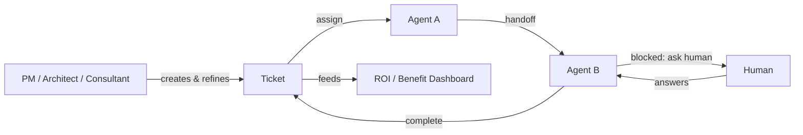

# Meridian

**A timeline-driven project & ticket management system where human teams and a marketplace of AI agents complete work together.**

Meridian is one system serving four jobs that are normally four separate tools:

1. **Project management** — projects live on a timeline, optionally broken into sprints, with milestones and dependencies.
2. **Ticket/issue tracking** — tickets (epics, stories, tasks, bugs) move through a customizable status workflow, same as Jira/Linear.
3. **An AI agent platform** — a marketplace of installable agents can be assigned tickets, complete them, or hand them off to another agent or a human.
4. **ROI measurement** — every ticket accrues cost and time data (human and AI) so the org can see, in dollars and hours, what AI involvement is actually worth.

Humans (PMs, architects, consultants, engineers) and agents are peers in the system: both can be assigned tickets, both post updates in the same activity feed, and either can hand a ticket to the other mid-flight.

---

## The core idea

A ticket's **assignee** is not necessarily a person. It can be:

- a human,
- an agent installed from the **Agent Marketplace**, or
- both — co-assigned, with a defined split of responsibility.

When an agent is assigned a ticket, it works the ticket through its own tool loop and ends in one of four states: **complete**, **blocked** (asks a human a question), **handoff** (passes the ticket to another agent better suited to the remaining work), or **rejected** (can't do it, returns it to the queue). Every leg of that journey — who worked on it, for how long, what it cost, what it produced — is recorded on the ticket's **execution trail**, which is also the raw material for ROI reporting.

---

## Documentation

| Doc | Description |
|---|---|
| [`docs/README.md`](docs/README.md) | Doc index and reading order |
| [`docs/00-overview.md`](docs/00-overview.md) | Goals, non-goals, personas, success criteria |
| [`docs/01-architecture.md`](docs/01-architecture.md) | System context, container diagram, service map |
| [`docs/02-data-model.md`](docs/02-data-model.md) | Full entity model: projects, timelines, sprints, tickets, agents, handoffs, ROI |
| **Components** | |
| [`docs/03-components/timeline-and-sprints.md`](docs/03-components/timeline-and-sprints.md) | Timeline engine, sprint lifecycle, capacity, burndown |
| [`docs/03-components/ticketing.md`](docs/03-components/ticketing.md) | Ticket types, customizable workflow/status graph, linking |
| [`docs/03-components/agent-marketplace.md`](docs/03-components/agent-marketplace.md) | Agent manifest, listing, install, certification, billing |
| [`docs/03-components/agent-execution-and-handoff.md`](docs/03-components/agent-execution-and-handoff.md) | Agent Protocol, dispatch, handoff envelope, loop protection |
| [`docs/03-components/human-ai-collaboration.md`](docs/03-components/human-ai-collaboration.md) | Co-assignment, ask-human, shared activity feed, presence |
| [`docs/03-components/roi-analytics.md`](docs/03-components/roi-analytics.md) | Cost/time capture, baselines, ROI formula, dashboards |
| [`docs/03-components/permissions-rbac.md`](docs/03-components/permissions-rbac.md) | Roles, project-level RBAC, agent permission scopes |
| [`docs/03-components/notifications-and-integrations.md`](docs/03-components/notifications-and-integrations.md) | Notification fan-out, inbound integrations (Slack, GitHub, email-to-ticket) |
| **Cross-cutting** | |
| [`docs/04-api-contracts.md`](docs/04-api-contracts.md) | REST + WebSocket surface, the Agent Protocol wire format |
| [`docs/05-sequence-flows.md`](docs/05-sequence-flows.md) | End-to-end flows: ticket creation → multi-agent handoff → ROI rollup |
| [`docs/06-security.md`](docs/06-security.md) | Multi-tenancy, agent sandboxing, secrets, audit |
| [`docs/07-roadmap.md`](docs/07-roadmap.md) | Phased build plan |
| **ADRs** | |
| [`docs/adr/0001-modular-monolith-vs-microservices.md`](docs/adr/0001-modular-monolith-vs-microservices.md) | Service decomposition strategy |
| [`docs/adr/0002-agent-protocol-standard.md`](docs/adr/0002-agent-protocol-standard.md) | Open wire contract for marketplace agents |
| [`docs/adr/0003-event-sourced-ticket-activity.md`](docs/adr/0003-event-sourced-ticket-activity.md) | Ticket history as an append-only event log |
| [`docs/adr/0004-roi-attribution-model.md`](docs/adr/0004-roi-attribution-model.md) | Splitting credit/cost across multiple actors on one ticket |
| [`docs/adr/0005-handoff-loop-protection.md`](docs/adr/0005-handoff-loop-protection.md) | Preventing infinite agent-to-agent handoff loops |

---

## Implementation plan

See [`docs/07-roadmap.md`](docs/07-roadmap.md) for the phased plan.

**Quick summary:**
- Phase 0–1: Core PM — projects, timelines, sprints, tickets, workflow engine (humans only)
- Phase 2: Agent Marketplace — manifest format, catalog, install flow, manual agent assignment
- Phase 3: Agent Protocol — dispatch, single-agent execution, ask-human blocking
- Phase 4: Handoff — agent-to-agent handoff, execution trail, loop protection
- Phase 5: Human-AI collaboration — co-assignment, shared feed, presence, live steering
- Phase 6: ROI & analytics — cost/time capture, baselines, dashboards
- Phase 7: Enterprise hardening — RBAC, security, integrations, billing
