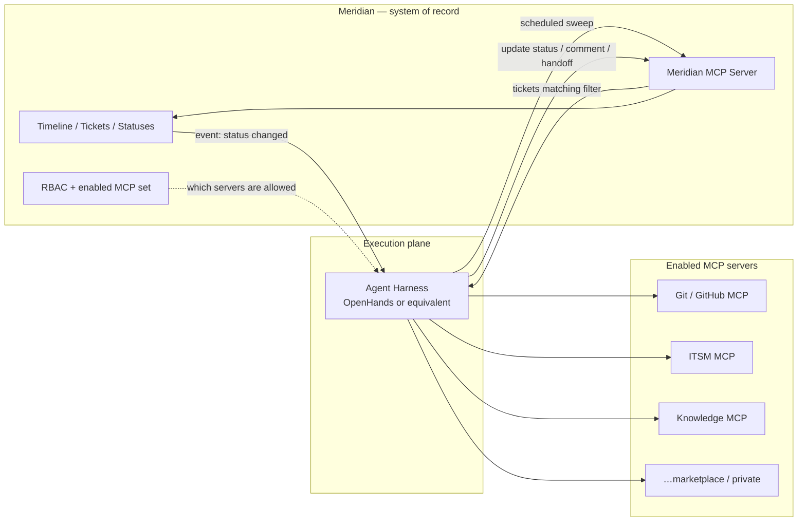

# Meridian

**Timeline-native work management where an agent harness picks up your tickets and works them through MCP.**

Meridian is one system doing four jobs that are normally four tools:

1. **Project management** — projects run as **waterfall** (phases + gates), **agile** (sprints), **kanban**, or **hybrid**, all rendered on one timeline.
2. **Ticket management** — issues, problems, incidents, changes, risks, defects, stories, tasks — created and viewed **on the timeline**, not in a separate list-only tracker.
3. **An AI execution platform** — a pluggable **agent harness** (OpenHands or equivalent) reads tickets by filter criteria, decides which **MCP server** to call from an RBAC-controlled enabled set, does the work, and writes results back.
4. **ROI measurement** — every ticket accrues human time and agent/MCP cost, so the org can see in dollars and hours what AI involvement is actually worth.

Humans and agents are peers: both get assigned tickets, both post to the same activity feed, and either can hand work to the other mid-flight.

---

## Why not just Jira

| # | Meridian | Jira today |
|---|---|---|
| 1 | **Status is tracked visually on a timeline** as the primary surface — bars, gates, and status colour in one view | Timeline is a separate paid add-on (Advanced Roadmaps); the board/backlog is the primary surface |
| 2 | **Issues, problems, incidents, changes all live on the same timeline** as first-class ticket types | Incidents/problems live in a different product (JSM) with a different data model and no shared timeline |
| 3 | **Tickets are worked by agents, humans, or both** — one assignee model, one activity feed | Automation rules and add-on bots, not assignable AI peers with their own execution trail |
| 4 | **The agent harness runs on events *and* on a schedule** — a ticket entering a status wakes it; a cron sweep catches the rest | Automation is rule-triggered only; no scheduled agent sweep over filter criteria |
| 5 | **The harness chooses which MCP server to call** from a list of enabled servers, gated by RBAC | No MCP concept; integrations are fixed per-app connectors |
| 6 | **Waterfall and agile are co-equal first-class modes** — phases/gates and sprints on the same timeline, even in one project | Agile-first; waterfall is bolted on via plugins |
| 7 | **New MCP servers are enabled from a marketplace or registered privately**, changing agent capability with no redeploy | Marketplace apps extend the *UI/product*, not the agent's tool surface |

---

## How it works

The harness is the only thing that *executes*. Meridian is the only thing that *records*. Everything the harness can reach — including Meridian itself — is an MCP server, so capability is configuration, not code.

---

## Documentation

| Doc | Description |
|---|---|
| [`docs/README.md`](docs/README.md) | Doc index and reading order |
| [`docs/00-overview.md`](docs/00-overview.md) | Differentiators, personas, goals, non-goals, success criteria |
| [`docs/01-architecture.md`](docs/01-architecture.md) | Record plane vs execution plane, service map, trigger model |
| [`docs/02-data-model.md`](docs/02-data-model.md) | Every entity: phases, gates, sprints, tickets, agent profiles, MCP installations, execution trail, ROI |
| **Components** | |
| [`docs/03-components/timeline.md`](docs/03-components/timeline.md) | The timeline surface: bars, gates, incidents, swimlanes, critical path |
| [`docs/03-components/delivery-modes.md`](docs/03-components/delivery-modes.md) | Waterfall, agile, kanban, hybrid on one model |
| [`docs/03-components/ticketing.md`](docs/03-components/ticketing.md) | Ticket types (incl. incident/problem/change), workflows, links |
| [`docs/03-components/project-administration.md`](docs/03-components/project-administration.md) | Project creation, templates, status definition, tracking config |
| [`docs/03-components/mcp-marketplace.md`](docs/03-components/mcp-marketplace.md) | MCP server catalog, manifests, certification, private registration |
| [`docs/03-components/agent-harness.md`](docs/03-components/agent-harness.md) | Trigger rules, claim/lease, MCP routing, handoff, guardrails |
| [`docs/03-components/human-ai-collaboration.md`](docs/03-components/human-ai-collaboration.md) | Co-assignment, ask-human, presence, live takeover |
| [`docs/03-components/roi-analytics.md`](docs/03-components/roi-analytics.md) | Token accounting, cost split, efficiency metrics, budgets, ROI at task and project level |
| [`docs/03-components/permissions-rbac.md`](docs/03-components/permissions-rbac.md) | Roles, three-layer MCP grant model, ticket visibility management |
| [`docs/03-components/notifications-and-integrations.md`](docs/03-components/notifications-and-integrations.md) | Notification fan-out and inbound integrations |
| **Cross-cutting** | |
| [`docs/04-api-contracts.md`](docs/04-api-contracts.md) | Meridian MCP tool surface, REST, harness registration, event stream |
| [`docs/05-sequence-flows.md`](docs/05-sequence-flows.md) | Worked end-to-end flows |
| [`docs/06-security.md`](docs/06-security.md) | Tenancy, MCP trust, prompt injection, secrets, audit |
| [`docs/07-roadmap.md`](docs/07-roadmap.md) | Phased build plan |
| **ADRs** | |
| [`docs/adr/0001-modular-monolith-vs-microservices.md`](docs/adr/0001-modular-monolith-vs-microservices.md) | Service decomposition |
| [`docs/adr/0002-mcp-as-integration-substrate.md`](docs/adr/0002-mcp-as-integration-substrate.md) | MCP instead of a bespoke agent protocol |
| [`docs/adr/0003-event-sourced-ticket-activity.md`](docs/adr/0003-event-sourced-ticket-activity.md) | Append-only ticket history |
| [`docs/adr/0004-roi-attribution-model.md`](docs/adr/0004-roi-attribution-model.md) | Cost/credit split across actors |
| [`docs/adr/0005-handoff-loop-protection.md`](docs/adr/0005-handoff-loop-protection.md) | Preventing runaway handoff loops |
| [`docs/adr/0006-unified-waterfall-and-agile.md`](docs/adr/0006-unified-waterfall-and-agile.md) | One model for both methodologies |
| [`docs/adr/0007-harness-owned-routing.md`](docs/adr/0007-harness-owned-routing.md) | Harness pulls and routes; Meridian does not push-dispatch |

---

## Measurement: what Meridian tracks that the harness doesn't

A harness like OpenHands already tracks cost per step inside a run. Meridian owns the layer above
it — the one that spans runs and knows what the work was *for*:

| Layer | Owner | Answers |
|---|---|---|
| Step / tool call | Harness | "Why did this run cost $4?" |
| Model invocation | Meridian `UsageRecord` | "Tokens and cache hits for this leg?" |
| Execution leg | Meridian `CostEntry` | "Model + MCP + human cost for this actor's turn?" |
| Ticket | Meridian `RoiSummary` | "What did this ticket cost vs. its baseline?" |
| Sprint / phase | Meridian `UsageRollup` | "Are we inside budget?" |
| Project / portfolio | Meridian `EfficiencyMetric` | "Is AI paying for itself here?" |

Costs stay split by source (model / MCP / human) all the way up, because a project running hot is
either over-reasoning, over-calling a metered server, or paying for human rework — three different
fixes, indistinguishable in a single "AI spend" figure. Budgets attach at any scope with alert
thresholds and enforcement. Drill-through to the harness's own trace is via `harness_step_id`.

---

## Implementation plan

See [`docs/07-roadmap.md`](docs/07-roadmap.md).

- **Phase 0–1** — Timeline, tickets, workflow engine, project creation, status definition, waterfall + agile (humans only)
- **Phase 2** — Ticket visibility management, field sensitivity, configuration audit
- **Phase 3** — Meridian MCP server, MCP catalog + private registration, agent profiles and grants
- **Phase 4** — Agent harness: scheduled sweeps, claim/lease, single-agent execution, ask-human
- **Phase 5** — Event triggers, harness MCP routing, handoff + guardrails
- **Phase 6** — Human-AI co-assignment, presence, live takeover
- **Phase 7** — Token/cost/efficiency tracking, budgets, ROI at task and project level
- **Phase 8** — Enterprise hardening: certification, prompt-injection controls, residency, billing, SSO
