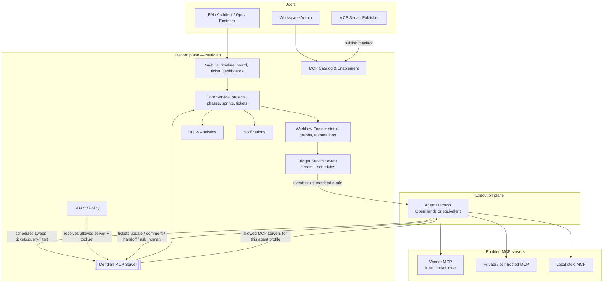
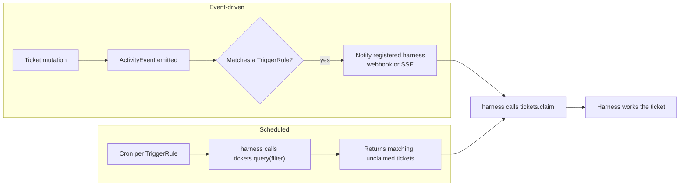

# Meridian — Architecture

> **Reading order position:** 2 of 9. Builds on [`00-overview.md`](00-overview.md).

---

## 1. Two Planes

The single most important structural decision: Meridian is split into a **record plane** and an
**execution plane**, and they meet only over MCP.

| | Record plane (Meridian) | Execution plane (harness + MCP servers) |
|---|---|---|
| Owns | Timeline, tickets, statuses, assignments, permissions, audit, ROI | Reasoning loops, tool calls, doing the actual work |
| Runs | Meridian's own services | OpenHands or equivalent, plus whatever MCP servers are enabled |
| Talks to the other via | The **Meridian MCP Server** (tools the harness calls) and an **event stream** (which wakes the harness) | MCP client calls into Meridian; MCP client calls out to enabled servers |
| Fails how | If it's down, nothing is recorded — hard stop | If it's down, tickets simply sit unworked; humans continue normally |

This is why the harness is replaceable. Meridian never holds a reference to an agent framework; it
holds tickets and an MCP surface over them.

---

## 2. Service Map

| Service | Owns | Does not own |
|---|---|---|
| **Core Service** | Workspaces, projects, delivery modes, phases, gates, sprints, tickets, links, comments, assignments, and the append-only `activity_event` log | Execution, routing, ROI computation |
| **Workflow Engine** | Per-type status graphs, transition validation, automations | Ticket content |
| **Trigger Service** | Trigger rules (filter criteria), event fan-out to registered harnesses, scheduled sweep coordination, claim/lease bookkeeping | Deciding *which MCP server* handles a ticket — that's the harness |
| **MCP Catalog & Enablement** | MCP server listings/versions/manifests, per-workspace installations, pinning, health | Running MCP servers |
| **RBAC / Policy** | Human roles; agent profiles' permitted MCP servers, tools, projects, fields, and budgets | Anything the harness does internally |
| **Meridian MCP Server** | The tool surface the harness uses to read and mutate tickets — the *only* programmatic write path for agents | Business rules (delegates to Core + Workflow Engine) |
| **ROI & Analytics** | Cost/time per execution leg, MCP call costs, baselines, rollups | Billing settlement |
| **Notifications** | Fan-out to in-app/email/Slack/webhook, digesting | Message authorship (derives from events) |
| **Web UI** | Timeline, board, backlog, ticket detail, MCP catalog admin, ROI dashboards | Server-side state |

Deployed as a **modular monolith** initially, with boundaries enforced in code so a later split is
a deployment change — see [ADR-0001](adr/0001-modular-monolith-vs-microservices.md). The Trigger
Service and the Meridian MCP Server are the two most likely first extractions, because both have
traffic profiles driven by harness behaviour rather than by human UI use.

---

## 3. The Trigger Model

Two independent paths, both supported simultaneously (goal G5 / differentiator D4):

They are deliberately **not** primary-and-fallback. The event path gives low latency (an incident
raised at 02:00 gets a first response in seconds). The scheduled path gives **completeness** — it
re-queries the filter criteria from scratch, so a ticket whose event was lost to a harness outage,
a network partition, or a rule added *after* the ticket was created is still picked up. Systems
that rely on events alone accumulate silently-stranded work; the sweep is what makes the set of
worked tickets equal the set of matching tickets.

Claim/lease semantics (see [`agent-harness.md`](03-components/agent-harness.md) §4) are what keep
the two paths from double-working the same ticket.

---

## 4. Who Decides What

A recurring source of confusion in agent platforms is *where* routing intelligence lives. Meridian
splits it explicitly:

| Decision | Made by | Why there |
|---|---|---|
| Which tickets are eligible for automation | **Meridian** (TriggerRule filter criteria) | It's a policy/planning decision a PM owns, and it must be inspectable in the UI |
| Which agent profile handles a ticket | **Meridian** (assignment, or a trigger rule's default profile) | It's an assignment — the same act as assigning a human |
| Which MCP servers that profile *may* call | **Meridian** (RBAC) | Security boundary; must be enforced server-side regardless of harness behaviour |
| Which MCP server/tool to *actually* call for this ticket | **The harness** | It's a reasoning decision requiring the ticket's content; this is exactly what the harness is for (D5, [ADR-0007](adr/0007-harness-owned-routing.md)) |
| Whether the resulting state change is legal | **Meridian** (Workflow Engine) | An agent must obey the same status graph as a human |

The harness has latitude *within* a boundary Meridian sets. It cannot widen that boundary by
reasoning about it.

---

## 5. Data Ownership

Core Service is the only writer to the ticket tables and the only writer to the append-only
`activity_event` table (see [ADR-0003](adr/0003-event-sourced-ticket-activity.md)). The Meridian
MCP Server, the Trigger Service, and the ROI Service all mutate state by calling Core's internal
API — so there is exactly one code path where workflow validation, permission checks, and event
emission happen, whether the caller is a human clicking a button or a harness calling an MCP tool.

Every MCP call the harness makes on a ticket's behalf is additionally recorded as an
`McpCallRecord` (see [`02-data-model.md`](02-data-model.md) §4) — this is what makes "which server
did the agent actually call, with what arguments, and what did it cost" answerable after the fact,
which both the audit story (G11) and the ROI story (G10) depend on.

---

## 6. Deployment Shape (indicative)

- **API layer:** REST + WebSocket for the UI; a separate MCP endpoint (streamable HTTP) for
  harnesses.
- **Datastore:** Postgres. `activity_event` and `mcp_call_record` are append-only; current ticket
  state is a synchronously-maintained projection.
- **Queue:** durable job queue for scheduled sweeps, notification fan-out, and ROI rollups.
- **Realtime:** WebSocket + pub/sub for live timeline/board updates and presence.
- **Harness connectivity:** harnesses register (see [`04-api-contracts.md`](04-api-contracts.md)
  §4), authenticate per agent profile, and receive events by webhook or SSE. MCP servers are
  reached **by the harness**, not by Meridian — Meridian never proxies tool traffic, it only
  governs which servers are permitted.
