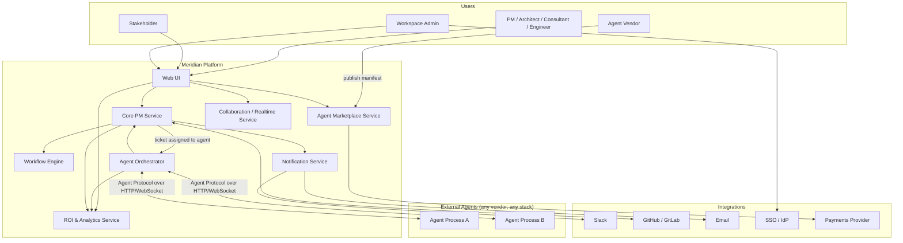
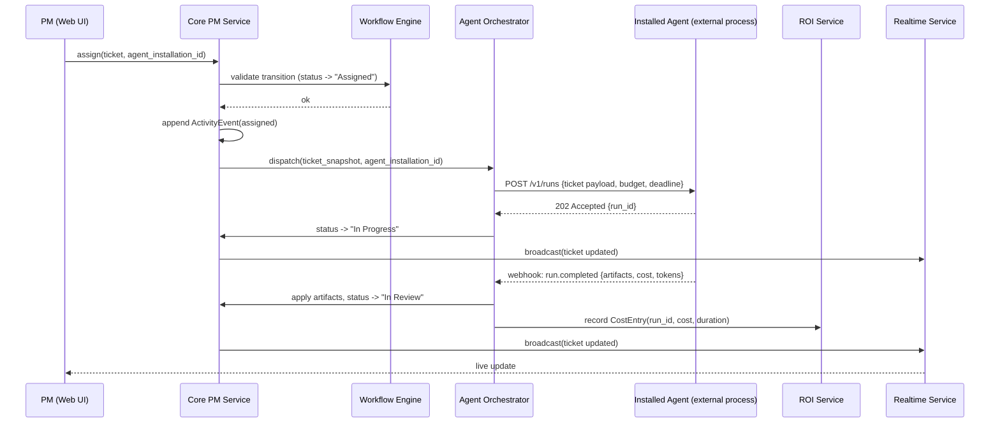

# Meridian — Architecture

> **Reading order position:** 2 of 9. Builds on [`00-overview.md`](00-overview.md).

---

## 1. System Context

**Key point:** agents are **external processes**, owned and hosted by whoever published them
(an internal team or a third-party vendor). Meridian does not run agent reasoning loops itself —
it runs the **Agent Orchestrator**, which dispatches ticket payloads to installed agents over the
[Agent Protocol](03-components/agent-execution-and-handoff.md) and processes their responses
(complete / blocked / handoff / rejected). This mirrors how a CI system dispatches jobs to runners
without being a runner itself.

---

## 2. Service Map

| Service | Owns | Does not own |
|---|---|---|
| **Core PM Service** | Workspaces, projects, timelines, sprints, tickets, ticket types, labels, links, comments, activity log (event store) | Agent execution, ROI computation |
| **Workflow Engine** | Per-project status graphs, transition validation, automation rules ("when status → X, do Y") | Ticket content |
| **Agent Marketplace Service** | Agent manifests, versioning, certification tiers, ratings/reviews, per-workspace installs, entitlements, metered billing events | Running agents |
| **Agent Orchestrator** | Dispatch of tickets to installed agents, Agent Protocol session lifecycle, handoff routing, budget/time-ceiling enforcement, loop detection | Agent internal reasoning, ticket data model |
| **Collaboration / Realtime Service** | WebSocket fan-out for live ticket/board updates, presence, ask-human blocking state, co-assignment turn-taking | Persisted ticket state (delegates to Core) |
| **ROI & Analytics Service** | Cost/time capture per execution leg, baseline estimation, ROI rollups, dashboards | Billing settlement |
| **Notification Service** | Fan-out to email/Slack/webhooks/in-app, digesting and de-duplication | Message content authoring (delegates to Core events) |
| **Web UI** | Timeline/Gantt view, board view, ticket detail, agent marketplace browser, ROI dashboards | All server-side state |

This is a **modular monolith at MVP**, split into these services as separately deployable units
only when scale requires it — see [ADR-0001](adr/0001-modular-monolith-vs-microservices.md). The
module boundaries above are enforced in code from day one (no cross-module direct DB access)
specifically so the later split is a deployment change, not a rewrite.

---

## 3. Request Flow: Ticket Assigned to an Agent

The same shape handles **handoff** (the webhook is `run.handoff` instead of `run.completed`,
targeting a different agent installation) and **ask-human** (`run.blocked`, which pauses the run
and creates a HITL prompt instead of a status transition) — see
[`agent-execution-and-handoff.md`](03-components/agent-execution-and-handoff.md) and
[`human-ai-collaboration.md`](03-components/human-ai-collaboration.md).

---

## 4. Data Ownership and the Event Log

All ticket mutation flows through Core PM Service, which is the **only** writer to the ticket
table and the **only** writer to the append-only `activity_event` table (see
[ADR-0003](adr/0003-event-sourced-ticket-activity.md)). The Agent Orchestrator, ROI Service, and
Collaboration Service never write ticket state directly — they call Core's internal API, so there
is exactly one code path that can produce a ticket mutation, and exactly one place workflow
validation and event emission happen. This is the same principle a payments system applies to its
ledger: many services *propose* changes, one service *commits* them.

---

## 5. Deployment Shape (indicative)

- **API layer:** REST + WebSocket gateway in front of the modules above (single deployable at
  MVP).
- **Datastore:** relational database (Postgres) for all core entities; the `activity_event` table
  is append-only and the source of truth for ticket history — current ticket state is a projection
  of it, materialized synchronously on write for read performance (see
  [`02-data-model.md`](02-data-model.md)).
- **Queue:** durable job queue (e.g., BullMQ/Redis or SQS-equivalent) for agent dispatch,
  notification fan-out, and ROI rollup computation — anything that shouldn't block the request
  path.
- **Realtime:** WebSocket layer backed by a pub/sub broker for multi-instance fan-out.
- **Agent connectivity:** outbound HTTP calls to agent-hosted endpoints, plus inbound webhook
  receivers per agent installation, authenticated with per-installation signing secrets.

Full topology, scaling, and environment breakdown is intentionally deferred to an implementation
phase — this doc fixes the module boundaries and data ownership rules that make that a later,
low-risk decision.
