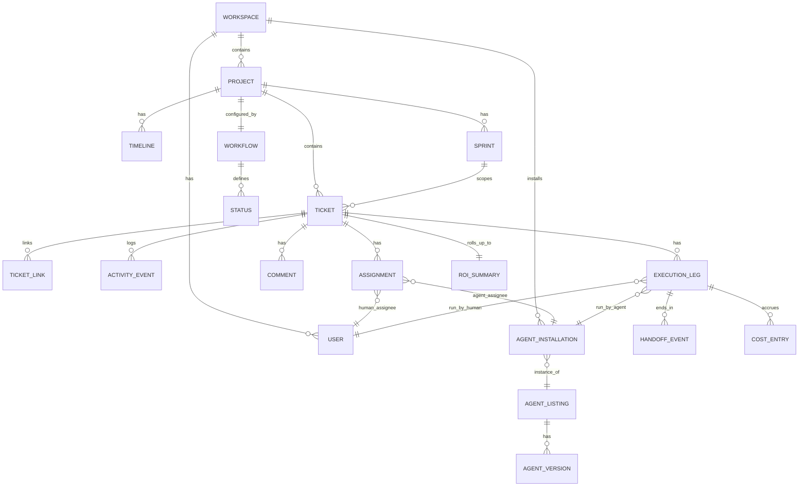

# Meridian — Data Model

> **Reading order position:** 3 of 9. Builds on [`01-architecture.md`](01-architecture.md).
> Nearly every other doc in this tree refers back to the entities defined here.

---

## 1. Entity Relationship Overview

---

## 2. Core Entities

### Workspace
The tenancy boundary. Everything below belongs to exactly one workspace.

| Field | Type | Notes |
|---|---|---|
| `id` | uuid | |
| `name` | string | |
| `plan` | enum | `free`, `team`, `enterprise` — gates marketplace tiers, agent count, retention |
| `default_currency` | string | for ROI cost rollups |
| `created_at` | timestamp | |

### Project
| Field | Type | Notes |
|---|---|---|
| `id` | uuid | |
| `workspace_id` | uuid (FK) | |
| `name`, `key` | string | `key` is the ticket prefix, e.g. `ENG` → `ENG-142` |
| `methodology` | enum | `scrum` (sprints required), `kanban` (continuous, no sprints), `timeline_only` (Gantt, sprints optional) — see [`timeline-and-sprints.md`](03-components/timeline-and-sprints.md) |
| `workflow_id` | uuid (FK → Workflow) | |
| `roi_baseline_id` | uuid (FK → RoiBaseline, nullable) | see [`roi-analytics.md`](03-components/roi-analytics.md) |
| `archived_at` | timestamp, nullable | |

### Timeline
One per project (or one per portfolio rollup — see below). A timeline is a view over tickets and
milestones plotted against dates; it is largely a projection, not new stored state, except for:

| Field | Type | Notes |
|---|---|---|
| `id` | uuid | |
| `project_id` | uuid (FK) | |
| `milestones` | Milestone[] | `{id, name, target_date, ticket_ids[]}` |
| `portfolio_group_id` | uuid, nullable | lets several projects' timelines roll up into one cross-project view |

### Sprint
| Field | Type | Notes |
|---|---|---|
| `id` | uuid | |
| `project_id` | uuid (FK) | |
| `name` | string | |
| `goal` | text | |
| `starts_at`, `ends_at` | timestamp | |
| `status` | enum | `planned`, `active`, `completed` |
| `capacity` | Capacity | `{human_hours, agent_budget_usd}` — see [`timeline-and-sprints.md`](03-components/timeline-and-sprints.md) |

### Workflow / Status
A **Workflow** is a project-scoped, configurable status graph — see
[ADR](adr) note in [`ticketing.md`](03-components/ticketing.md).

| Field | Type | Notes |
|---|---|---|
| `Workflow.id` | uuid | |
| `Workflow.ticket_type` | string | one workflow per ticket type (Epic/Story/Task/Bug/Spike/custom) |
| `Status.id` | uuid | |
| `Status.name` | string | e.g. `Backlog`, `Ready`, `In Progress`, `Needs Input`, `In Review`, `Blocked`, `Done` |
| `Status.category` | enum | `not_started`, `active`, `blocked`, `done` — drives burndown/ROI logic independent of custom names |
| `Status.transitions_to` | uuid[] | allowed next statuses |
| `Status.automations` | Automation[] | `{trigger, action}`, e.g. `on_enter: notify(watchers)` |

### Ticket
| Field | Type | Notes |
|---|---|---|
| `id` | uuid | |
| `project_id`, `sprint_id` (nullable) | FK | |
| `key` | string | e.g. `ENG-142` |
| `type` | enum | `epic`, `story`, `task`, `bug`, `spike`, or project-defined custom type |
| `title`, `description` | string, markdown | |
| `acceptance_criteria` | markdown | |
| `status_id` | uuid (FK → Status) | |
| `priority` | enum | `low`, `medium`, `high`, `urgent` |
| `estimate` | number, unit | story points or hours, per-project config |
| `labels` | string[] | |
| `parent_id` | uuid, nullable | epic → story → task nesting |
| `created_by` | uuid (FK → User) | |
| `current_assignments` | Assignment[] | see below — 0, 1, or 2 (human+agent co-assignment) |
| `execution_trail` | ExecutionLeg[] | full agent/human handoff history, see §3 |
| `roi_summary_id` | uuid (FK → RoiSummary, nullable) | |

### TicketLink
| Field | Type | Notes |
|---|---|---|
| `from_ticket_id`, `to_ticket_id` | uuid | |
| `relation` | enum | `blocks`, `blocked_by`, `relates_to`, `duplicates`, `caused_by` |

### Assignment
Distinct from `ExecutionLeg` (§3): an Assignment is *who is currently responsible*; an
ExecutionLeg is *a completed or in-progress unit of work by one actor*. A ticket can have up to
one human assignment and one agent assignment active at a time (co-assignment), each with a role.

| Field | Type | Notes |
|---|---|---|
| `id` | uuid | |
| `ticket_id` | uuid (FK) | |
| `assignee_type` | enum | `human`, `agent` |
| `user_id` / `agent_installation_id` | uuid | one or the other, per `assignee_type` |
| `role` | enum | `owner`, `reviewer`, `collaborator` — see [`human-ai-collaboration.md`](03-components/human-ai-collaboration.md) for split-responsibility semantics |
| `assigned_at`, `unassigned_at` | timestamp | |

### Comment
| Field | Type | Notes |
|---|---|---|
| `id` | uuid | |
| `ticket_id` | uuid (FK) | |
| `author_type` | enum | `human`, `agent` |
| `author_id` | uuid | |
| `body` | markdown | |
| `kind` | enum | `note`, `question` (ask-human), `proposal`, `answer`, `system` |
| `created_at` | timestamp | |

### ActivityEvent
The append-only log — see [ADR-0003](adr/0003-event-sourced-ticket-activity.md). Every mutation
to a ticket, assignment, or execution leg produces exactly one of these; current state is a
materialized projection.

| Field | Type | Notes |
|---|---|---|
| `id` | uuid | |
| `ticket_id` | uuid (FK) | |
| `type` | enum | `created`, `status_changed`, `assigned`, `unassigned`, `commented`, `handoff`, `blocked`, `unblocked`, `linked`, `field_changed` | 
| `actor_type` | enum | `human`, `agent`, `system` |
| `actor_id` | uuid | |
| `payload` | jsonb | type-specific detail (e.g. `{from_status, to_status}`) |
| `occurred_at` | timestamp | immutable |

---

## 3. Agent & Execution Entities

### AgentListing (marketplace catalog entry)
| Field | Type | Notes |
|---|---|---|
| `id` | uuid | |
| `publisher_id` | uuid | vendor or internal team |
| `name`, `description` | string | |
| `capability_tags` | string[] | e.g. `["contract-review", "legal"]`, `["code-review", "typescript"]` |
| `certification_tier` | enum | `unverified`, `community`, `verified`, `enterprise` — see [`agent-marketplace.md`](03-components/agent-marketplace.md) |
| `pricing_model` | enum | `per_run`, `per_token`, `subscription`, `self_hosted_free` |
| `rating_avg`, `rating_count` | number | workspace-scoped reviews aggregated publicly with tenant identity stripped |

### AgentVersion
| Field | Type | Notes |
|---|---|---|
| `id` | uuid | |
| `listing_id` | uuid (FK) | |
| `semver` | string | |
| `manifest` | jsonb | full capability manifest — input/output ticket-type contract, required tool scopes, protocol version — see [`agent-marketplace.md`](03-components/agent-marketplace.md) §2 |
| `endpoint_url` | string | where the Orchestrator dispatches runs for this version |
| `deprecated_at` | timestamp, nullable | |

### AgentInstallation
An agent listing, installed into one workspace, with local configuration. **This is what actually
appears in an assignee picker** — not the listing.

| Field | Type | Notes |
|---|---|---|
| `id` | uuid | |
| `workspace_id` | uuid (FK) | |
| `agent_version_id` | uuid (FK) | pinned version |
| `display_name` | string | can be renamed per workspace, e.g. "Contract Reviewer (Legal)" |
| `permission_scope` | jsonb | which projects, which ticket fields/tools it may access — see [`permissions-rbac.md`](03-components/permissions-rbac.md) |
| `budget_ceiling` | Money | hard stop on spend, enforced by Orchestrator |
| `allowed_handoff_targets` | uuid[] | other installations this agent may hand off to (empty = orchestrator default routing) |
| `status` | enum | `active`, `paused`, `revoked` |
| `installed_by`, `installed_at` | uuid, timestamp | |

### ExecutionLeg
One actor's unit of work on a ticket — the atomic unit of the **execution trail**. A ticket with
three handoffs has (at least) four legs: original assignee, two handoff recipients, and whoever
closes it.

| Field | Type | Notes |
|---|---|---|
| `id` | uuid | |
| `ticket_id` | uuid (FK) | |
| `sequence` | integer | order within the trail |
| `actor_type` | enum | `human`, `agent` |
| `actor_id` | uuid | user_id or agent_installation_id |
| `started_at`, `ended_at` | timestamp | |
| `outcome` | enum | `completed`, `handed_off`, `blocked_on_human`, `rejected`, `timed_out`, `budget_exceeded` |
| `artifacts` | jsonb | what this leg produced (draft text, diff, file refs, structured output — schema defined by the ticket type's contract) |
| `confidence` | number, nullable | agent-reported confidence in its output, 0–1 |

### HandoffEvent
| Field | Type | Notes |
|---|---|---|
| `id` | uuid | |
| `from_leg_id` | uuid (FK → ExecutionLeg) | |
| `to_actor_type`, `to_actor_id` | enum, uuid | may be unresolved at creation time if the Orchestrator must route (see [`agent-execution-and-handoff.md`](03-components/agent-execution-and-handoff.md)) |
| `reason_code` | enum | `needs_different_capability`, `stage_complete`, `low_confidence`, `out_of_scope`, `budget_would_exceed` |
| `context_bundle` | jsonb | condensed state handed to the next actor (not the full ticket — see handoff doc) |
| `hop_count` | integer | incremented from the previous leg's hop count; loop protection reads this |

### CostEntry
| Field | Type | Notes |
|---|---|---|
| `id` | uuid | |
| `execution_leg_id` | uuid (FK) | |
| `kind` | enum | `agent_run` (tokens/API cost), `human_time` (hours × rate) |
| `amount` | Money | |
| `raw_metric` | jsonb | e.g. `{tokens_in, tokens_out, model}` or `{hours, hourly_rate}` |

---

## 4. ROI Entities

### RoiBaseline
A project-level (or ticket-type-level) estimate of "what this would have cost without agent
involvement," used as the ROI denominator. See [`roi-analytics.md`](03-components/roi-analytics.md)
for how baselines are derived (historical velocity vs. manual estimate).

| Field | Type | Notes |
|---|---|---|
| `id` | uuid | |
| `project_id` | uuid (FK) | |
| `ticket_type` | string, nullable | baseline can be per-type |
| `source` | enum | `historical_velocity`, `manual_estimate` |
| `baseline_hours`, `baseline_cost` | number, Money | |

### RoiSummary (one per ticket, computed on completion and recomputable)
| Field | Type | Notes |
|---|---|---|
| `id` | uuid | |
| `ticket_id` | uuid (FK) | |
| `total_cost` | Money | sum of CostEntry across all legs |
| `total_cycle_time` | duration | first leg start → ticket closed |
| `baseline_cost_used` | Money | snapshot of the baseline applied |
| `roi_pct` | number | `(baseline_cost - total_cost) / total_cost` |
| `time_saved` | duration | `baseline_hours - actual_human_hours` |
| `autonomy_level` | enum | `fully_autonomous` (no human leg), `human_assisted` (mixed legs), `human_only` |
| `attributed_legs` | AttributedLeg[] | `{execution_leg_id, cost_share, time_share}` — see [ADR-0004](adr/0004-roi-attribution-model.md) |

---

## 5. Notes on Design Choices

- **Assignment vs. ExecutionLeg is a deliberate split.** Assignment answers "who is on the hook
  right now" (drives the board/inbox UI). ExecutionLeg answers "who actually did what, and when"
  (drives the audit trail and ROI). Collapsing them would make either the UI or the audit trail
  wrong the moment a ticket is reassigned mid-flight without having "finished" a leg.
- **Status has both a free-text `name` and a fixed `category`.** Per-project custom status names
  (G8 in the overview) must not break cross-project rollups (burndown, ROI "in progress" filters),
  so every custom status still maps to one of a small fixed set of categories.
- **`context_bundle` on HandoffEvent, not the full ticket.** Handing off the entire ticket object
  (including full comment history and every prior artifact) to every subsequent agent is both a
  cost problem (context bloat) and a scope-creep risk (an agent seeing data outside its permission
  scope). The bundle is a deliberately curated summary — see
  [`agent-execution-and-handoff.md`](03-components/agent-execution-and-handoff.md) §3.
