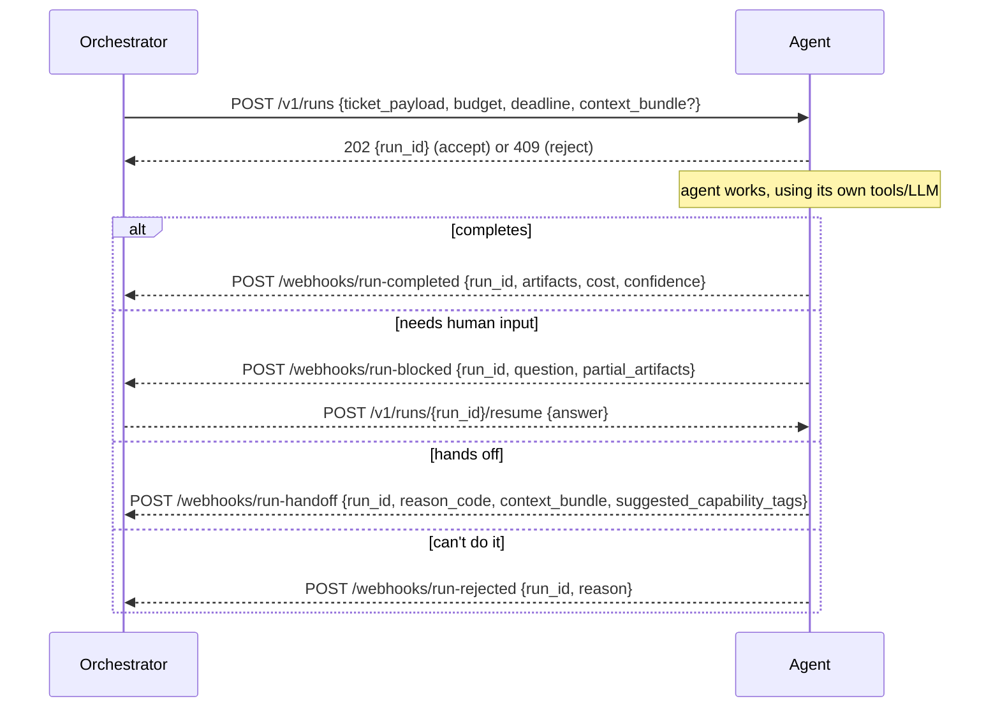
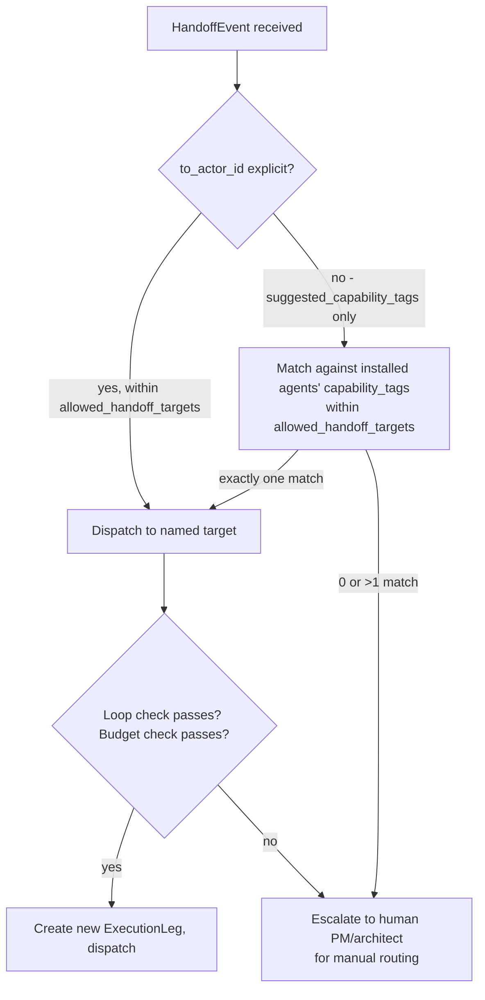

# Component: Agent Execution & Handoff

> Builds on [`02-data-model.md`](../02-data-model.md) (`ExecutionLeg`, `HandoffEvent`, `CostEntry`) and
> [`agent-marketplace.md`](agent-marketplace.md). This is the mechanical core of "agents can complete
> tasks or hand over to another agent to do so."

---

## 1. The Agent Protocol (Summary)

Every marketplace agent, regardless of internal implementation, speaks the same small HTTP +
webhook contract with the Orchestrator. Full wire format is in
[`04-api-contracts.md`](../04-api-contracts.md) §3; this is the state-machine summary.

Four outcomes only: **complete, blocked, handoff, rejected**. Anything an agent's internal
reasoning does — plan mode, its own sub-agents, retries, tool calls to its own systems — is
invisible to Meridian by design (see overview non-goals); Meridian only needs to know which of
these four buckets a run landed in and what it produced.

---

## 2. Dispatch: Building the Ticket Payload

On dispatch, the Orchestrator does **not** hand the agent the raw `Ticket` row. It assembles a
payload filtered through:

1. The `AgentInstallation.permission_scope` (§2 of [`permissions-rbac.md`](permissions-rbac.md)) —
   fields and linked-ticket data outside scope are omitted, not redacted-in-place, so the agent
   never even sees that a hidden field exists.
2. The ticket type's declared **agent contract** (from [`ticketing.md`](ticketing.md) §1) — the
   fixed shape an agent of this ticket type should expect, so a "contract review" agent and a
   "bug fix" agent receive structurally different, purpose-built payloads rather than one bloated
   generic ticket dump.
3. If this leg is the result of a handoff, the prior leg's `context_bundle` (§3 below) rather than
   the full execution trail.

This keeps dispatch payloads small (token-efficient) and keeps agents from ever depending on
undocumented ticket internals.

---

## 3. Handoff: What Gets Passed On

A `HandoffEvent`'s `context_bundle` is a deliberately curated summary, not a raw dump of everything
the prior leg touched:

| Field | Purpose |
|---|---|
| `summary` | Prior agent's own natural-language summary of what it did and why it's handing off |
| `artifacts_so_far` | The prior leg's `ExecutionLeg.artifacts` (its actual output), passed forward so work isn't redone |
| `reason_code` | Structured reason (`needs_different_capability`, `stage_complete`, `low_confidence`, `out_of_scope`, `budget_would_exceed`) — drives routing in §4 |
| `suggested_capability_tags` | What kind of agent the handing-off agent thinks should pick this up (optional; Orchestrator may override) |
| `confidence` | Carried from the leg, informs whether the next actor should be an agent at all or should route straight to a human |

Bundling only this — not the ticket's full comment history or earlier legs' internals — bounds
context growth across a handoff chain and keeps each subsequent agent's exposure limited to what
it needs (reinforcing the scope principle in `permissions-rbac.md`).

---

## 4. Handoff Routing

Routing never invents a target outside `AgentInstallation.allowed_handoff_targets` — an agent
cannot hand a ticket to an installation the workspace admin didn't explicitly permit for it,
regardless of what `suggested_capability_tags` says. Ambiguous or out-of-scope routing always
degrades to a human, never to a guess.

---

## 5. Loop Protection

See [ADR-0005](../adr/0005-handoff-loop-protection.md) for the full rationale. Enforced at handoff
time, before a new `ExecutionLeg` is created:

- **Hop ceiling.** `HandoffEvent.hop_count` is checked against a per-project configured maximum
  (default 5). Exceeding it escalates to a human unconditionally, regardless of reason code.
- **Cycle detection.** The Orchestrator checks whether `to_actor_id` already appears earlier in
  this ticket's execution trail. A repeat actor within the same trail is allowed once (an agent
  may legitimately get a ticket back after a human answers a question elsewhere), but a second
  repeat triggers escalation.
- **Budget ceiling.** Before dispatching a handoff, the Orchestrator checks the ticket's
  cumulative `CostEntry` sum against the sprint's `agent_budget_usd` and the target installation's
  `budget_ceiling`. A handoff that would exceed either is rejected back as `budget_exceeded` and
  escalated.
- **Wall-clock ceiling.** A ticket's total time across all legs is checked against the ticket
  type's configured max cycle time (if set); exceeding it escalates regardless of remaining
  budget, so a cheap-but-slow loop can't run indefinitely.

Escalation in every case above means: create a system `Comment` explaining exactly which guard
tripped, reassign to the ticket's human owner (or the project's default escalation role if
unassigned), and set status to `Needs Input`.

---

## 6. Ask-Human (Blocked) In Detail

A `run-blocked` webhook does **not** end the `ExecutionLeg** — the leg stays open (`outcome` unset)
while the ticket enters the `NeedsInput` status category. The Orchestrator:

1. Creates a `question`-kind `Comment` from the agent with the agent's question and any
   `partial_artifacts`.
2. Notifies the ticket's human owner (or watchers) per [`notifications-and-integrations.md`](notifications-and-integrations.md).
3. Starts an SLA clock (configurable per project) — an unanswered question past SLA can itself
   trigger escalation to a broader audience.
4. On a human `answer`-kind comment, calls the agent's `resume` endpoint with the answer, and the
   same leg continues — it does not count as a new hop for loop-protection purposes, since no
   handoff occurred.

This is the mechanism [`human-ai-collaboration.md`](human-ai-collaboration.md) builds the
real-time "ask-human" experience on top of.

---

## 7. Timeouts and Failures

| Failure | Orchestrator behavior |
|---|---|
| Agent doesn't accept (`202`) within manifest `sla.response_time` | Treated as reject; ticket returns to queue, optionally auto-reassigns to next-best agent per capability match |
| Agent accepts but no webhook within manifest `sla.max_run_duration` | Leg marked `timed_out`; ticket returns to `Ready` (or `Needs Input` if partial artifacts exist) and human is notified |
| Agent endpoint unreachable (connection error) | Retried with backoff up to a fixed limit, then treated as reject; installation is flagged `degraded` after repeated failures across tickets, surfaced to the workspace admin |
| Malformed webhook payload | Rejected at the API boundary with a 4xx; does not mutate ticket state; logged for the publisher's visibility in the marketplace dashboard |

Failure handling never leaves a ticket silently stuck: every failure path above ends in either a
retry, a requeue, or a human-visible `Needs Input`/notification state.
