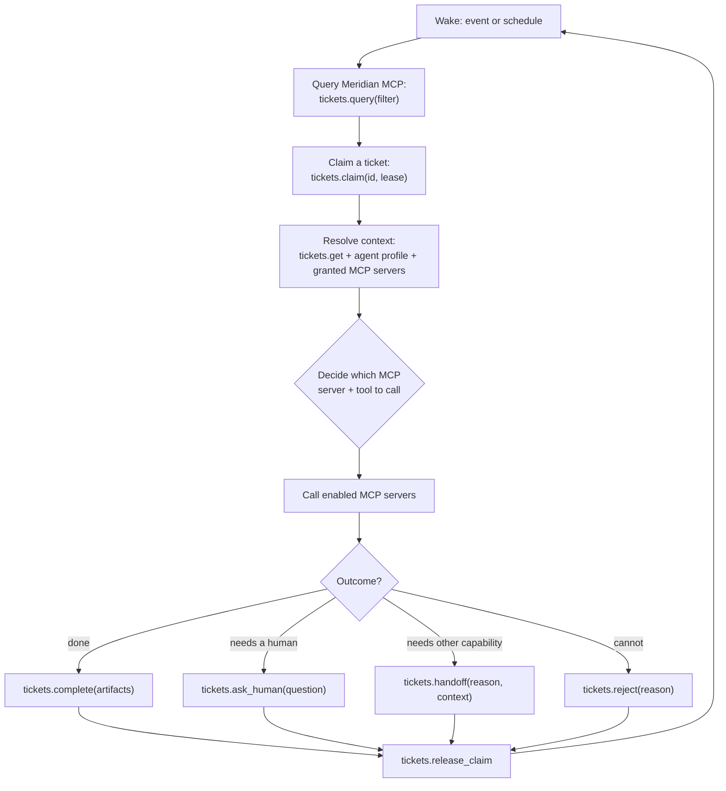
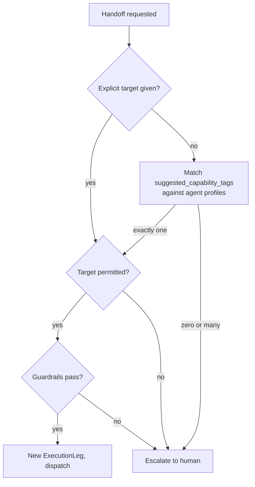

# Component: The Agent Harness

> Differentiators **D3**, **D4**, **D5**. Builds on [`02-data-model.md`](../02-data-model.md)
> (`AgentProfile`, `HarnessRegistration`, `TriggerRule`, `McpGrant`, `ExecutionLeg`,
> `McpCallRecord`) and [ADR-0007](../adr/0007-harness-owned-routing.md).

---

## 1. What the Harness Is

The harness is an **external MCP-speaking runtime** — OpenHands is the reference target, but any
runtime that can act as an MCP client and hold a conversation with a model qualifies. It is the
only component that executes work. Meridian never runs agent reasoning.

The harness's entire job is a loop:



Everything in that loop except step **E** and step **F** is a call into Meridian's MCP server.
Step E is the reasoning Meridian delegates; step F is the work itself.

Where the profile holds a grant for the memory service, step **D** also calls `memory.recall` with
the ticket's scope context, and terminal outcomes feed the ingestion pipeline. Memory is an ordinary
granted MCP server, not a special path — see [`memory-module.md`](memory-module.md). A profile
working externally-sourced tickets should hold recall without `memory.propose`, since that is the
injection-to-persistence route.

---

## 2. Trigger Modes — Events *and* Schedules (D4)

A `TriggerRule` declares filter criteria and a mode:

```jsonc
{
  "name": "Auto-triage P1 incidents",
  "mode": "both",                       // event | scheduled | both
  "schedule": "*/5 * * * *",            // used when mode includes scheduled
  "filter": {
    "ticket_types": ["incident"],
    "statuses": ["New"],
    "severities": ["P1", "P2"],
    "unassigned_only": true
  },
  "agent_profile_id": "…incident-first-responder…",
  "max_concurrent": 5
}
```

**Event mode.** A ticket mutation emits an `ActivityEvent`; the Trigger Service evaluates open
rules against the new state and, on a match, notifies every registered harness that owns the
target profile (webhook or SSE per `HarnessRegistration.event_transport`). Latency is seconds —
this is what makes an incident raised at 02:00 get a first response before anyone wakes up.

**Scheduled mode.** On the rule's cron, the harness re-runs `tickets.query` against the filter from
scratch and works whatever matches. This is not a fallback — it is the completeness guarantee:

- A ticket whose event fired while the harness was down or partitioned.
- A rule created *after* the tickets it should match already existed.
- A ticket whose eligibility changed for a reason that emitted no event (an SLA clock crossing a
  threshold, a blocker resolving elsewhere, a date arriving).

Event-only automation accumulates silently-stranded work, and nobody notices because the missing
signal is the absence of an event. The sweep makes the worked set equal the matching set. Running
both is the intended configuration for anything that matters; `max_concurrent` throttles the
combined result.

**Manual.** A human assigning a ticket to an agent profile in the UI is a third path into the same
loop — it emits an event the harness handles identically.

---

## 3. Agent Profiles

An `AgentProfile` is what appears in the assignee picker next to human names (D3). It binds:

| Element | Purpose |
|---|---|
| `harness_registration_id` | which runtime executes it |
| `model_config` | provider/model/params — opaque to Meridian, passed through to the harness |
| `system_policy` | standing instructions defining the profile's role and constraints |
| `capability_tags` | how TriggerRules and handoff routing find it |
| `accepts_ticket_types` | what it can be assigned |
| `budget` | per-run / per-day / per-ticket ceilings |
| `max_hops` | handoff hop ceiling for tickets it starts |
| **McpGrants** | **the set of MCP servers and tools it may call** |

The same OpenHands deployment can back a dozen profiles — "Incident First Responder", "Change Risk
Assessor", "Code Reviewer" — differing only in policy, tags, budget, and grants. Creating a new
kind of worker is a configuration act, not a deployment.

---

## 3A. Execution Modes — Shadow, Propose, Autonomous

A profile runs in one of three modes. This is the mechanism for introducing agents into a live
tracker without betting the tracker on them, and it is missing from most agent platforms — which is
why their first deployment is also their first incident.

| Mode | Agent does | Meridian applies | Cost | Use |
|---|---|---|---|---|
| `shadow` | Full reasoning; **all MCP calls restricted to `read`-class tools**; produces the artifact it *would* have produced | Nothing. Output is stored on a shadow leg, visible only to admins and the profile's owner | Real | Evaluating a new profile, and generating the counterfactual for ROI baselines |
| `propose` | Full reasoning; may call `write_internal` tools | Output posted as a `proposal` comment; **no status transition, no field write** without a human accepting | Real | Building trust; the default for a newly granted profile |
| `autonomous` | Full reasoning and granted writes | Applied directly, subject to workflow validation and approval gates | Real | Steady state for profiles with a track record |

Properties worth stating:

- **Shadow legs never mutate the ticket** and are excluded from `autonomy_level` and from the
  ticket's `total_cost` in headline ROI — they are reported separately as evaluation spend, because
  counting evaluation against delivery ROI penalises exactly the behaviour that makes the numbers
  trustworthy.
- **Shadow output is scoreable.** Where a human subsequently completes the ticket, Meridian records
  the divergence between the shadow artifact and the human's actual output. That is a direct,
  cheap, pre-production quality measure — and it is a far better promotion signal than a vendor's
  benchmark.
- **Mode is per profile per project**, so the same profile can be autonomous on low-severity
  incidents and in `propose` on P1s.
- **Promotion is deliberate**, recorded as a configuration change with its supporting metrics.

---

## 3B. Profile Versioning

An `AgentProfile` whose `model_config`, `system_policy`, `capability_tags`, or grants change is
materially a different worker. Without versioning, "Agent X's ROI trend" silently compares
pre-change and post-change behaviour and the trend line means nothing.

Every mutation to those fields creates a new `AgentProfileVersion` (semver-ish, auto-incremented).
`ExecutionLeg` records the **version** it ran under, not just the profile. Consequences:

- Efficiency and ROI trends are plotted per version, with change markers on the timeline — a step
  change in `first_pass_yield` is attributable to the config change that caused it.
- A regression can be diagnosed and rolled back to a prior version, which is otherwise guesswork.
- Comparing versions is the natural A/B: run v3 in `shadow` against live v2 traffic and compare
  divergence before promoting.

---

## 3C. Circuit Breaker

MCP *installations* can be marked degraded ([`mcp-marketplace.md`](mcp-marketplace.md) §5), but a
failing **profile** needs its own brake — a profile can be perfectly connected and still be wrong
about everything.

A profile is auto-paused when, over a rolling window (default 20 legs or 24h):

| Trip condition | Default threshold | Usual cause |
|---|---|---|
| Rejection rate | > 40% | Mis-scoped `accepts_ticket_types`, or trigger filter too broad |
| `denied_by_policy` rate | > 25% | Missing grants — a **policy** fix, not a model fix |
| Handoff rate | > 60% | Profile is a router, not a worker; capability tags wrong |
| Human override rate | > 50% | Output not trusted in practice |
| Cost per ticket vs. its own trailing median | > 3× | Runaway loops or a degraded upstream server |

Auto-pause stops new dispatch, leaves in-flight legs to finish, and raises an admin notification
naming the tripped condition and its numbers. It never silently degrades throughput — a paused
profile is loudly paused, because the alternative is a queue quietly filling with unworked tickets.

Thresholds are per profile and per project. A profile in `shadow` mode has a higher tolerance since
its failures are free.

---

## 4. Claim and Lease

With event and scheduled triggers both live, and possibly several harness replicas, duplicate work
is the obvious failure mode. `tickets.claim` performs an atomic compare-and-set on the ticket's
`claim` field:

- Succeeds only if unclaimed or the existing lease has expired.
- Returns `{lease_token, leased_until}`; the harness renews with `tickets.renew_claim` while
  working.
- A lease that expires without renewal (harness crash, network loss) makes the ticket eligible
  again on the next sweep — no manual cleanup, and no ticket permanently locked by a dead worker.
- All subsequent writes require the `lease_token`, so a harness that resumes after its lease was
  reassigned cannot clobber the new worker's progress.
- Releasing is explicit on every terminal outcome; a `HarnessRegistration` that stops heartbeating
  has its leases released in bulk.

---

## 5. Routing: Which MCP Server to Call (D5)

This is the decision Meridian deliberately does not make. The harness receives, per ticket:

1. The ticket payload, filtered to fields the profile's permission scope allows.
2. The profile's `system_policy`.
3. **The resolved grant set** — the concrete list of MCP servers it may use for this ticket, each
   with its tool manifest, description, and `capability_tags`, already filtered by RBAC and project
   scope. Servers it has no grant for are simply absent; the harness never sees that they exist.

The harness then reasons over the ticket and that catalogue to choose which server and tool to
invoke — the same way any tool-using model selects among available tools, except the available set
was assembled by the policy engine rather than by a static config file.

**Three properties make this safe:**

- **The grant set is the ceiling.** Reasoning selects *within* it and cannot widen it. A call to a
  server outside the grant set is rejected server-side and recorded as
  `McpCallRecord.outcome = denied_by_policy`, regardless of harness behaviour (SC-5).
- **Approval-gated tools.** `McpGrant.requires_approval` lists tools that pause for human approval
  before executing — the natural place for destructive or externally-visible actions (deploying,
  emailing a customer, closing a change window).
- **Every call is recorded.** `McpCallRecord` captures server, tool, argument digest, outcome,
  latency and cost, tied to the `ExecutionLeg`. "Which server did the agent actually call, and
  what did that cost" is answerable for every ticket.

If the harness concludes it needs a capability it holds no grant for, the correct move is a
**handoff** with `reason_code = missing_mcp_grant` — routinely to a profile that does hold it.
That's a healthy outcome, not an error, and it's visible to admins as a signal that a grant may be
mis-scoped.

---

## 6. Outcomes

Four terminal outcomes, each an MCP tool call back into Meridian:

| Outcome | Tool | Effect |
|---|---|---|
| **Complete** | `tickets.complete` | Artifacts attached, status advanced through the Workflow Engine (which may route to a review state rather than done), leg closed as `completed` |
| **Ask human** | `tickets.ask_human` | Posts a `question` comment, moves status to a `blocked`-category state, starts a **response** clock, notifies the owner. Pauses neither SLA clock — an internal dependency must not launder a customer commitment ([`ticketing.md`](ticketing.md) §1). **The leg stays open** and its waiting time is attributed to `blocked_on_internal`, excluded from the leg's `effort`; the harness is later resumed with the answer — this is not a new hop |
| **Handoff** | `tickets.handoff` | Closes the leg as `handed_off`, creates a `HandoffEvent` with a curated `context_bundle`, routes per §7 |
| **Reject** | `tickets.reject` | Closes the leg as `rejected`, returns the ticket to the queue or to a human, with a reason |

---

## 7. Handoff

### What gets passed on

`HandoffEvent.context_bundle` is a curated summary, deliberately not a dump of everything the prior
leg saw:

| Field | Purpose |
|---|---|
| `summary` | The handing-off agent's own account of what it did and why it's stopping |
| `artifacts_so_far` | The prior leg's output, so work isn't repeated |
| `reason_code` | Structured reason, drives routing |
| `suggested_capability_tags` | What kind of worker should pick this up (advisory) |
| `confidence` | Informs whether the next actor should be an agent at all, or a human |

Bounding the bundle keeps context cost flat across a chain and limits each subsequent agent's
exposure to only what it needs.

### The bundle is a redaction hole unless it is treated as one

`summary` and `artifacts_so_far` are **authored by the handing-off agent**, which may hold a higher
clearance than the recipient. Field-level sensitivity
([`permissions-rbac.md`](permissions-rbac.md) §7) filters *payloads*; it does nothing about prose
an agent wrote after reading those fields. Without a control, a two-hop handoff silently launders
every `secret` field into plain text.

The bundle therefore carries a **clearance label** — the maximum sensitivity of any input the
authoring leg saw — and is gated on delivery:

| Recipient clearance vs. bundle label | Behaviour |
|---|---|
| Equal or higher | Delivered as authored |
| Lower | Bundle is **regenerated** under an explicit redaction constraint scoped to the recipient's clearance, and re-labelled. The original is retained on the `HandoffEvent` for audit, visible only at the original clearance |
| Lower, and regeneration would remove information the reason code depends on | Handoff escalates to a human rather than delivering a degraded bundle |

Regeneration is a model call and can fail to redact perfectly, so it is a mitigation rather than a
guarantee. Where a ticket type's fields are marked `secret`, the stronger control is to prevent the
cross-clearance handoff in the first place: `AgentProfile.allowed_handoff_targets` should not span
clearance boundaries for such types, and the admin UI flags configurations that do.

### Routing the handoff



Handoff to a **human** is a first-class target, not a failure path — `suggested_capability_tags`
can name a human role, and low `confidence` can route to a person by policy.

### Guardrails ([ADR-0005](../adr/0005-handoff-loop-protection.md))

Four independent checks, any one sufficient to escalate:

1. **Hop ceiling** — `HandoffEvent.hop_count` against the profile's `max_hops` (default 5).
2. **Cycle detection** — an actor reappearing in the same trail is allowed once (legitimate after
   an intervening step), a second repeat escalates. Catches tight A↔B loops fast.
3. **Budget ceiling** — cumulative `CostEntry` against the profile's budget and the sprint's
   `agent_budget`; a handoff that would breach either is refused.
4. **Wall-clock ceiling** — total elapsed across legs against the ticket type's max cycle time.
   Catches a cheap-but-slow loop the other three would miss.

Every trip escalates identically: a system comment naming **which check fired and the numbers
behind it**, reassignment to the human owner (or the project's escalation role), and a
`blocked`-category status. The failure mode is always "stops and explains", never "silently burns
budget".

---

## 8. Failure Handling

| Failure | Behaviour |
|---|---|
| Harness stops heartbeating | Marked stale; its leases are released; tickets return to the eligible pool for the next sweep |
| Lease expires mid-work | Ticket becomes claimable again; the stale harness's later writes are rejected on `lease_token` mismatch |
| MCP server unreachable | `McpCallRecord.outcome = error`; harness may retry, route to an alternative granted server, or hand off. Repeated failures mark the installation `degraded` and surface to the admin |
| MCP call denied by policy | `denied_by_policy` recorded; the harness should hand off with `missing_mcp_grant` rather than retry |
| Model/agent error | Leg closed `rejected` with the reason; ticket returns to a human-visible state |
| Budget exceeded mid-run | Run halted, leg closed `budget_exceeded`, ticket escalated with cost detail |

No path leaves a ticket silently stuck: every one ends in a retry, a requeue, or a human-visible
state with a notification.

---

## 9. Swapping the Harness

Because the contract is MCP tools plus an event subscription, replacing OpenHands with a different
runtime is a `HarnessRegistration` change and a repoint of `AgentProfile.harness_registration_id`.
Nothing in the ticket model, the grants, the trigger rules, or the audit trail changes. Multiple
harnesses of different kinds can run concurrently in one workspace, each backing different
profiles — which is also the safe way to trial a new runtime on a narrow set of trigger rules
before moving anything else.
