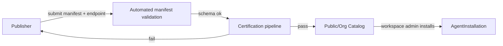

# Component: Agent Marketplace

> Builds on [`02-data-model.md`](../02-data-model.md) (`AgentListing`, `AgentVersion`, `AgentInstallation`).
> See also [ADR-0002](../adr/0002-agent-protocol-standard.md) for the wire contract this section assumes.

---

## 1. Publishing an Agent

Any team (internal or third-party vendor) can publish an agent by submitting an `AgentVersion`
with a manifest. Publishing does **not** require Meridian to host or run the agent — the agent
runs on infrastructure the publisher owns and exposes an HTTPS endpoint speaking the
[Agent Protocol](agent-execution-and-handoff.md). Meridian's marketplace is a **catalog and
router**, not a hosting platform, by the same logic a package registry indexes packages without
running your code.

---

## 2. The Manifest

The manifest is the machine-readable contract a workspace relies on before ever calling the agent.
Required fields:

| Field | Purpose |
|---|---|
| `protocol_version` | which Agent Protocol version this agent speaks |
| `capability_tags` | free-text tags used for search and for auto-assignment rules (`["contract-review", "legal", "nda"]`) |
| `accepts_ticket_types` | which ticket types (and required field presence) this agent can be dispatched for |
| `output_contract` | schema of artifacts it produces (matches `ExecutionLeg.artifacts`) |
| `required_tool_scopes` | what the agent needs access to *within the ticket's data* (e.g., `read:comments`, `read:linked_tickets`, `write:attachments`) — enforced by the Orchestrator, not self-policed by the agent, see [`permissions-rbac.md`](permissions-rbac.md) §3 |
| `handoff_targets_declared` | capability tags of agents this agent typically hands off to, used for default routing when `AgentInstallation.allowed_handoff_targets` is empty |
| `pricing_model` + rate | `per_run`, `per_token`, `subscription`, `self_hosted_free` |
| `sla` | max response time to accept a dispatch, max run duration before the Orchestrator treats it as `timed_out` |
| `endpoint_url`, `webhook_secret` | where dispatches go and how callbacks are verified |

A manifest that fails schema validation, or declares an `output_contract` for a ticket type it
also claims not to `accept`, is rejected before it reaches the catalog.

---

## 3. Certification Tiers

| Tier | Requirements | Effect |
|---|---|---|
| `unverified` | Manifest schema valid | Installable only with an explicit admin override; flagged in UI |
| `community` | Passed automated conformance tests (protocol compliance, error handling, timeout behavior) against a sandbox harness | Installable by default; visible in public catalog |
| `verified` | `community` + manual security review of declared tool scopes + track record (≥ N successful runs across ≥ M workspaces) | Featured in catalog; eligible for auto-assignment rules by default |
| `enterprise` | `verified` + signed data-processing agreement, SOC2-equivalent attestation | Eligible for regulated-workspace installs |

Certification is re-evaluated on every new `AgentVersion` — a tier is per-version, not
per-listing, so a publisher can't coast on an old version's certification after shipping a
regressed one.

---

## 4. Installing an Agent

Installing creates an `AgentInstallation` scoped to one workspace:

1. Admin picks a listing + version from the catalog.
2. Admin sets `permission_scope` (which projects it can be assigned in, which tool scopes from the
   manifest's `required_tool_scopes` are actually granted — a workspace may grant a subset).
3. Admin sets `budget_ceiling` and optional per-sprint concurrency limit.
4. Admin optionally sets `allowed_handoff_targets` to restrict which other installations this one
   may hand work to (default: any installation whose `capability_tags` match the manifest's
   `handoff_targets_declared`).
5. Installation goes `active` and immediately appears in assignee pickers for permitted projects —
   no redeploy (overview SC-2).

Uninstalling (`revoked`) does not delete history: existing `ExecutionLeg` and `CostEntry` records
referencing the installation are retained for audit and ROI purposes; only future dispatch is
blocked.

---

## 5. Ratings and Trust Signals

Workspaces can rate an `AgentListing` after ticket completion (1–5 stars + optional text),
attached to the specific `AgentVersion` used. Aggregate ratings shown in the public catalog strip
tenant identity — a reviewer never sees *which* workspace left a review, only the aggregate and
(optionally) an anonymized text excerpt, preserving tenant confidentiality (overview G9) while
still letting trust signals be public.

Objective signals surfaced alongside star ratings, computed from `ExecutionLeg`/`RoiSummary` data
across all workspaces that opted into anonymized benchmarking:

- Completion rate (`completed` legs / total dispatches)
- Median handoff count per ticket (lower is better — fewer bounces)
- Median cost per ticket type
- SLA adherence (% of dispatches accepted within declared response time)

---

## 6. Billing

Metered usage (`per_run`/`per_token`) generates `CostEntry` records exactly as any other run cost
(see [`02-data-model.md`](../02-data-model.md) §3) and is settled between the workspace and the
publisher through a third-party payments provider on a periodic cycle — Meridian reports usage
and never custodies funds (overview non-goal).
