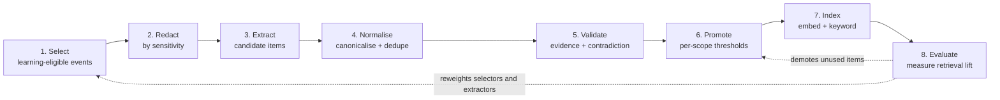

# Component: Mnemos — Self-Learning Memory Module

> A **standalone** memory service with its own store, API, and release cycle, consumed by Meridian
> over MCP like any other server. Scoped at **global / project / ticket-type** levels with
> narrower-scope override, and driven by an ingestion pipeline that defines *and refines* what it
> learns.

---

## 1. Why Standalone

Mnemos is not a Meridian subsystem. It has its own datastore, its own MCP server, its own version
line, and no compile-time dependency on Meridian — it consumes work-outcome events through a thin
adapter and could be pointed at a different system of record entirely. See
[ADR-0008](../adr/0008-standalone-memory-module.md).

This matters for three reasons beyond reusability:

- **It is granted, not assumed.** Because it is an MCP server, an agent profile reaches memory only
  through an `McpGrant` like any other capability, with read and write as separate tools. Memory
  access is therefore governed by the same three-layer model as everything else
  ([`permissions-rbac.md`](permissions-rbac.md) §3) rather than being ambient.
- **Its failure is degraded, not fatal.** If Mnemos is unreachable, agents work without recall.
  Tickets still get done, slightly worse. A memory layer wired into the ticket write path would
  make forgetting an outage.
- **It is independently evaluable.** A separate service with a measurable retrieval API can be
  A/B'd against itself (§7). Embedded memory is almost impossible to attribute lift to.

---

## 2. What a Memory Is

```
MemoryItem {
  scope: global | project | ticket_type          (+ scope_id)
  kind:  procedure | fact | preference | pitfall | entity | resolution
  content, evidence[], confidence, clearance, status, provenance
}
```

| Kind | Holds | Example |
|---|---|---|
| `procedure` | How work of this kind is done here | "Schema changes require a migration ticket linked before the change is approved" |
| `fact` | A durable property of the environment | "`billing-api` reads replica lag from `pg_stat_replication`, not the dashboard" |
| `preference` | An organisational convention | "This client wants rollback plans written as numbered steps, not prose" |
| `pitfall` | A known failure and its cause | "Restarting `ingest-worker` before draining the queue loses in-flight messages" |
| `entity` | Canonical information about a service, component, or system | Owner, dependencies, runbook location for `checkout-svc` |
| `resolution` | Symptom → effective fix, with the evidence | "P1 `5xx spike on checkout` resolved 4/5 times by rotating the upstream cert" |

**`pitfall` is the highest-value kind and the one naive designs miss.** Systems that only learn
what worked keep rediscovering what doesn't. Negative results are cheaper to validate (one clear
failure is strong evidence) and prevent more waste than positive ones.

Every item carries `evidence[]` — pointers to the execution legs, tickets, or human corrections
that support it. **An item with no evidence pointer cannot be promoted.** This is what separates a
memory from a model's assertion.

---

## 3. Scope, Resolution, and Override

Three scope levels, resolved most-specific-first. `ticket_type` can attach globally (all incidents,
everywhere) or within a project (incidents *on this project*), giving four resolution tiers:

| Precedence | Scope | Means |
|---|---|---|
| 1 (highest) | `project` + `ticket_type` | "Change requests on the Atlas programme" |
| 2 | `project` | "Anything on the Atlas programme" |
| 3 | `global` + `ticket_type` | "Change requests, org-wide" |
| 4 (lowest) | `global` | "Anything, org-wide" |

### Override modes

A narrower scope declares how it relates to what it inherits — this is the "local override"
mechanism, and it applies to **both** individual items and pipeline configuration (§4):

| Mode | Effect |
|---|---|
| `extend` (default) | Narrower items are added to inherited ones; both are retrievable |
| `replace` | Inherited items of this kind are not retrievable at this scope — the local set is authoritative |
| `suppress` | One specific inherited item is switched off here, with a required reason |
| `pin` | One item is always retrieved at this scope regardless of ranking |
| `amend` | A local item supersedes a specific inherited one, carrying a link to what it overrides |

**Conflicts are surfaced, never silently shadowed.** When a narrower item contradicts a broader one
(detected in validation, §4.5), retrieval returns the winner *and* a `shadowed_by`/`shadows`
reference. An agent reading "deploys need CAB approval (global)" that has been locally amended to
"pre-approved for this project's non-prod" should be able to see both, because the difference is
often exactly the thing that matters. A memory system that quietly hides the general rule teaches
agents the local exception as if it were universal.

`suppress` requires a reason string, and suppressions are listed in the project's memory admin view
— otherwise they accumulate invisibly and nobody can explain why the org-wide rule stopped applying
here eighteen months ago.

---

## 4. The Ingestion Pipeline

The pipeline is **configuration at each scope**, with the same override modes as items. A project
can extend the global selectors, replace the extraction rules for one ticket type, and inherit
everything else.



### 4.1 Select
Which events are learning-eligible. Defaults: ticket reaching a `done` category, a leg closing
`rejected` or `superseded` (failures teach more), a human correcting agent output, a gate decision,
an incident resolution, an approval rejection. Selectors are predicates over the event and ticket —
`{ticket_types[], outcomes[], min_confidence, labels[], exclude_labels[]}`.

Scope override matters here: a project handling regulated work may exclude everything except
human-reviewed outcomes.

### 4.2 Redact — *before extraction, not after*
Source content is stripped of `secret` fields and masked for `restricted` ones **before the
extraction model sees it**. Ordering is the whole point: extracting first and redacting the output
is the C5 defect ([`08-design-critique.md`](../08-design-critique.md)) made permanent, because
prose written by a model that read a secret cannot be reliably cleaned afterwards.

Each candidate inherits a `clearance` equal to the highest sensitivity of any input that survived
redaction, and retrieval never returns an item above the caller's clearance (§6).

### 4.3 Extract
Produces structured candidates: `{kind, content, claimed_scope, evidence_ref, extractor_id}`.
Extractors are named and versioned so their yield can be measured individually in stage 8 — an
extractor producing memories nobody ever retrieves is a cost with no return, and you can only find
that out if you can attribute items back to it.

Extraction proposes a scope; promotion decides it (§4.6). An extractor claiming `global` from a
single project's evidence is a common and damaging failure, so the claim is advisory only.

### 4.4 Normalise
Canonicalise entity references, then dedupe against existing items by semantic and key match.
A near-duplicate does not create a new item — it **adds evidence to the existing one**, which is how
`support_count` grows and how confidence becomes meaningful rather than a model's guess.

### 4.5 Validate
- **Evidence threshold** — minimum distinct supporting occurrences, per kind and scope.
- **Contradiction detection** — does this conflict with an active item at any scope? Conflicts route
  to review rather than auto-resolving; the newer item does not simply win, because recency is not
  correctness.
- **Schema and grounding** — content must cite its evidence; unsupported generalisation is rejected.

### 4.6 Promote
Thresholds rise with scope breadth, because the blast radius does:

| Target scope | Default promotion rule |
|---|---|
| `project` + `ticket_type` | ≥ 2 supporting occurrences, no active contradiction |
| `project` | ≥ 3 occurrences, spanning ≥ 2 distinct tickets |
| `global` + `ticket_type` | ≥ 5 occurrences spanning ≥ 2 projects |
| `global` | **Human review required**, plus evidence from ≥ 2 projects |

`pitfall` items promote at a lower bar (a single well-evidenced failure is admissible), since the
cost of acting on a false pitfall is usually caution, while the cost of missing a real one is a
repeat incident.

### 4.7 Index
Hybrid retrieval — embeddings plus keyword/structured filters on scope, kind, and entity — because
scope filtering must be exact while topical matching should be fuzzy.

### 4.8 Evaluate → the refinement loop
This is what makes the pipeline self-*refining* rather than merely self-*accumulating*:

- Items retrieved and followed by success gain confidence; retrieved and followed by rework or
  rejection lose it.
- Items never retrieved within `staleness_window` are demoted to `dormant` (still stored, not
  served), then archived. Unbounded memory growth degrades retrieval precision for everything else.
- **Extractor and selector weights are adjusted by the measured value of what they produced.** An
  extractor whose items are consistently retrieved and useful runs more aggressively; one producing
  noise is throttled.

Crucially, "followed by success" is correlation. §7 covers how actual lift is measured rather than
assumed.

---

## 5. Decay, Contradiction, and Being Wrong Later

The failure mode that matters most: a memory that was true, and is no longer. A workaround for a
since-fixed bug, a runbook for a decommissioned service, a client preference from a prior
engagement. These do not announce themselves.

| Mechanism | Behaviour |
|---|---|
| **Half-life by kind** | `fact` and `entity` decay slowly; `resolution` and `procedure` faster; `preference` only on explicit change. Confidence decays toward a floor, not to zero |
| **Revalidation on use** | An item retrieved and then contradicted by the outcome is immediately flagged, not merely decayed |
| **Source invalidation** | If the evidence tickets are reopened, reverted, or superseded, dependent items are flagged for review — memory inherits the fate of what it was learned from |
| **Explicit correction** | A human marking an item wrong retires it *and* records the correction as a new item, so the wrong version does not get relearned from the same evidence |
| **Contradiction quarantine** | Two active items that conflict are both demoted to `contested` and surfaced for resolution; neither is served as authoritative in the interim |

The last row is deliberate. Serving one of two contradictory memories with unearned confidence is
worse than serving neither and saying so.

---

## 6. Retrieval and Security

`memory.recall(query, scope_context, budget)` returns ranked items with full provenance —
evidence pointers, confidence, scope, and any `shadows` relationship. Provenance is not optional
output: an agent acting on a memory should be able to cite why, and an auditor should be able to
trace a decision back to the ticket that taught it.

**Injection budget.** Recall is capped by token budget per call, and consumption is reported as
`UsageRecord` like any other context cost ([`roi-analytics.md`](roi-analytics.md) §2). Memory that
costs more in context than it saves in rework is a net loss, and the only way to know is to meter
it.

### Clearance and cross-ticket leakage

This is the module's sharpest risk, because **memory persists and crosses tickets** — the exact
property that makes it valuable also makes it the ideal leak vector.

- Items carry `clearance` from redaction (§4.2); recall filters on the caller's clearance.
- Items derived from `confidential` tickets are scoped to the grantee set of their source by
  default, not to the project.
- **Aggregation is the unsolved part.** Several individually non-sensitive facts can combine into a
  sensitive one, and no clearance label on individual items prevents that. Mnemos mitigates
  (per-source clearance, minimum evidence diversity before an item generalises) but does not
  solve it. Recorded as an open issue rather than claimed as handled.

### Poisoning

Prompt injection ([`06-security.md`](../06-security.md) §4) becomes materially worse with memory,
because a single injected ticket can plant a durable instruction affecting every future ticket in
scope. Controls:

- Content from `external` provenance (email-created tickets, integration imports, attachments) is
  **selector-excluded from extraction by default** — learnable only from human-reviewed outcomes.
- Promotion requires evidence from **multiple distinct tickets** at every scope above the narrowest,
  so one poisoned ticket cannot promote alone.
- Global scope requires human review unconditionally.
- Memory writes are a **separate MCP tool from reads**, so a profile can be granted recall without
  the ability to teach — which should be the default for any profile working externally-sourced
  tickets.

---

## 7. Measuring Whether Memory Actually Helps

An accumulating memory store always *looks* successful: it grows, it gets retrieved, tickets close.
None of that is evidence it helped. Same trap as the ROI baselines
([`roi-analytics.md`](roi-analytics.md) §5.1), and the same remedy:

**Retrieval holdout.** A configurable share (default 10%) of eligible runs execute with recall
disabled. Comparing first-pass yield, rework rate, handoff count, and cost per ticket across the
two arms gives measured **lift**, not correlation.

Reported per scope and per memory kind, which answers the question that actually drives
configuration: *which* memory is earning its context budget. It is entirely normal for `pitfall`
and `entity` items to show strong lift while `procedure` items show none — and without the holdout
you would keep paying context cost for all of them.

| Metric | Meaning |
|---|---|
| `recall_hit_rate` | Share of runs where any item was retrieved |
| `measured_lift` | Δ first-pass yield / Δ cost per ticket, holdout vs. served |
| `context_cost_ratio` | Recall tokens as a share of run tokens |
| `staleness_rate` | Share of served items later contradicted or corrected |
| `promotion_precision` | Share of promoted items still active after 90 days |

A scope whose `measured_lift` is not distinguishable from zero should have its recall budget cut,
and the module should say so rather than quietly consuming tokens.

---

## 8. Human Curation Is a First-Class Path

Fully automatic learning is not the goal; **useful** memory is. Humans can author items directly,
review the promotion queue, correct or retire items, and pin critical knowledge that has no
evidence trail yet (a new policy, a fresh architectural decision). Curated items are labelled as
such, carry higher default confidence, and are exempt from usage-based decay.

Cold start is otherwise brutal: a new project has no evidence, so nothing promotes, so nothing is
retrieved, so no evidence accrues. Seeding from a project template's curated set
([`project-administration.md`](project-administration.md) §1) is what breaks that loop.
