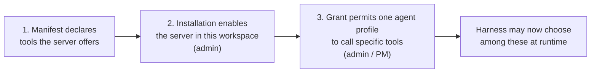

# Component: Permissions & RBAC

> Differentiator **D5** — the harness chooses which MCP server to call, *from a list controlled by
> RBAC*. Builds on [`02-data-model.md`](../02-data-model.md) (`McpGrant`, `AgentProfile`) and
> pairs with [`06-security.md`](../06-security.md).

---

## 1. Human Roles

| Role | Scope | Can do |
|---|---|---|
| `workspace_admin` | Workspace | Enable/revoke MCP installations, register private servers, manage all grants, billing, SSO, RBAC |
| `project_pm` | Project | Timeline/phases/sprints, tickets, trigger rules, ROI baselines; **grant** already-enabled MCP servers to profiles within this project's scope |
| `architect` | Project | Ticket rights; may override an agent's routing on a specific ticket; may approve approval-gated tool calls |
| `contributor` | Project | Create/edit/assign tickets, comment; no workflow or grant changes |
| `service_desk` | Project | Raise and work operational tickets; approve incident-related agent actions |
| `viewer` | Project/Workspace | Read-only, including dashboards (cost detail optionally withheld) |

Roles are additive across projects — `project_pm` on one, `viewer` on another.

---

## 2. Agents Do Not Hold Roles

An agent profile is never assigned a human role. It holds a **permission scope** plus a set of
**MCP grants**, both strictly narrower than any human role's default:

| Dimension | Controls | Enforced at |
|---|---|---|
| Project scope | Which projects it may be assigned tickets in | Trigger/assignment time |
| Ticket field scope | Which fields appear in its payload | Payload assembly, by omission |
| **MCP grants** | **Which servers and which tools it may call** | Every tool call |
| Approval-gated tools | Which granted tools pause for human sign-off | Before tool execution |
| Handoff scope | Which profiles it may hand off to | Handoff routing |
| Budget | Per-run / per-day / per-ticket ceilings | Before dispatch and on each cost report |

---

## 3. The Grant Model — Three Independent Layers

This is the heart of D5. Three separate decisions, made by different people, that must all say yes:

1. **Manifest** — what the server *can* do. Authored by the publisher; a maximum, not an
   entitlement.
2. **Installation** — the workspace has enabled this server, pinned to a version, scoped to
   certain projects, with secrets supplied. A procurement/integration decision.
3. **Grant** (`McpGrant`) — *this* agent profile may call *these* tools on that installation, with
   `requires_approval` on the subset that needs a human. A security decision.

Only after all three does the server appear in the harness's resolved catalogue for a ticket.

**Why three layers rather than two:** collapsing installation and grant means enabling a server for
any purpose silently widens every existing agent's capability — the classic way permission systems
drift into over-provisioning. Keeping them apart makes "we enabled the deployment server for the
release pipeline" not also mean "the incident triage bot can now deploy".

### Tool-level, not server-level

Grants are per tool, not per server. A profile can be granted `github.search_code` and
`github.get_pr` without `github.merge_pull_request`. Servers bundle broad capability; roles need
narrow slices.

### Defaults that fail closed

- A new grant defaults to the server's `read`-class tools only.
- `write_external` and `destructive` tools default to `requires_approval` when granted at all.
- No grant is created implicitly by enabling a server, by installing a marketplace listing, or by
  a profile requesting one.

---

## 4. Enforcement

All enforcement is **server-side, at the Meridian MCP boundary** — never delegated to the harness:

- The resolved catalogue sent to the harness contains only granted servers/tools. Ungranted
  servers are **absent**, not marked forbidden — the harness cannot reason about, request, or leak
  the existence of tools it may not use.
- Every call is re-validated against the grant at execution time, not just at catalogue assembly,
  so a grant revoked mid-run takes effect on the next call.
- A call outside the grant is refused and written as `McpCallRecord.outcome = denied_by_policy`
  (SC-5). It is a policy event, not merely an error — repeated denials from one profile are an
  admin-visible signal.
- Agents never hold a database credential or general API token. Every read is a payload Meridian
  assembled; every write is a scoped MCP tool call validated before Core sees it.

A tightened grant therefore takes effect immediately, with no change on the harness side, and a
compromised or misbehaving harness still cannot exceed the grant set.

---

## 5. Approval Gates

Two kinds, both routed to the same human approval queue:

- **Tool-level** — `McpGrant.requires_approval` pauses a specific tool call. The approver sees the
  server, tool, argument preview, and the ticket context before deciding. The harness's run blocks
  meanwhile (the leg stays open, like an ask-human).
- **Transition-level** — `Status.approval_role` requires a named role to approve a status change.
  This is how "the agent may do the work but a person signs it off" is expressed, and it composes
  with phase Gates in waterfall projects.

Both are configuration. A fully autonomous project can carry no gates; a regulated one can gate
every external-effect call and every terminal transition.

---

## 6. Project and Configuration Rights

Distinct from ticket rights, because the blast radius is different:

| Right | Default holder | Notes |
|---|---|---|
| Create project | `workspace_admin` | Delegable to a named group, optionally template-restricted — see [`project-administration.md`](project-administration.md) §1 |
| Edit shared status scheme | `workspace_admin` | Affects every project pinned to it; requires impact preview |
| Fork scheme to project-local | `project_pm` | Blocked when the scheme is `locked_by_policy` |
| Define ticket types / fields | `workspace_admin` | Field `sensitivity` changes are admin-only |
| Set budgets and thresholds | `workspace_admin` (workspace/project), `project_pm` (phase/sprint) | |
| Enable / revoke MCP installation | `workspace_admin` | Procurement decision |
| Grant MCP tools to a profile | `workspace_admin`, or `project_pm` within project scope | Security decision (§3) |
| Set ticket visibility rules | `project_pm` | Cannot widen beyond the project's `default_ticket_visibility` ceiling |

---

## 7. Ticket Visibility Management

Role-based access answers "what may you do"; visibility answers "what may you *see*". They are
separate, because a `contributor` on a project should not automatically see an HR investigation, a
security incident, or a client-confidential change filed in that project.

### Three levels

| Level | Who sees it |
|---|---|
| `project` | Every member of the project, per their role. The default. |
| `restricted` | Project members **plus** explicit `TicketGrant`s — used when extra people need in |
| `confidential` | **Only** explicit grantees and `workspace_admin`. Project membership alone is not enough |

A `confidential` ticket is invisible in lists, boards, timelines, search, saved filters, counts,
and rollup totals for anyone without a grant. It does not appear as a redacted placeholder —
knowing that a confidential ticket exists is itself often the leak.

### Rules, not toggles

`VisibilityRule` sets the level automatically from the ticket's own content — type, labels,
severity, or a field predicate — at creation and on subsequent field changes. Relying on a person
to remember a toggle is how confidential data ends up on a public board. Rules carry `precedence`
and may only ever **narrow** what a higher-precedence rule decided, so composing rules cannot
accidentally open something up.

`grant_to` on a rule automatically extends access to the right people the moment the rule fires
(e.g. any P1 security incident becomes `restricted` and is granted to the security group), so
narrowing visibility never strands a ticket with nobody able to work it.

### Field-level sensitivity

Independently of ticket-level visibility, individual fields carry
`sensitivity: normal | restricted | secret` in the ticket type's schema. A user who can see the
ticket may still get a field redacted. This is what lets a widely-visible `change` ticket carry a
credential reference or a contract value that only a subset can read.

### Agents and visibility

An agent profile is subject to the same model, with one deliberate tightening:

- A profile sees a ticket only if it holds a grant (`agent_profile` is a valid `grantee_type`) or
  the ticket is `project`-visible **and** the profile's project scope includes it.
- Fields of `sensitivity: secret` are **excluded from agent payloads by default** even when the
  profile could otherwise see the ticket. Including them requires an explicit per-profile
  allowance — because agent payloads leave Meridian's boundary for an external harness, which is a
  materially different exposure from a human reading a field in the UI ([`06-security.md`](../06-security.md) §4).
- Restricting visibility mid-run is honoured on the next MCP read; in-flight context already
  dispatched cannot be recalled, which is a limitation worth stating plainly rather than implying
  otherwise.

### Enforcement and leak paths

Visibility is applied as a single predicate in the data-access layer, not per-endpoint — so it
holds uniformly across list, search, timeline aggregation, saved filters, exports, and the MCP
tool surface. The paths that leak in practice are the indirect ones, and each is closed
explicitly:

| Path | Treatment |
|---|---|
| Counts and rollups | Invisible tickets are excluded from totals; a viewer's dashboard sums only what they may see |
| Notifications | Never include title or body for a ticket the recipient cannot see; suppressed entirely rather than sent as a stub |
| Links from visible tickets | Render as "restricted item" with key hidden — the relation exists but discloses nothing |
| Activity feeds and mentions | Filtered by the same predicate |
| ROI cost attribution | Costs of invisible tickets roll into totals only for those permitted to see the scope's full cost |
| Audit log | `workspace_admin` and auditors retain full visibility by design — the audit trail is the one surface that must be complete |

---

## 8. No Ambient Authority

An agent working a ticket inherits **nothing** from the human who assigned it, even if that person
has far broader access. Grants are set deliberately at profile level by an admin or PM, never
implied per assignment. This avoids the "agent runs as whoever clicked the button" escalation
pattern, and it means an agent's blast radius is knowable by reading its grants rather than by
auditing who has ever assigned it work.
