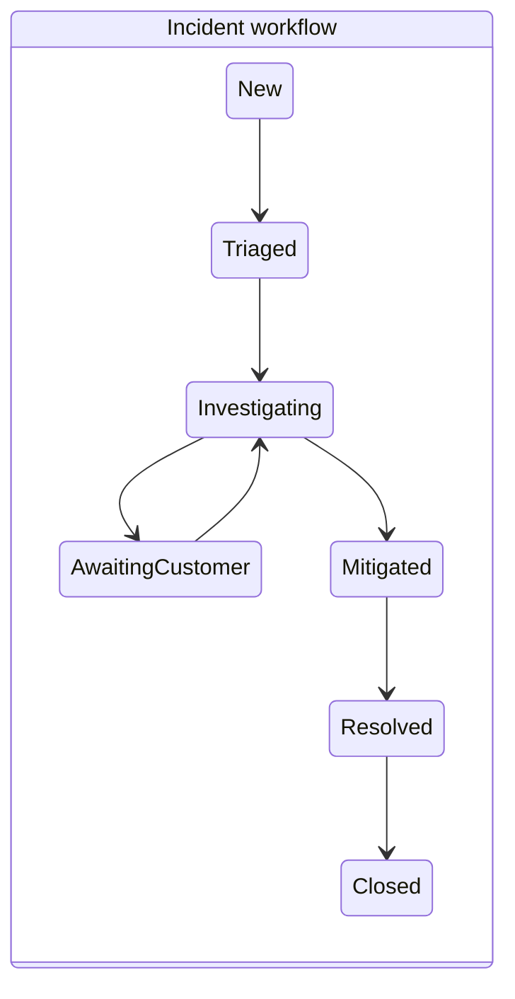

# Component: Ticketing

> Differentiator **D2** — issues, problems, incidents and changes as first-class ticket types on
> the same timeline. Builds on [`02-data-model.md`](../02-data-model.md).

---

## 1. Ticket Types Span Delivery and Operations

A `TicketType` is configuration: a field schema, a workflow, a timeline render mode, an SLA policy,
and an agent I/O contract. The shipped defaults cover three categories:

| Category | Types | Notable fields | Timeline render |
|---|---|---|---|
| `delivery` | Epic, Story, Task, Defect | estimate, acceptance criteria | Band / Bar |
| `operational` | **Incident**, **Problem**, **Change** | severity, detected_at, service, change_window, rollback_plan | Point (Incident/Problem), Bar (Change) |
| `governance` | Risk, Decision, Milestone | probability, impact, decision_date | Bar / Diamond |

Keeping these in one entity — rather than in a separate service-desk product with its own data
model — is what makes the shared timeline possible, and it is what lets an incident's follow-up
work be an ordinary child task in the same sprint as feature work, rather than a linked record in
a different system that nobody's timeline shows.

### Operational semantics

The ITSM relationships are ordinary `TicketLink` relations:

- Many **Incidents** `caused_by` one **Problem**.
- A **Problem** is `resolved_by` a **Change**.
- A **Change** `implements` one or more delivery tickets.

Incidents carry an `sla_policy` (response and resolution targets).

**SLA clocks come in two classes, and conflating them is a reporting error with commercial
consequences:**

| Class | Pauses when | Example |
|---|---|---|
| `external` | The organisation is genuinely waiting on a party outside it — the customer, a vendor | `Awaiting Customer` |
| `internal` | Never pauses for internal dependencies; runs until resolution | Time-to-resolve against a customer commitment |

A status declares `sla_behaviour` per clock class rather than one blanket pause flag. The
distinction matters most for **ask-human**: an agent blocking to ask your own team a question is an
internal dependency. Pausing the customer-facing clock for it would mean the resolution SLA
improves precisely because your automation got stuck — a metric that rewards the wrong thing, and
one that is trivially gameable once anyone notices. Ask-human therefore pauses **neither** clock by
default; the elapsed time is separately attributed to `blocked_on_internal` so it is visible as its
own cost without laundering the commitment.

Time-in-blocked is tracked per class, so "how long did we hold this" and "how long were we waiting
on someone else" remain separately answerable.

---

## 2. The Status Graph

Each ticket type has a `Workflow`: a directed graph of statuses, configurable per project. A
support queue and a delivery pipeline need genuinely different states, and forcing one shape onto
both is what drives teams to encode real status in labels.

Every status carries a fixed `category` (`not_started`, `active`, `blocked`, `done`, `cancelled`)
alongside its custom name, so timeline colouring, burndown, SLA pause logic, and ROI cycle-time all
work without knowing project-specific names.

**Transitions are validated in one place** — the Workflow Engine — regardless of whether the
requester is a human clicking a dropdown or the harness calling `tickets.update_status` over MCP.
An agent cannot skip a required review state any more than a person can.

A status may set `approval_role`, requiring a named role to approve entry. This is the per-ticket
analogue of a phase Gate, and it's the mechanism behind agent output requiring human sign-off (see
[`human-ai-collaboration.md`](human-ai-collaboration.md) §2).

---

## 3. Automations

`on_enter` / `on_exit` actions from a fixed vocabulary, executed by the Workflow Engine:

| Trigger | Action |
|---|---|
| `on_enter: Triaged` | Evaluate TriggerRules — may make the ticket eligible for agent pickup |
| `on_enter: AwaitingCustomer` | Pause the `external` SLA clock only; notify watchers |
| `on_enter: Done` | Compute `RoiSummary` |
| `on_exit: Blocked` | Record time-in-blocked for cycle-time analytics |

Automations are configuration, not scripts — auditable, and keeping transition side effects in one
place rather than scattered across UI and integration code.

---

## 4. Links and Hierarchy

`parent_id` gives hierarchy (epic → story → task, or WBS nesting within a phase).
`TicketLink` gives lateral relations. `blocks`/`blocked_by` do double duty: they draw dependency
arrows on the timeline **and** they gate agent dispatch — the harness will not be handed a ticket
whose blockers are unresolved, which avoids burning agent budget on work that isn't actually ready.

---

## 5. Comments as Structured Collaboration

`Comment.kind` distinguishes an agent's `proposal` (rendered with accept / edit / reject
affordances) from a `question` (an ask-human, which changes ticket status and starts an SLA clock),
an `answer`, a plain `note`, and `system` entries. This typing is what lets the same thread serve
as both a human conversation and the agent interaction protocol surface, instead of bolting a
separate "AI panel" onto the ticket.

---

## 6. Views

- **Timeline** — primary; see [`timeline.md`](timeline.md).
- **Board** — grouped by status, WIP limits in kanban mode.
- **Backlog** — flat, priority-ordered, filterable by assignee type (human / agent / both /
  unassigned).
- **Queue** — SLA-ordered view for operational types, showing time-to-breach.
- **Saved filters** — a query language over any field, including execution-trail properties like
  `hops > 1` (tickets that have been handed off, a useful signal that an agent profile is
  mis-scoped) or `last_leg_outcome = policy_denied` (tickets an agent couldn't finish because it
  lacked an MCP grant).
