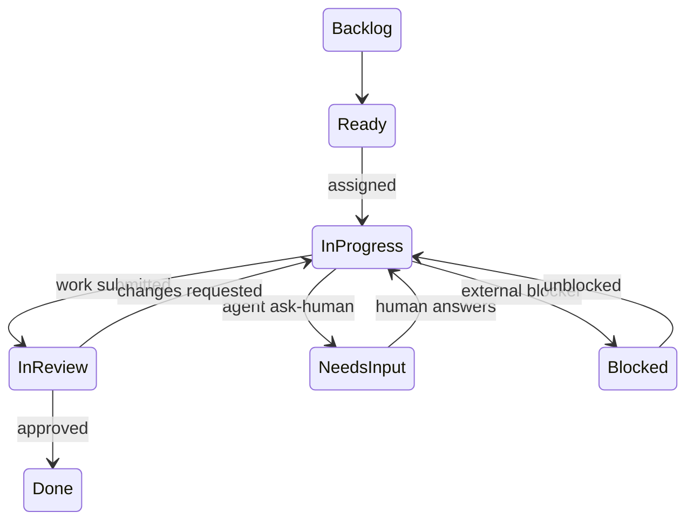

# Component: Ticketing

> Builds on [`02-data-model.md`](../02-data-model.md) (`Ticket`, `Workflow`, `Status`, `TicketLink`, `Comment`).

---

## 1. Ticket Types

Every project ships with a default set (`Epic`, `Story`, `Task`, `Bug`, `Spike`), but ticket types
are configuration, not code: a project can define a custom type (e.g., `Contract Review`,
`Support Case`) with its own field schema and its own `Workflow`. This is what lets Meridian serve
software delivery, legal ops, and customer support inside the same platform (per overview G8).

A ticket type declares:

| Aspect | Example |
|---|---|
| Field schema | `Bug` adds `severity`, `repro_steps`; `Contract Review` adds `counterparty`, `contract_value` |
| Default workflow | which `Workflow` (status graph) new tickets of this type start in |
| Agent contract | the shape of input an agent receives and output it must produce for this type — see [`agent-execution-and-handoff.md`](agent-execution-and-handoff.md) §2 |
| Estimate unit | story points, hours, or none |

---

## 2. The Status Graph (Workflow)

A `Workflow` is a directed graph of `Status` nodes, configured per project per ticket type — not
a fixed enum. This is deliberate: a support queue's states (`New → Triaged → In Progress →
Waiting on Customer → Resolved`) look nothing like a software delivery pipeline's
(`Backlog → Ready → In Progress → In Review → Blocked → Done`), and forcing one shape onto both
produces the awkward "everything is secretly Done or Not Done" tracker teams route around with
labels.

Each `Status` carries a fixed `category` (`not_started` / `active` / `blocked` / `done`) alongside
its custom `name`, so cross-project reporting, burndown, and ROI cycle-time computation never need
to know the project's specific status names — see [`02-data-model.md`](../02-data-model.md) §5.

**Transition validation** happens once, in the Workflow Engine, regardless of whether the actor
requesting the transition is a human clicking a dropdown or an agent's Orchestrator-mediated
status update. An agent cannot skip straight to `Done` if the graph requires passing through
`In Review` — the same rule a human is held to.

---

## 3. Linking

`TicketLink` relations (`blocks`, `blocked_by`, `relates_to`, `duplicates`, `caused_by`) are
symmetric-aware: creating `A blocks B` automatically materializes `B blocked_by A` for query
convenience, but both rows point at one logical link so there is one thing to delete.

`blocks`/`blocked_by` links feed directly into the timeline's dependency arrows
(see [`timeline-and-sprints.md`](timeline-and-sprints.md) §2) and into agent dispatch: the
Orchestrator will not dispatch a ticket to an agent while it has an unresolved `blocked_by` link
in the `blocked` status category, avoiding wasted agent runs on work that isn't actually ready.

---

## 4. Automations

Each `Status` can declare `on_enter`/`on_exit` automations, evaluated by the Workflow Engine:

| Trigger | Example action |
|---|---|
| `on_enter: NeedsInput` | notify the ticket's human owner or watchers; start a response-time SLA clock |
| `on_enter: Done` | trigger `RoiSummary` computation for the ticket |
| `on_enter: InProgress` (agent-assigned) | dispatch to the Agent Orchestrator |
| `on_exit: Blocked` | log time-in-blocked as a metric feeding cycle-time analytics |

Automations are configuration (trigger → action pairs from a fixed action vocabulary), not
arbitrary scripts — this keeps them auditable and keeps the Workflow Engine the single place
transition side effects are defined, rather than scattered across UI code.

---

## 5. Comments as Structured Collaboration, Not Just Text

A `Comment.kind` (`note`, `question`, `proposal`, `answer`, `system`) lets the UI render an agent's
structured contribution distinctly from a human's freeform note — a `proposal` comment from an
agent renders with accept/reject/edit affordances inline, rather than as inert text. This is the
mechanism `human-ai-collaboration.md` builds the ask-human and co-authoring flows on top of.

---

## 6. Bulk Operations and Views

- **Board view** groups tickets by `Status.category` within a project or sprint (Kanban-style),
  usable regardless of methodology.
- **Backlog view** is a flat, priority-ordered list, filterable by type/label/assignee-type
  (human/agent/unassigned) — the assignee-type filter is what lets a PM see "everything currently
  sitting with an agent" at a glance.
- **Saved filters** (JQL-equivalent query language) scope any of the above by arbitrary field
  combinations, including agent-specific fields like `execution_trail.length > 1` ("tickets that
  have been handed off at least once") for spotting agents that are mis-scoped.
