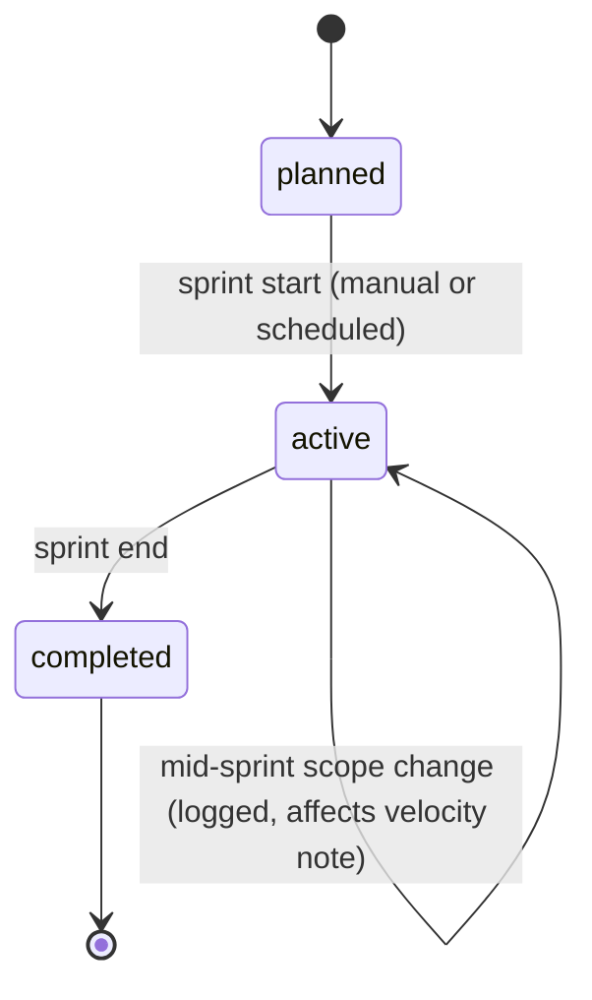

# Component: Timeline & Sprints

> Builds on [`02-data-model.md`](../02-data-model.md) (`Project`, `Timeline`, `Sprint`).

---

## 1. Three Methodologies, One Data Model

A project picks one `methodology` at creation (changeable later, with migration rules):

| Methodology | Sprints? | Primary view | Typical use |
|---|---|---|---|
| `scrum` | Required | Sprint board + burndown | Fixed-cadence delivery teams |
| `kanban` | None — continuous flow | Board with WIP limits | Support queues, ongoing ops, ticket triage |
| `timeline_only` | Optional, used as date buckets rather than commitments | Gantt/timeline | Client-facing project plans, consulting engagements |

All three share the same `Ticket` entity and `Workflow`. The methodology only changes which views
are primary and which automations are enabled (e.g., "close sprint" is meaningless in `kanban`).

---

## 2. Timeline

The timeline is the cross-cutting view: milestones and tickets plotted against real dates,
independent of sprint boundaries. Every ticket with a `due_date` or that belongs to a sprint with
`starts_at`/`ends_at` appears on it automatically — the timeline is mostly a **read projection**,
not a separately authored plan, so it can never drift out of sync with the actual tickets.

- **Milestones** are lightweight markers (`{name, target_date, ticket_ids[]}`) a PM drags onto the
  timeline; a milestone's "at risk" indicator is computed from whether its linked tickets'
  estimated completion (based on current velocity/agent throughput) crosses the target date.
- **Dependencies** (`TicketLink` with `relation = blocks`) render as arrows between timeline bars.
  A blocked ticket's bar is visually distinct and its downstream dependents get a computed
  "earliest possible start" based on the blocker's current status and estimate.
- **Portfolio rollup.** Multiple projects can share a `portfolio_group_id` so a program manager
  sees one timeline spanning several teams' projects — read-only at that level; edits happen on
  the owning project.

---

## 3. Sprint Lifecycle

- **Planning.** Tickets are pulled from the backlog into a `planned` sprint up to its `capacity`.
  Capacity is two numbers, not one: `human_hours` (sum of team members' available hours) and
  `agent_budget_usd` (spend ceiling across all agent-assigned tickets in the sprint) — because
  agent throughput is bounded by budget, not by hours in a day.
- **Start.** Moving `planned → active` locks the sprint's ticket set for burndown purposes;
  tickets added mid-sprint are flagged as scope change rather than silently included, so velocity
  and ROI numbers stay honest.
- **Burndown.** Standard remaining-estimate-over-time chart, computed per methodology-appropriate
  unit (points or hours). Because agents can complete tickets far faster than humans, the
  burndown additionally splits the "remaining" line into `human-assigned remaining` and
  `agent-assigned remaining` so a PM can see whether the sprint is on track *because* of agent
  throughput, not despite ambiguous averaging.
- **Close.** Moving `active → completed` snapshots final velocity (points/hours completed) and
  triggers the sprint's `RoiSummary` rollup (sum of all completed tickets' ROI in the sprint) —
  see [`roi-analytics.md`](roi-analytics.md).
- **Retro notes.** Freeform per-sprint notes field, surfaced next to the ROI rollup so "what did we
  learn" and "what did it cost/save" sit side by side.

---

## 4. Capacity Planning With Agents in the Mix

Agent capacity is fundamentally different from human capacity: an agent can, in principle, work
many tickets concurrently, bounded by budget and by the installation's configured concurrency
limit, not by an 8-hour day. Sprint planning therefore asks two separate questions:

1. **Human capacity check** (unchanged from traditional Scrum): sum of estimates on human-owned
   tickets ≤ team's available hours.
2. **Agent budget check**: sum of expected cost (from the agent's historical average cost per
   ticket type, or a manifest-declared estimate for a newly installed agent) on agent-assigned
   tickets ≤ the sprint's `agent_budget_usd`.

A ticket that's co-assigned counts partially against both, split by the expected responsibility
split declared at assignment time (see [`human-ai-collaboration.md`](human-ai-collaboration.md)
§2).

---

## 5. Automations Tied to Timeline/Sprint Events

Configured per project, executed by the Workflow Engine (see [`ticketing.md`](ticketing.md) §4):

- On sprint start: auto-assign tickets tagged with an agent's `capability_tags` to that agent's
  installation, up to its per-sprint concurrency limit.
- On milestone at-risk: notify the milestone owner.
- On sprint close: freeze `RoiSummary` for every ticket in the sprint (no further cost attribution
  after close, even if an execution leg technically continues — it rolls into the next sprint's
  numbers instead, keeping historical sprint ROI stable for reporting).
