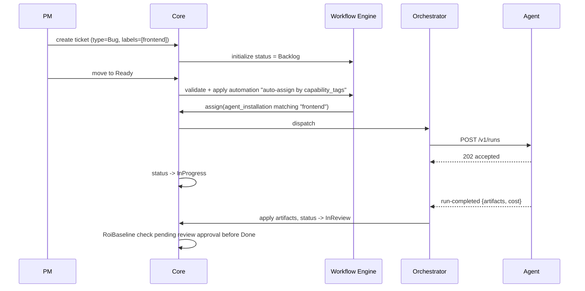
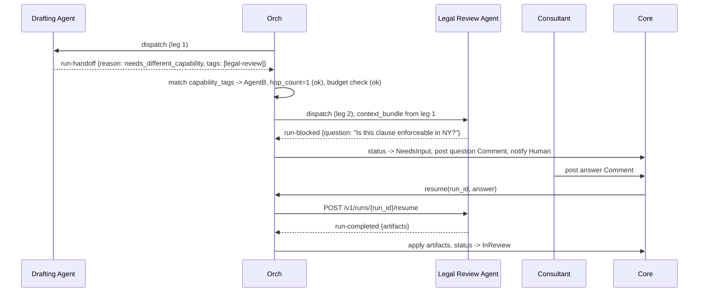
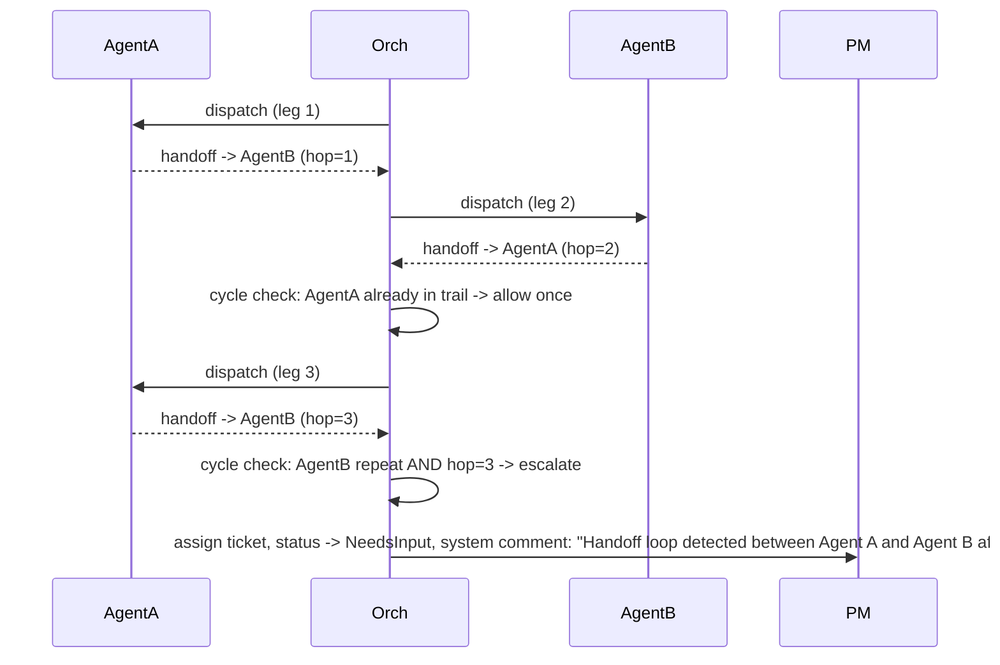
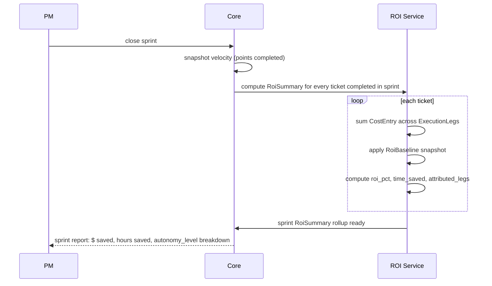

# Sequence Flows

> Worked end-to-end examples tying together the components in `03-components/`. Each flow
> references the specific docs/entities it exercises.

---

## Flow 1 — Ticket Created by a PM, Auto-Assigned to an Agent

Exercises: [`ticketing.md`](03-components/ticketing.md), [`agent-marketplace.md`](03-components/agent-marketplace.md), [`agent-execution-and-handoff.md`](03-components/agent-execution-and-handoff.md).



---

## Flow 2 — Multi-Agent Handoff Ending in Ask-Human

Exercises: [`agent-execution-and-handoff.md`](03-components/agent-execution-and-handoff.md) §3–6, [`human-ai-collaboration.md`](03-components/human-ai-collaboration.md) §3.



Note leg 2 is a single `ExecutionLeg` spanning the block/resume — the ask-human round trip does not
create a new hop (per [`agent-execution-and-handoff.md`](03-components/agent-execution-and-handoff.md) §6).

---

## Flow 3 — Handoff Loop Detected, Escalated

Exercises: [ADR-0005](adr/0005-handoff-loop-protection.md), [`agent-execution-and-handoff.md`](03-components/agent-execution-and-handoff.md) §5.



---

## Flow 4 — Sprint Close and ROI Rollup

Exercises: [`timeline-and-sprints.md`](03-components/timeline-and-sprints.md) §3, [`roi-analytics.md`](03-components/roi-analytics.md) §1–4.



---

## Flow 5 — Co-Assigned Ticket With Human Override

Exercises: [`human-ai-collaboration.md`](03-components/human-ai-collaboration.md) §2 and §4.

```mermaid
sequenceDiagram
    participant Agent as Agent (owner)
    participant Human as Human (reviewer)
    participant Orch
    participant Core

    Orch->>Agent: dispatch
    Agent-->>Core: proposal Comment (draft artifact)
    Human->>Core: edits proposal directly (creates linked human-authored version)
    Human->>Core: approves -> status -> Done (approval_role: reviewer satisfied)
    Core->>Roi: RoiSummary computed; attributed_legs splits cost/time between Agent leg and Human review leg
```
