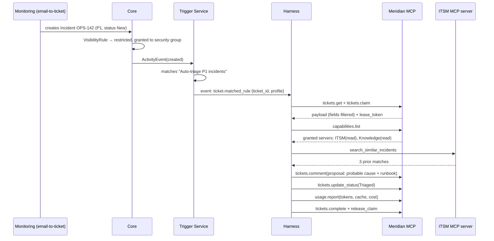
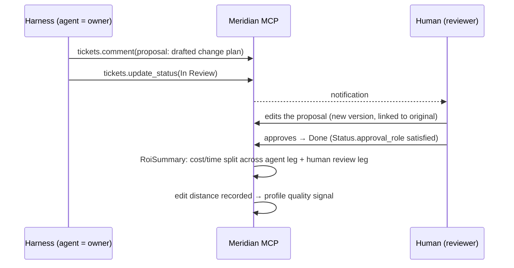

# Sequence Flows

> Worked examples tying the components together. Each references the docs it exercises.

---

## Flow 1 — Event-Triggered Incident, First Response in Seconds

Exercises [`agent-harness.md`](03-components/agent-harness.md) §2, [`ticketing.md`](03-components/ticketing.md), [`permissions-rbac.md`](03-components/permissions-rbac.md) §3.



---

## Flow 2 — Scheduled Sweep Catches What the Event Missed

Exercises [`agent-harness.md`](03-components/agent-harness.md) §2 and §4.

```mermaid
sequenceDiagram
    participant Core
    participant H as Harness
    participant MM as Meridian MCP

    Note over H: Harness was down 02:00–02:20; its event was lost
    Core->>Core: OPS-155 created 02:05, no pickup
    Note over H: 02:25 — cron fires for rule "Auto-triage P1"
    H->>MM: tickets.query(filter, claimable_only=true)
    MM-->>H: [OPS-155]  ← still matching, still unclaimed
    H->>MM: tickets.claim(OPS-155)
    Note over H: works normally from here
```

The sweep re-evaluates the filter from scratch, so completeness does not depend on any event
having been delivered. This is also the path that picks up tickets whose eligibility changed
without emitting an event — an SLA clock crossing a threshold, or a blocker resolving elsewhere.

---

## Flow 3 — Handoff Because of a Missing MCP Grant

Exercises [`agent-harness.md`](03-components/agent-harness.md) §5 and §7, [`permissions-rbac.md`](03-components/permissions-rbac.md) §3.

```mermaid
sequenceDiagram
    participant H as Harness (Triage profile)
    participant MM as Meridian MCP
    participant H2 as Harness (Change Exec profile)

    H->>MM: capabilities.list
    MM-->>H: ITSM(read), Knowledge(read)
    Note over H: fix requires a config change;<br/>no grant for the deployment server
    H->>MM: tickets.handoff {reason: missing_mcp_grant,<br/>suggested_tags: ["change-execution"]}
    MM->>MM: route → "Change Executor" profile; hop=1, budget ok
    MM->>H2: event: ticket.matched (new leg)
    H2->>MM: capabilities.list
    MM-->>H2: Deploy MCP (write_external, requires_approval)
    H2->>MM: tool call → approval gate
    MM-->>H2: awaiting human approval
```

Handing off on a missing grant is the designed behaviour, not a failure: the agent reasoned
correctly and stopped at its policy boundary.

---

## Flow 4 — Budget Threshold Stops Dispatch

Exercises [`roi-analytics.md`](03-components/roi-analytics.md) §7.

```mermaid
sequenceDiagram
    participant H as Harness
    participant MM as Meridian MCP
    participant Roi as ROI Service
    participant PM

    H->>MM: usage.report(leg costs)
    MM->>Roi: append UsageRecord + CostEntry
    Roi->>Roi: sprint budget now at 96% (threshold 0.95)
    Roi->>PM: notify: budget threshold crossed
    Roi->>MM: set sprint budget state = block_agent_dispatch
    H->>MM: tickets.claim(next ticket)
    MM-->>H: error budget_exceeded — dispatch blocked
    Note over PM: PM raises the ceiling or defers work;<br/>humans continue unaffected
```

---

## Flow 5 — Waterfall Gate Blocking a Downstream Phase

Exercises [`delivery-modes.md`](03-components/delivery-modes.md) §2, [`timeline.md`](03-components/timeline.md) §4.

```mermaid
sequenceDiagram
    participant PM
    participant Core
    participant Wf as Workflow Engine

    Note over Core: Build phase due to start; "Design Sign-off" gate still pending
    Core->>Core: at-risk flag on Build phase + downstream milestones
    PM->>Core: attempts to move a Build ticket to In Progress
    Core->>Wf: validate transition
    Wf-->>Core: rejected — blocking gate unapproved
    PM->>Core: gate decision = approved (approver_role satisfied)
    Core->>Core: ActivityEvent(gate_decided); at-risk cleared
    PM->>Core: transition now succeeds
```

---

## Flow 6 — Co-Assigned Ticket With Human Sign-off

Exercises [`human-ai-collaboration.md`](03-components/human-ai-collaboration.md) §2–4.



---

## Flow 7 — Sprint Close, Rollup, and Project ROI

Exercises [`roi-analytics.md`](03-components/roi-analytics.md) §4–6.

```mermaid
sequenceDiagram
    participant PM
    participant Core
    participant Roi as ROI Service

    PM->>Core: close sprint
    Core->>Core: snapshot velocity; freeze scope
    Core->>Roi: compute RoiSummary for each completed ticket
    loop each ticket
        Roi->>Roi: sum UsageRecord → model cost; McpCallRecord → MCP cost; human_time
        Roi->>Roi: apply baseline snapshot; attribute across legs
    end
    Roi->>Roi: UsageRollup(sprint) → EfficiencyMetric(sprint)
    Roi->>Roi: recompute project rollup from summed totals, not averaged ROI
    Roi-->>PM: $ saved, hours returned, autonomy mix, cost split, cache hit ratio
```

---

## Flow 8 — Confidential Ticket Stays Invisible

Exercises [`permissions-rbac.md`](03-components/permissions-rbac.md) §7.

```mermaid
sequenceDiagram
    participant Sec as Security lead
    participant Core
    participant Dev as Contributor (no grant)
    participant H as Harness (ungranted profile)

    Sec->>Core: create ticket; VisibilityRule → confidential + grant security group
    Dev->>Core: GET /timeline, /search, /board
    Core-->>Dev: ticket absent from results, counts, and rollups
    Dev->>Core: opens a visible ticket linked to it
    Core-->>Dev: link renders as "restricted item", key hidden
    H->>Core: tickets.query
    Core-->>H: ticket not returned — no agent grant
    Note over Core: audit log retains full detail for admins/auditors
```
